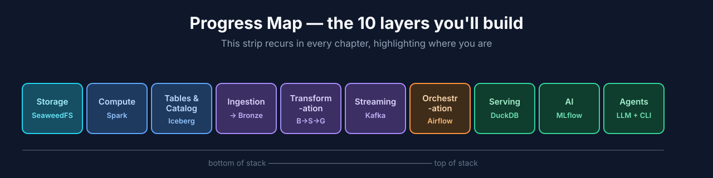
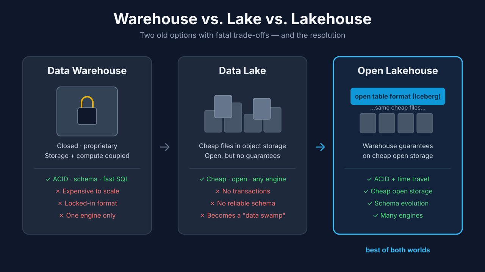
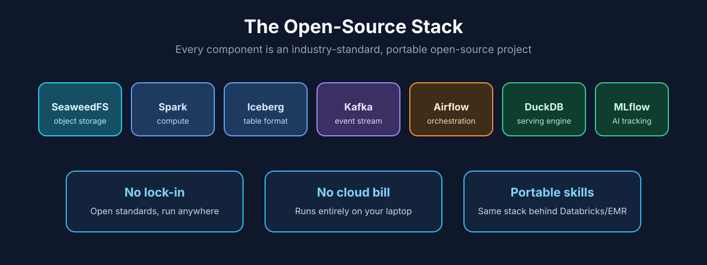
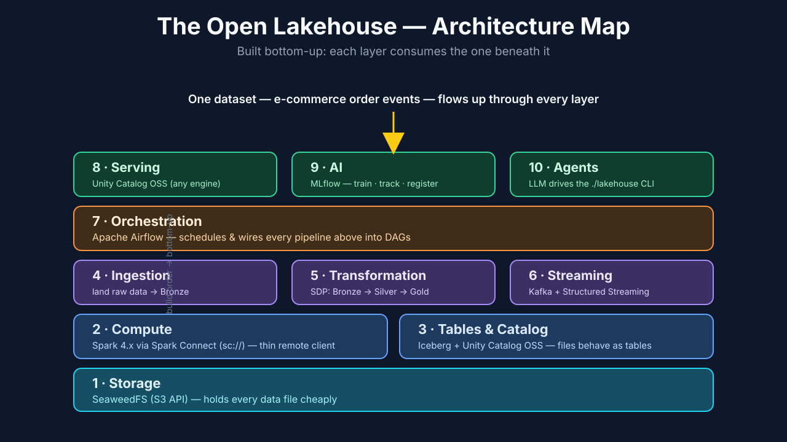
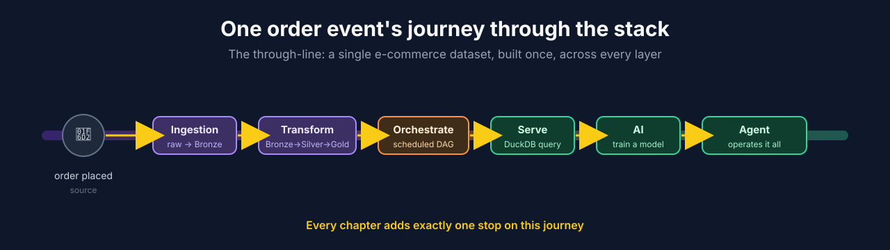
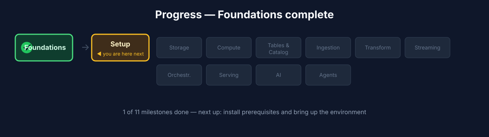

# Chapter 1 — Foundations: What an Open Lakehouse Is and Why You'd Build One

## 1.0 What you'll build in this chapter

Nothing yet — and that's deliberate. Before you install a single tool, this
chapter gives you the **map**: what an open lakehouse actually is, why the
open-source approach is worth your time, and a labeled tour of the exact stack
you'll assemble over the next twelve chapters. Everything after this is
hands-on; this chapter is the mental model that makes the rest click.

Think of it like being handed the blueprint before you help build the house.
You could start nailing boards together immediately, but ten minutes spent
understanding *why the foundation goes where it goes* saves you from tearing out
walls later. By the time you finish this chapter, you'll be able to look at any
modern data platform — Databricks, Snowflake's Iceberg tables, AWS's lakehouse
offerings — and recognize the same handful of moving parts underneath the
marketing.

**Figure 1.1** — The recurring progress map, which we return to at the start of
every chapter with the current layer highlighted.

## 1.1 Learning objectives

By the end of this chapter you can:

- Explain the difference between a data warehouse, a data lake, and a **lakehouse**
  in one sentence each — and explain *why* each one exists.
- Define **open table format** and why it's the single piece that makes a
  lakehouse possible.
- Give three practitioner reasons to build on an open-source stack, and answer
  the "why not just use the cloud console?" objection.
- Name every component in the stack and the one job each does.
- Describe the bottom-up build order and why each layer depends on the one below it.

## 1.2 A story: the pipeline that ate a weekend

Let's start with a scene you may recognize, because it explains *why this entire
field exists*.

A data engineer — call her Maya — runs the nightly job that loads the company's
order data into the analytics warehouse. It's Friday. Two things happen at once:
the nightly load kicks off, and a colleague in another timezone manually re-runs
a backfill for last week's numbers. Both jobs write to the same `orders` table.
By Saturday morning, the finance dashboard shows revenue that's roughly *double*
what it should be — the two jobs interleaved their writes and nobody can tell
which rows are real. There's no "undo." There's no record of what the table
looked like *before* the mess. Maya spends the weekend reconstructing the table
from raw files, by hand.

Every capability we build in this course exists to prevent some version of
Maya's weekend:

- **ACID transactions** so two writers can't corrupt each other.
- **Snapshots and time travel** so "what did this table look like before?" is a
  one-line query, and "undo" is real.
- **Schema enforcement** so a malformed load is rejected at the door, not
  discovered in a dashboard.
- **An open format** so that when something *does* go wrong, you can inspect the
  underlying files with *any* tool, not just the one vendor's console.

Keep Maya in mind. When we reach time travel in Chapter 5 and you roll a table
back to a previous snapshot in a single command, that's the weekend she never
gets back — handed to you as a feature.

## 1.3 The problem: two bad options

For most of data's history, you chose between two architectures, each with a
fatal trade-off.

**The data warehouse.** A closed, transactional system (think Teradata, or
classic Snowflake/BigQuery usage) where storage and compute are tightly coupled.
It's reliable — ACID transactions, enforced schemas, fast SQL — but it's
proprietary, and because storage and compute scale together, it gets expensive
quickly. Your data lives in *their* format; getting it out or querying it with
another tool is painful.

The warehouse's original sin is **coupling**. Because the storage and the query
engine are welded together, you can't scale them independently. Need more
storage but not more compute? Too bad — you pay for both. Want to run a
machine-learning framework directly against the data? You can't; it only speaks
the warehouse's SQL dialect through the warehouse's connectors. The data is a
hostage in a very comfortable prison.

**The data lake.** The reaction to that: just dump files (CSV, JSON, Parquet)
into cheap **object storage** and query them with whatever engine you like. Cheap
and open — but you lose everything the warehouse gave you. No transactions, so
two jobs writing at once corrupt each other (Maya's weekend). No reliable schema,
so a column can silently change type between Tuesday and Wednesday. No easy way
to update or delete a single row — object storage only really knows how to write
a *whole new file*. Lakes routinely degraded into "data swamps": vast, cheap, and
untrustworthy.

Here's the tension in one line: **the warehouse gave you trust but took your
freedom; the lake gave you freedom but took your trust.** For a decade,
practitioners assembled awkward hybrids — a lake for cheap storage *and* a
warehouse for trusted queries, with brittle pipelines shovelling data between
them. Two copies of everything, two bills, two things to keep in sync.

**Table 1.1** — Warehouse vs. Lake vs. Lakehouse:

| Property | Data Warehouse | Data Lake | **Open Lakehouse** |
|---|---|---|---|
| Storage cost | High | Low | **Low** |
| Open format | No | Yes | **Yes** |
| ACID transactions | Yes | No | **Yes** |
| Schema enforcement/evolution | Yes | No | **Yes** |
| Time travel / rollback | Limited | No | **Yes** |
| Multi-engine access | No | Yes | **Yes** |
| Storage/compute decoupled | No | Yes | **Yes** |

Read that last column top to bottom. The whole premise of this course is that
you no longer have to choose — you can have every property in the "good" column
at once, on your own laptop, with open-source tools.

## 1.4 The resolution: the open lakehouse

> **Open lakehouse** *(canonical term)*: warehouse-grade tables — ACID
> transactions, schema evolution, time travel — provided directly on cheap object
> storage, using open file and table formats.

The trick is a new layer. You still keep your data as cheap files in object
storage. But you place an **open table format** on top of those files.

> **Open table format** *(canonical term)*: a specification — we'll use **Apache
> Iceberg** — that adds a metadata layer over your data files so a plain pile of
> files behaves like a transactional table.

That metadata layer is what turns files into a real table: it tracks which files
belong to the table right now, records every write as a versioned **snapshot**
(enabling time travel and rollback), enforces and evolves schema, and coordinates
concurrent writers so they don't corrupt each other. Open format on the bottom,
warehouse guarantees on top, cheap storage throughout.

An analogy that tends to stick: object storage is a **warehouse full of unlabeled
boxes**. Cheap to rent, infinite space, but finding "the orders from last
Tuesday" means opening every box. The open table format is the **inventory
management system** bolted on top — a precise, always-current ledger of which
boxes hold what, when each box arrived, and which boxes made up the inventory *as
of any past date*. The boxes (your Parquet files) never change what they
fundamentally are; the ledger is what makes the warehouse behave like a store.

**Figure 1.2** — The three-panel contrast: locked warehouse box → loose pile of
lake files → lakehouse (files + an "open table format: ACID · time travel ·
schema" layer drawn on top).

### Under the hood — why "table format," not "file format"

Parquet is a *file* format — it describes how one file's columns are stored,
compressed, and encoded. A *table* format sits a level up: it's the metadata that
says "these 240 Parquet files, at these paths, as of this snapshot, are the table
`orders`." The distinction matters because it's exactly what the lake was
missing. A pile of Parquet files is just a pile of files; nothing records that
they collectively *are* a table, which files are current, or what happened when.

Iceberg, Delta Lake, and Apache Hudi are the three main open table formats. All
three solve the same core problem; they differ in metadata layout and ecosystem.
This course uses **Iceberg** because it's the most engine-neutral — the format
least tied to any single vendor's compute — but the *concepts* you learn transfer
directly to all three.

### Under the hood — how a table format gives you ACID on "dumb" storage

Object storage can't do transactions. It can barely do "rename a file" reliably.
So how does Iceberg give you ACID? With a trick: **every change produces a brand
new metadata file describing the new state of the table, and a single atomic
"pointer swap" makes it official.** Writers never edit existing files in place —
they add new data files and write a new metadata snapshot. The table "becomes"
the new version only when the catalog atomically updates one pointer from the old
snapshot to the new one. If two writers race, only one wins the pointer swap; the
other is told to retry. That single atomic swap — the one operation object stores
*can* do safely — is the foundation the entire lakehouse stands on. You'll see the
snapshots this produces first-hand in Chapter 5.

## 1.5 Why open source for this build

Three practitioner reasons — not ideology, just pragmatics:

1. **No lock-in.** Every component is an open standard you can run on your laptop,
   on-prem, or on any cloud. Your data stays in open formats you own. If a vendor
   triples their price or a tool falls out of favor, your data doesn't move — you
   just point a different engine at the same Iceberg tables.
2. **No cloud bill to learn.** The whole system runs locally, so you can
   experiment freely, break things, and tear it all down — without a credit card
   or a running meter quietly draining your budget while you learn.
3. **The same stack underlies the paid platforms.** Databricks is built on Spark
   and Delta/Iceberg; managed services wrap Kafka and Airflow; Snowflake now reads
   and writes Iceberg. Learn the open tools directly and moving to a managed
   service later is a small step — you already understand what's under the hood,
   so the managed product is just "this, but someone else runs it."

### "Why not just click around in a cloud console?"

It's the fair objection, so let's answer it directly. Cloud consoles are
excellent — for people who already understand what the buttons do. The problem is
that they *hide the architecture*. Click "create table" in a managed console and
you learn where that vendor put the button; you don't learn what a table format
is, why a catalog exists, or what happens when two writers collide. When
something breaks at 2 a.m. — and it will — button-knowledge runs out fast.
Building the stack yourself, once, from the storage layer up, is how you develop
the mental model that makes *every* platform legible. This course is the
expensive-to-learn-the-hard-way knowledge, made cheap and safe.

**Figure 1.3** — Stack component row (SeaweedFS, Spark, Iceberg, Kafka, Airflow,
DuckDB, MLflow) captioned "no lock-in · no cloud bill · portable skills."

## 1.6 The stack, layer by layer

Here's every component and the single job it does. We build **bottom-up**,
because each layer consumes the one beneath it — you can't transform data before
you can store and compute it, and you can't serve or train on data you haven't
transformed.

**Table 1.2** — The stack and build order:

| Build order | Layer | Component | Its one job |
|---|---|---|---|
| 1 | **Storage** | SeaweedFS (S3 API) + Iceberg format | Hold data cheaply **and** decide how files become tables |
| 2 | **Compute** | Apache Spark 4.x via **Spark Connect** (`sc://`) | Read, write, and transform data from a thin remote client |
| 3 | **Tables & Catalog** | Apache Iceberg + **Unity Catalog OSS** | Create real Iceberg tables a catalog can track and any engine can find |
| 4 | **Ingestion** | Spark Connect → Iceberg | Land raw source data (Bronze) |
| 5 | **Transformation** | Spark Declarative Pipelines (SDP) | Build Bronze → Silver → Gold declaratively |
| 6 | **Streaming** | Kafka + Spark Structured Streaming | Handle real-time events |
| 7 | **Orchestration** | Apache Airflow | Schedule and wire pipelines together |
| 8 | **Serving** | Unity Catalog OSS (REST catalog) | Expose the same tables to any engine |
| 9 | **AI** | MLflow | Train, track, and register a model on the data |
| 10 | **Agents** | `./lakehouse` CLI + skills | Let an LLM operate the lakehouse |

Notice how the list reads like a sentence: *store* the data, get *compute* to act
on it, wrap it in *tables* a *catalog* can find, *ingest* raw data, *transform* it
into clean tables, add a *streaming* path for real-time, *orchestrate* the whole
thing on a schedule, *serve* it to any engine, feed it to *AI*, and finally let an
*agent* operate it all. Each layer is a consumer of the one below and a provider
to the one above.

A note on the two halves of storage. "Storage" in a lakehouse is really *two*
decisions stacked on top of each other, and Chapter 3 covers both: first, **where
the bytes live** — an **object store** like SeaweedFS, MinIO, or Amazon S3, all
speaking the same S3 API — and second, **how those files become a table** — an
**open table format** like Iceberg, Delta, or Hudi layered on top of the files. We
choose **SeaweedFS** for the object store (lightweight, laptop-friendly) and
**Iceberg** for the table format (engine-neutral — the heart of the "open"
promise). Chapter 5 then does the hands-on Iceberg build now that the *choice* is
made: creating tables through **Unity Catalog OSS**, schema evolution, and time
travel.

A note on compute. We drive Spark with **Spark Connect** — a thin client that
talks to a remote Spark cluster over `sc://` — rather than the classic model where
your program bundles the whole Spark engine. Chapter 4 explains why this is the
modern default (connect from anywhere, thin dependencies, client/server
isolation), and Spark Declarative Pipelines in Chapter 7 build on it.

**Figure 1.4** — The master architecture diagram: object storage at the base,
compute and table/catalog above it, the data-flow layers (ingestion,
transformation, streaming) in the middle, orchestration spanning them, and
serving/AI/agents at the top. **This is the single most important visual in the
course** — the progress map (Figure 1.1) is its condensed, recurring form.

### Why bottom-up, and not top-down?

You might reasonably ask: shouldn't we start with the *goal* — the dashboards, the
model, the agent — and work backward? For *designing* a system, top-down is often
right. For *building* and *learning* one, bottom-up wins, for a concrete reason:
each layer is only testable once the layer beneath it works. You can't verify that
ingestion landed data correctly until storage and compute exist to land it into
and read it back with. Building bottom-up means every chapter ends with something
you can actually run and check — a working, growing system — rather than a stack
of mocks you can only validate at the very end. It's the difference between a
house you can walk through room by room as it's built and one that only stands up
when the last brick is placed.

## 1.7 The through-line: one dataset, built once

To keep the course coherent, we use one story throughout: a stream of realistic
**e-commerce order events**. You'll land those orders raw, clean and conform them,
aggregate them into business tables, schedule the whole pipeline, serve it to
multiple engines, train a model on it, and finally let an agent operate it. Every
chapter adds exactly one layer to a system you keep running — so by the end, the
finished lakehouse in the cold-open demo is entirely yours.

Why order events specifically? Because they exercise *every* capability naturally,
without contrivance. Orders arrive continuously (a reason for **streaming**). They
arrive messy — duplicates, nulls, wrong types (a reason for **transformation** and
**data quality**). They aggregate into obviously useful business questions like
"revenue per day" (a reason for **serving**). And they contain signal you can
learn from, like predicting order value (a reason for **AI**). One honest dataset,
carried all the way through, beats a dozen disconnected toy examples — and it's
exactly the shape of data you'll meet in a real job.

**Figure 1.5** — The order-event's journey across the layers (a single horizontal
"data flows through the stack" ribbon).

## 1.8 Checkpoint

No build this chapter. You're ready to proceed when you can, without looking:

- Draw the three-panel warehouse/lake/lakehouse contrast.
- Say what an open table format adds and why it matters.
- Name the ten layers in build order.
- Explain, in your own words, how a table format delivers ACID on object storage
  that can't do transactions itself.

## 1.9 Try it yourself

No cluster required — these are thinking exercises to cement the mental model
before we start building:

1. **Spot the layer.** Pick any data tool you've used (a BI dashboard, a Jupyter
   notebook querying a database, an ETL tool). Which of the ten layers was it
   playing the role of? What layer beneath it was it depending on, whether you saw
   it or not?
2. **Retell Maya's weekend.** In three or four sentences, explain to an imaginary
   coworker which two lakehouse capabilities would have saved Maya's Friday-night
   pipeline — and how each one specifically prevents the failure.
3. **Argue the other side.** Come up with one honest scenario where a fully managed
   cloud warehouse is genuinely the *better* choice than building this yourself.
   (Understanding when *not* to build something is part of being a good engineer.)
4. **Predict the dependencies.** Without reading ahead, sketch which layers the
   "Serving" layer (Chapter 10) must have working before it can do its job.

## 1.10 Check your understanding

- What is the one operation object storage *can* do safely, and how does a table
  format build ACID transactions on top of it?
- A colleague says "Parquet is our table format." What's the correction, and why
  does the distinction matter?
- Give the one-sentence definition of each: data warehouse, data lake, open
  lakehouse.
- Why do we build the stack bottom-up rather than starting from the dashboards?

## 1.11 Recap & what's next

- A **warehouse** is reliable but closed and coupled; a **lake** is open and
  cheap but offers no guarantees; an **open lakehouse** puts warehouse guarantees
  on cheap open storage via an **open table format**.
- The warehouse traded freedom for trust; the lake traded trust for freedom; the
  lakehouse refuses the trade and keeps both.
- The magic is a **metadata layer** that turns a pile of files into a
  transactional table via atomic snapshot pointer-swaps.
- We build on open source for **no lock-in, no cloud bill, and transferable
  skills** — and because building it yourself is the only way to truly understand
  every platform built on the same parts.
- The stack has **ten layers**, built **bottom-up**, unified by one order-event
  dataset.
- **Next — Chapter 2, Setup:** install prerequisites, clone the project, and bring
  the environment up with a single command.

**Figure 1.6** — Progress map with **Foundations ✓** checked and **Setup**
highlighted as next.
