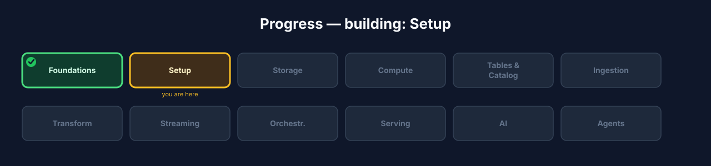
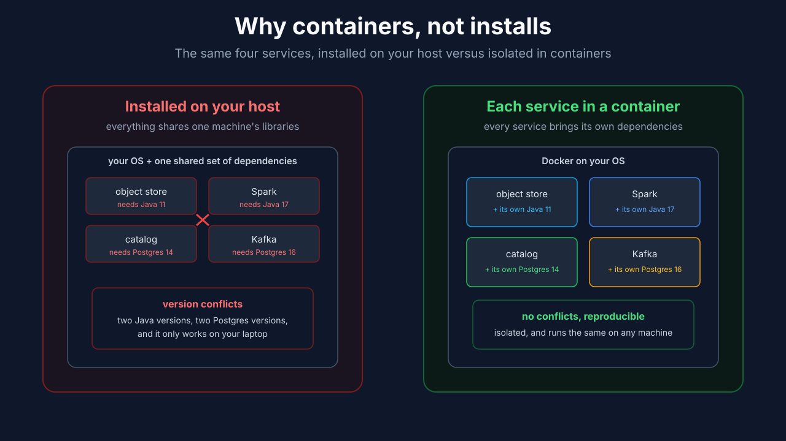
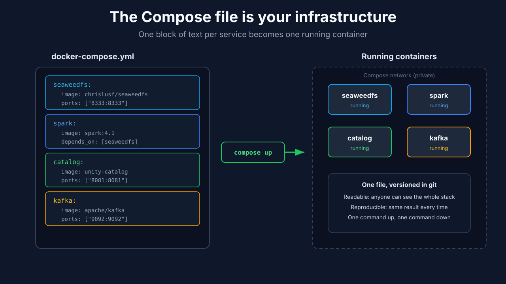
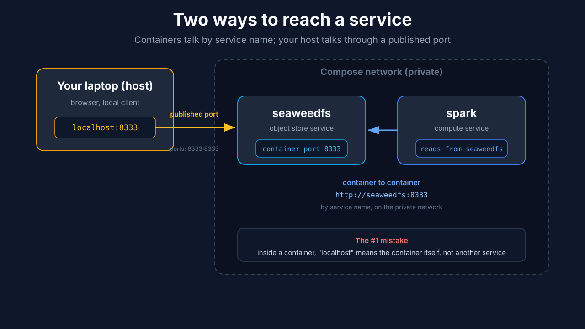
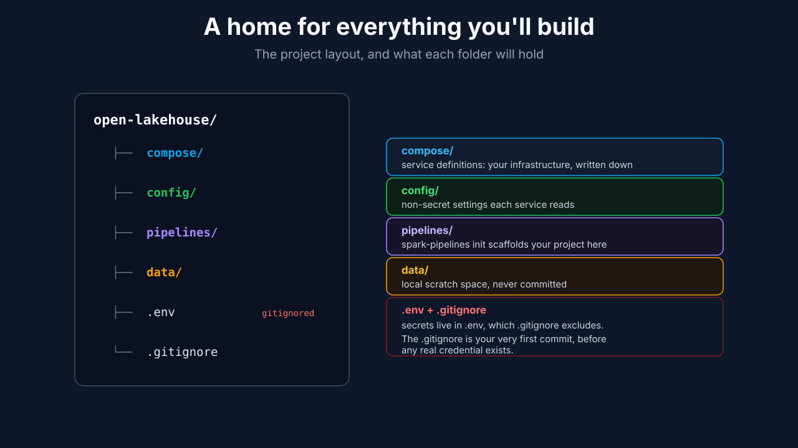
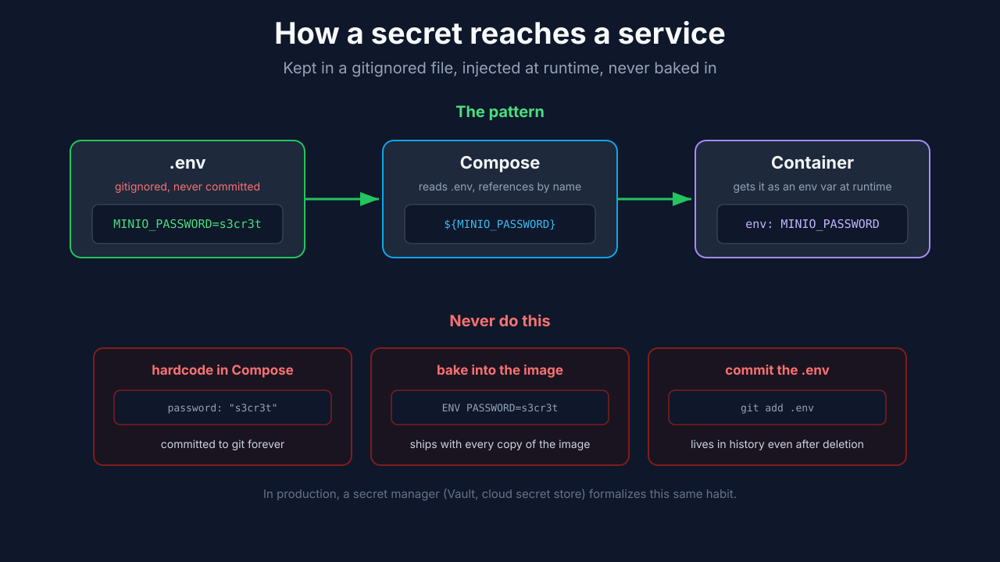
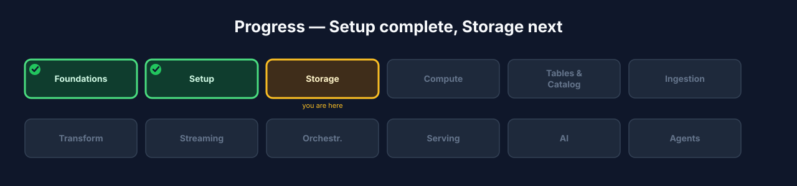

# Chapter 2: Setup

Chapter 1 was decisions. This is where you start running things. By the end you'll have the foundation in place on your machine: the tools installed, the project laid out, and Docker confirmed working, ready to add the first service to.

A lakehouse is a handful of services (an object store, a Spark cluster, a catalog and its database, and later Kafka and an orchestrator), their configuration, and the wiring that lets them find each other. You're going to build that yourself, one service at a time, so you understand exactly what's running and can fix it when something breaks. The services run as containers, and Docker Compose is what defines and runs them, so that's the tool at the center of this chapter.

This chapter does the groundwork the rest of the build stands on: install the prerequisites, lay out the project directory, set up configuration and secrets properly before there are any secrets to leak, and confirm Docker actually works. You won't stand up a lakehouse service yet. That starts in the next chapter with the object store. What you'll have when you finish here is a clean, working foundation to build on.



**Figure 2.1**. Progress map with **Setup** highlighted.

## Learning objectives

By the end of this chapter you'll be able to:

- Install the prerequisites (Docker with Compose, Python, and Git) and say what each one is for in the stack.
- Explain what Docker and Docker Compose actually give you here: reproducible services defined in a file, rather than software installed by hand on your machine.
- Lay out a project directory that will hold the service definitions, configuration, and pipeline code you build over the rest of the course.
- Keep configuration and secrets in a `.env` file that stays out of version control, and explain why that habit matters before you have any real credentials.
- Confirm Docker can pull and run a container, so you know your foundation works before the first real service.

## The mental model: services in containers, defined in a file

A lakehouse is several independent services that have to run at once and find each other: an object store, a Spark cluster, a catalog and its database, and later Kafka and an orchestrator. You could install each one directly on your machine, but that road is painful and you've probably been down it: version conflicts, half-uninstalled leftovers, and a setup that works on your laptop and nowhere else. It also doesn't resemble how any of this runs in production.

So you don't install these services on your host. You run each one as a **container**: a packaged, isolated copy of the software with its own dependencies baked in, that runs the same way on any machine. Docker is what runs containers. That's the first tool you install, and for most of this build it's the only thing that actually touches your host system. The object store, Spark, the catalog, Kafka, they all run as containers on top of Docker, so your machine stays clean and every reader ends up with the same stack.

Running one container by hand is a long command with a lot of flags. Running six of them, wired together with shared networks and consistent settings, is unmanageable that way. That's what **Docker Compose** solves. Compose lets you describe your services in a single file, `docker-compose.yml`, one block per service, saying which image it runs, what ports it exposes, and how it connects to the others. Then one command brings the whole set up, and another tears it down. The file is the source of truth: it's readable, you keep it in version control, and it *is* your infrastructure, written down rather than assembled by memory.

That is the pattern for the rest of the course. Each chapter adds one service to this Compose file, brings it up, and confirms it's healthy, so by the end you have the whole stack described in one file you wrote and understand line by line. This chapter just gets Docker and Compose in place so the next one can stand up the first real service.



**Figure 2.2**. The same four services installed directly on your host (shared dependencies, version conflicts, works only on your machine) versus each in its own container (isolated dependencies, no conflicts, reproducible anywhere).



**Figure 2.3**. One block of text per service in `docker-compose.yml` becomes one running container. The file is your infrastructure: readable, versioned, and reproducible with one command.

## Why a stack of services, not one program

It's worth being clear about why a lakehouse is built as several separate services instead of one big application, because that shape drives everything about how you run it.

Each piece of the lakehouse does one job. The object store holds bytes. Spark runs computation. The catalog tracks tables and governs access. Kafka carries event streams. You could imagine bundling all of that into a single program, but you'd regret it fast: those jobs have completely different resource needs, they scale differently, and they evolve on their own schedules. Computation is bursty and hungry for CPU and memory; storage is steady and wants disk; the catalog is a small, always-on coordinator. Welding them together means you can't scale or restart one without dragging the others along.

So instead, each job runs as its own service, in its own container, and they cooperate over the network. This is the same reasoning behind what people call a microservices architecture, though here it's less a philosophy and more just how these tools are built. The payoff is concrete. You can scale compute up for a heavy job and leave storage untouched. You can restart the catalog without stopping Spark. You can swap one object store implementation for another, or run a query engine that isn't Spark, because each service talks to the others through stable interfaces rather than shared internals. And it mirrors how this runs in production, where these are genuinely separate systems, often on separate machines or managed services entirely.

That decomposition is exactly why Docker Compose is the right tool. Compose is built to define and run a set of cooperating services as a unit, which is precisely what a lakehouse is. Each service you add over the coming chapters is one more block in the Compose file, one more independently running container, joined to the same private network so the others can reach it. The next section is about that network: how services find and talk to each other.

## How services find each other: networks and ports

Once you have several containers that need to talk (Spark reading from the object store, the catalog answering both), you need to know how they reach each other, and how *you* reach them from your laptop. This trips up almost everyone the first time, so it's worth getting straight now, before you have real services to debug.

When Compose brings up your services, it puts them all on a single private network it creates for the project. On that network, each service is reachable by its **service name**, the name of its block in the Compose file. So if you define a service called `minio`, another container can reach it at the address `minio`, and Compose's built-in DNS resolves that name to the right container. You do not use IP addresses, and you do not use `localhost`; you use the service name. This is why the Compose file's service names matter: they become the hostnames your services use to find each other.

Reaching a service from your **host** (your laptop, outside the container network) is a separate thing, and this is the distinction that causes the confusion. A container's ports are private to that Compose network unless you explicitly **publish** them. Publishing a port maps a port on your host to a port inside the container, written `ports: ["9000:9000"]` in the service definition, meaning host port 9000 forwards to container port 9000. Only then can you open `http://localhost:9000` in your browser or point a client on your machine at it. A service with no published ports still works fine for other containers; it's just invisible from your host.

So there are two ways to reach a service, and they use different addresses:

- **Container to container** (inside the stack): use the service name, for example `http://minio:9000`. This is how Spark will reach the object store.
- **Host to container** (from your laptop): use `localhost` and the published port, for example `http://localhost:9000`. This is how you open a web console or run a local client.

Getting these two mixed up is the single most common "why can't it connect" mistake: a container trying to reach another at `localhost` (which, inside a container, means *itself*), or you trying to hit a service from your laptop that never published its port. When a connection fails later in the course, come back to this distinction first.



**Figure 2.4**. Services on the Compose network address each other by service name; the host reaches a service only through a published port.

## A note on operating systems

This course assumes Linux, and it's worth a sentence on why. Everywhere a lakehouse actually runs in production, an AWS EC2 instance, an EMR cluster, a Kubernetes node, a cloud VM, is Linux. Docker itself is Linux-native; on macOS and Windows it runs a hidden Linux VM to do its work. So developing on Linux isn't an arbitrary preference, it means the environment you build in matches the one you'll deploy to, and you hit fewer surprises when you ship.

That doesn't mean you need a dedicated Linux machine. What it means concretely:

- **Linux:** you're in the target environment already. Everything in this course is written for you.
- **Windows:** use WSL2 with an Ubuntu distribution and do everything inside that Ubuntu shell. WSL2 is a real Linux kernel, so this is genuinely Linux, not an emulation, and it aligns perfectly with the rest of the book. Don't run the stack from PowerShell; the commands here assume a Unix shell.
- **macOS:** Docker Desktop runs this stack fine on top of its Linux VM. It works well for development, with occasional differences around file mounts and container networking that surface rarely. If you hit friction, a Linux VM or WSL2-style Linux box is the reliable fallback.

Every command in this book is written for a Linux shell (bash, `apt`, and so on). On Windows that's your WSL2 Ubuntu shell; on macOS it's your terminal, with Homebrew standing in for `apt` where you need to install something on the host.

## Prerequisites

The point of running everything in containers is that your host stays clean, so the list of things you install directly is short. Three tools:

- **Docker, with the Compose plugin.** This is the one that matters. It runs every service in the stack, so if you install nothing else, install this. Follow Docker's official install guide for your OS, it's kept current and is the authoritative source: [Docker Desktop for Mac](https://docs.docker.com/desktop/install/mac-install/), [Docker Desktop for Windows](https://docs.docker.com/desktop/install/windows-install/) (enable the WSL2 backend when prompted), or [Docker Engine](https://docs.docker.com/engine/install/) on Linux (install the `docker-compose-plugin` package alongside it). A couple of notes the guides don't stress: use `docker compose` (two words, the built-in plugin), not the deprecated standalone `docker-compose`; and on Linux, add your user to the `docker` group so you don't need `sudo` for every command.
- **Python 3.10 or newer.** You'll write pipeline code and talk to Spark from Python, from your host, so you need it locally. This is the language you'll actually work in day to day.
- **Git.** To version your project: the Compose file, config, and pipeline code you build. Assume you have it; if not, install it.

Notice what's *not* here. You don't install Spark, or a JVM, or a database on your host. Spark is a JVM application, but its Java lives inside the Spark container you'll define in the Compute chapter, so there's nothing to set up for it now. The catalog's database is a container too. Keeping these off your host is the whole point of the container approach: the only things touching your machine are Docker, Python, and Git.

A note on hardware, because this is real distributed-systems software running locally. Plan for around 16 GB of RAM to run the full stack comfortably; 8 GB works if you bring services up one at a time and stop what you're not using, which the one-service-per-chapter structure makes easy. Give Docker a generous memory allowance in its settings (on Docker Desktop, under Resources), since the default is often too low for Spark. Budget 20 to 50 GB of free disk for container images and data.

After installing, confirm the tools are present:

```bash
docker --version
docker compose version
python3 --version
git --version
```

If any of these errors, fix it before going further. A missing tool is far easier to diagnose now than halfway through bringing up your first service.

## Lay out the project

You're building this from nothing, so start with an empty directory and put it under version control:

```bash
mkdir open-lakehouse && cd open-lakehouse
git init
```

You'll grow a specific structure over the course, but a little intention now saves cleanup later. Create these top-level folders:

```bash
mkdir compose config pipelines data
```

What each is for:

- **`compose/`** holds the service definitions. You can keep everything in one `docker-compose.yml` at the root, but as the stack grows it's cleaner to split it, one file per service, and combine them. Either way, this is where your infrastructure lives.
- **`config/`** holds service configuration that isn't secret: the settings files each service reads. It gets populated as you add services.
- **`pipelines/`** is where your data pipelines will live. You won't hand-build its internal structure: in the Transformation chapter you'll run Spark Declarative Pipelines' own initializer (`spark-pipelines init --name <project>`), which scaffolds a project subdirectory here containing a `spark-pipeline.yml` spec and a `transformations/` folder with example definitions. For now it's just an empty home waiting for that.
- **`data/`** is a local scratch space for sample data and anything you don't want committed.

None of this is load-bearing yet. The point is that you have a home for each kind of thing you'll create, so when a later chapter says "add the Spark service" or "initialize the pipeline project," you already know where it goes. We'll create the actual `docker-compose.yml` in the next chapter, when there's a first service to put in it.



**Figure 2.5**. The project layout. Each folder is a home for one kind of thing you'll build; `.env` holds secrets and is excluded by a `.gitignore` you commit first.

## Configuration and secrets

Services need configuration, and some of it is sensitive: access keys, database passwords. The rule you adopt now, before you have a single real credential, is that secrets never go in version control. Getting this habit in place while the stakes are zero is the point; it's much harder to retrofit after a key has already been committed and lives in your git history forever.

Two kinds of configuration, kept separate:

- **Non-secret config** (ports, service names, non-sensitive settings) can live in files you commit, so anyone with your project gets a working setup.
- **Secrets** (credentials, keys) go in a single `.env` file that you never commit. Services and Compose read values from it at startup.

Create the `.env` file and, in the same breath, make sure git will ignore it:

```bash
touch .env
echo ".env" >> .gitignore
echo "data/" >> .gitignore
git add .gitignore
git commit -m "Ignore secrets and local data"
```

That is deliberately the first thing you commit: the rule that keeps secrets out. The `.env` file is empty for now; you'll add values to it as you bring up services that need credentials, starting with the object store's access keys in the next chapter. Compose automatically reads a `.env` file sitting next to your `docker-compose.yml`, so any variable you define there is available to your service definitions without extra wiring.

One habit worth adopting alongside this: commit an example file, `.env.example`, that lists the *names* of the variables with placeholder values, and do commit that one. It documents what configuration the project expects without exposing any real secret, so someone setting up the project later knows exactly what to fill in.

The mechanism that makes this work is **environment-variable injection**: Compose reads `.env`, and each service's definition pulls the values it needs into the container's environment at startup, with a line like `environment: [ "MINIO_ROOT_PASSWORD=${MINIO_PASSWORD}" ]`. The secret lives in one gitignored file, gets injected into the container that needs it at runtime, and never appears in anything you commit. That indirection is the whole point, so two anti-patterns follow directly from it. Never hardcode a secret literally in `docker-compose.yml`, because that file is committed and the secret would go straight into your history. And never bake a secret into a container image (in a Dockerfile, say), because images get shared and pushed to registries, and anyone who pulls the image gets the secret with it. Config and code are shareable; secrets are injected at runtime and stay out of both.

This `.env` approach is right for local development, and it's worth being honest that it is not how you handle secrets in production. A gitignored file on a laptop doesn't rotate credentials, doesn't audit who read them, and doesn't scale across a team or a cluster. In production, secrets live in a dedicated secret manager, HashiCorp Vault, or a cloud provider's offering like AWS Secrets Manager, which handle rotation, access control, and auditing, and inject secrets into services the same way at runtime. The habit you're building now, keep secrets out of code and inject them at startup, is exactly the habit those tools formalize, so nothing you learn here is wasted when you graduate to them. We return to this in the deployment chapter.



**Figure 2.6**. The pattern: a secret lives in a gitignored `.env`, Compose references it by name, and the container receives it as an environment variable at runtime. The three anti-patterns below all commit the secret in some form.

## Verify Docker works

You won't stand up a lakehouse service in this chapter, that starts in the next one with the object store, but take ten seconds to confirm Docker can actually pull and run a container before you depend on it:

```bash
docker run hello-world
```

If you see Docker pull the image and print a "Hello from Docker!" message, your install works: Docker can reach a registry, pull an image, and run a container, which is everything the rest of the course stands on. That's all you need here; the first real `docker compose up` is the object store in the next chapter.

If that command failed, the usual causes are: Docker isn't running (start Docker Desktop, or `sudo systemctl start docker` on Linux), you're in a Windows PowerShell shell instead of WSL2, or a network restriction is blocking the image pull. Fix the cause and re-run before moving on.

## Checkpoint

You're ready to move on when:

- Docker, Compose, Python, and Git are installed and their version commands all work.
- You have a project directory under version control, with the `compose/`, `config/`, `pipelines/`, and `data/` folders laid out.
- Your first commit is a `.gitignore` that excludes `.env` and `data/`, and you understand why secrets stay out of version control.
- `docker run hello-world` printed the welcome message, confirming Docker can pull and run a container.

## Try it yourself

1. **Read a Compose file's shape.** Look up the reference for a `docker-compose.yml` service block and note the common keys (`image`, `ports`, `environment`, `volumes`, `depends_on`). You'll use every one of these as you add real services.
2. **Read what `hello-world` actually did.** Run `docker images` and `docker ps -a` after it, and notice the image it pulled and the stopped container it left behind. Then clean them up with `docker rm` and `docker rmi`. Knowing how to see and remove what Docker leaves around is a habit that pays off constantly.
3. **Reference a secret from Compose.** Add a line like `GREETING=hello` to your `.env`, then write a tiny Compose service that echoes `${GREETING}`, and confirm the value flows through. This is exactly how service credentials will reach your real services later.

## Check your understanding

- Why run each service in a container instead of installing it on your host? Give two concrete reasons.
- What does Docker Compose add on top of Docker, and why does that matter once you have more than one service?
- Why is the very first commit a `.gitignore` that excludes `.env`? What problem does that habit prevent?
- What does the `docker run hello-world` check actually prove about your setup?

## Recap and what's next

- The only tools on your host are **Docker (with Compose), Python, and Git**; everything else runs in containers. Plan for around 16 GB of RAM to run the full stack comfortably.
- Services run as **containers defined in a Compose file**, which is your infrastructure written down: readable, versioned, reproducible.
- Secrets live in a gitignored **`.env`**, and keeping them out of version control is the first habit you commit.
- You confirmed Docker can pull and run a container, and laid out a project directory ready for its first real service.
- **Next, Chapter 3, Storage:** create your first real service, an S3-compatible object store, in the `docker-compose.yml` you'll start for real, and set up the warehouse it holds.



**Figure 2.7**. Progress map with **Setup ✓** and **Storage** highlighted next.
