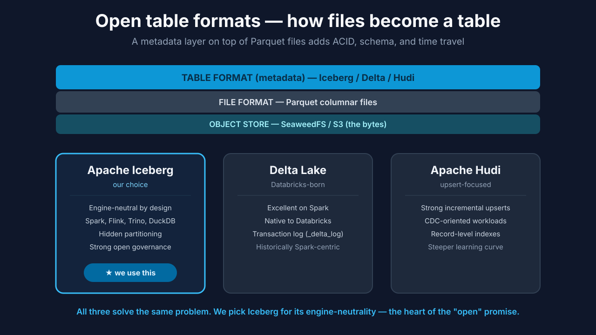

# Chapter 3 — Storage: Object Store + Open Table Format

## 3.0 What you'll build

The foundation of the whole lakehouse: a running **object store** on your laptop,
a **warehouse** location to hold table files, and a firm decision about the **open
table format** you'll layer on top. By the end you can put bytes in and get them
back out through the S3 API — and you'll know exactly why we chose SeaweedFS and
Iceberg.

This is the ground floor of everything. Every table, every pipeline, every model,
every query in the next ten chapters ultimately reads from and writes to what you
set up here. Get comfortable with the idea that "storage" in a lakehouse is *two*
distinct things stacked together — because confusing them is the single most
common source of muddled thinking about how lakehouses work.


**Figure 3.3** — Progress map with **Storage** highlighted.

## 3.1 Learning objectives

By the end of this chapter you can:

- Explain what an **object store** is and why it's the base of a lakehouse.
- Name three S3-API object stores (S3, MinIO, SeaweedFS) and when you'd pick each.
- Explain what an **open table format** adds on top of raw files.
- Compare Iceberg / Delta / Hudi and justify the Iceberg choice.
- Start the object store and create the warehouse bucket.

## 3.2 The big idea: storage is two decisions, not one

When someone says "we store our data in the lakehouse," they're actually
describing two separate choices that people constantly blur together:

1. **Where do the raw bytes physically live?** → the **object store**.
2. **What structure makes those bytes behave like a table?** → the **open table
   format**.

These are genuinely independent. You could keep the same object store and swap the
table format, or keep the format and move to a different object store — because the
format sits *on top of* files in the store, not inside the store's guts. Holding
these two ideas apart is the key mental unlock of this chapter. The rest of the
lakehouse makes sense once you see that "storage" is a two-layer sandwich:
cheap-bytes on the bottom, smart-structure on top.

## 3.3 Part 1 — Where the bytes live: the object store

> **Object storage** *(canonical term)*: cheap, effectively infinite, S3-API blob
> storage that holds all your data files.

Why object storage, and not a filesystem or a database? Three reasons: it's cheap
per gigabyte, it scales effectively without limit, and — critically for a
lakehouse — it's **decoupled from compute**, so you can point many engines at the
same files. The universal interface is the **S3 API**: originally Amazon's, now the
lingua franca that every object store speaks. Because your code targets the S3 API
rather than a specific product, moving between object stores is a configuration
change, not a rewrite.

### How object storage differs from a filesystem

It's tempting to think of an object store as "a hard drive in the cloud," but the
differences matter and explain a lot of lakehouse design:

- **No true folders.** Object stores have a flat namespace of keys. What looks like
  `warehouse/orders/data/file1.parquet` is really just one long key with slashes in
  it; the "folders" are a convenient fiction. This is why table formats keep their
  own precise index of files rather than trusting directory listings.
- **No in-place edits.** You can write a whole object or replace it, but you can't
  efficiently change byte 5,000 of a large file. This is *the* reason a table
  format works by writing new files and swapping a pointer, rather than editing
  existing ones — the storage layer simply doesn't support editing in place.
- **Massively parallel reads.** Many engines can read the same objects at once
  without contention. This is what makes "the same tables, many engines" (Chapter
  10) physically possible.

Understanding these three properties means you'll never be surprised by *why*
Iceberg does things the way it does. Its whole design is shaped by what object
storage can and can't do.

You'll meet three object stores:

- **Amazon S3** — the cloud original. Infinite, durable, zero-ops — but needs a
  cloud account and costs money to run. This is what most production lakehouses use.
- **MinIO** — a popular self-hosted, fully S3-compatible store. Great in labs and
  on-prem; slightly heavier footprint. You'll see it in many enterprise setups.
- **SeaweedFS** — lightweight, fast, tiny RAM footprint. **Our choice**, because
  it's the most laptop-friendly way to get a real S3 endpoint locally.

The important point: because all three speak the S3 API, the lakehouse you build
on SeaweedFS locally would run on Amazon S3 in production by changing an endpoint
and some credentials. Nothing about your tables or pipelines changes. *That* is
the payoff of building against a standard interface.


**Figure 3.1** — S3 vs. MinIO vs. SeaweedFS, all speaking the same S3 API.

> **Warehouse (location)** *(canonical term)*: the object-storage path where
> lakehouse tables physically live. Ours will be `s3a://lakehouse/warehouse`.

Note the `s3a://` prefix — that's the scheme Spark/Hadoop uses to talk to
S3-compatible storage. You'll see `s3://` (AWS tools), `s3a://` (Spark/Hadoop), and
plain paths in different contexts; they all point at the same objects, just through
different clients. Don't let the prefixes confuse you — they're dialects of the same
address.

## 3.4 Part 2 — How files become a table: the open table format

Cheap files alone are a data lake — and a data lake has no transactions, no
reliable schema, no safe concurrent writes (remember Maya's weekend from Chapter
1). To get warehouse guarantees we add a layer on top of the files.

> **Open table format** *(canonical term)*: a specification — we'll use **Apache
> Iceberg** — that adds a metadata layer over your data files so a plain pile of
> files behaves like a transactional table.

Think of it as three layers stacked:

1. **Object store** — the raw bytes (SeaweedFS / S3).
2. **File format** — Parquet columnar files.
3. **Table format** — Iceberg metadata that says "these Parquet files, at this
   snapshot, are the table `orders`," and coordinates ACID writes, schema
   evolution, and time travel.

The middle layer, Parquet, is worth a moment. Parquet is *columnar* — it stores all
the values of one column together, rather than row by row. That's a huge win for
analytics: a query that only needs the `order_total` column reads just that column's
data, skipping the rest. It also compresses beautifully, because similar values sit
next to each other. Parquet is the near-universal file format under all three table
formats; the table format's job is not to replace Parquet but to *organize* many
Parquet files into a coherent, transactional table.



**Figure 3.2** — Object store → Parquet → table format; Iceberg vs. Delta vs. Hudi.

The three main open table formats:

- **Apache Iceberg** — engine-neutral by design (Spark, Flink, Trino, DuckDB, …),
  hidden partitioning, strong open governance. **Our choice.**
- **Delta Lake** — excellent on Spark, native to Databricks; historically
  Spark-centric (now opening up).
- **Apache Hudi** — strong incremental upserts and CDC-oriented workloads; steeper
  learning curve.

All three solve the same problem. We pick **Iceberg** for its engine-neutrality —
the heart of the "open" promise, and what lets Chapter 10 serve the *same* tables
to multiple engines through Unity Catalog OSS.

### Under the hood — Iceberg's "hidden partitioning"

Here's one Iceberg feature worth knowing early because it fixes a decades-old
pain. In older systems, if a table was partitioned by day, you had to *know* that
and write your queries with the exact partition column, or you'd accidentally scan
the whole table. Get it wrong and a "quick" query reads terabytes. Iceberg's
**hidden partitioning** decouples how the table is physically laid out from how you
query it: you write a normal `WHERE order_date = '2026-01-01'` and Iceberg figures
out which files to read, using the partition scheme without you having to name it.
It's a small thing that removes an entire category of expensive mistakes.

### Under the hood — you're choosing now, building in Chapter 5

This chapter makes the two storage *decisions* — object store (SeaweedFS) and table
format (Iceberg). Chapter 5 does the hands-on Iceberg build — creating tables
through **Unity Catalog OSS**, evolving schema, and time-travel queries — so we
don't conflate the *choice* with the *mechanics*. Keep them separate in your head:
this chapter is "what and why"; Chapter 5 is "how."

## 3.5 Build — start the object store and create the warehouse

Step 1 — start storage and confirm it's healthy:

```bash
./lakehouse start
./lakehouse status
```

Expected: the object store shows healthy in the status table. The S3 endpoint is
reachable at `http://localhost:8333` (containers reach it at
`http://host.docker.internal:8333`).

**What just happened?** You started the object store and confirmed it's answering.
The two addresses matter: *you* reach it at `localhost:8333` from your host shell,
while *containers* (like Spark, soon) reach the same store at
`host.docker.internal:8333`. Same store, two doors — one for the host, one for
containers. Mixing these up is a classic source of "connection refused" errors, so
note which context you're in.

> Reminder from Chapter 2: the object store and Postgres run **natively on your
> host**, not as containers. If storage isn't healthy, confirm the host service is
> running before anything else.

Step 2 — confirm the storage credentials in your `.env`:

```bash
# .env (set in Chapter 2)
S3_ENDPOINT=http://host.docker.internal:8333
S3_ACCESS_KEY=<your-key>
S3_SECRET_KEY=<your-secret>
S3_BUCKET=lakehouse
S3_WAREHOUSE=s3a://lakehouse/warehouse
```

Step 3 — verify the warehouse bucket exists and is listable over the S3
API (using any S3 client, e.g. the AWS CLI pointed at the local endpoint):

```bash
aws --endpoint-url http://localhost:8333 s3 ls s3://lakehouse/
```

Expected: the `lakehouse` bucket lists successfully (empty is fine — we haven't
written tables yet). If the bucket doesn't exist, create it:

```bash
aws --endpoint-url http://localhost:8333 s3 mb s3://lakehouse
```

**What just happened?** You just talked to your local object store using the *same*
AWS CLI you'd use against real Amazon S3 — the only difference is `--endpoint-url`
pointing at your laptop instead of AWS. That's the S3-API promise made concrete:
one tool, one command shape, whether the store is on your machine or in the cloud.
An empty bucket is the correct result; you've built the container that tables will
live in, not the tables themselves.

## 3.6 Troubleshooting

- **Storage shows unhealthy in `status`.** The host-native object store isn't
  running. This is the #1 setup snag — confirm the service is up on the host before
  suspecting anything else.
- **`aws s3 ls` gives "Could not connect to the endpoint."** You're pointed at the
  wrong address or the store is down. From your host shell use `localhost:8333`, not
  `host.docker.internal:8333` (that's the container's door).
- **"Access Denied" listing the bucket.** The credentials the AWS CLI is using don't
  match the store's. Confirm `S3_ACCESS_KEY`/`S3_SECRET_KEY` in `.env`, and that your
  AWS CLI profile or environment is using the same values.
- **Bucket "already exists" when you try to create it.** That's fine — it means it's
  already there. Move on.

## 3.7 Checkpoint

- The object store is healthy in `./lakehouse status`.
- The `lakehouse` bucket exists and is listable over the S3 API.
- Your `.env` points `S3_WAREHOUSE` at `s3a://lakehouse/warehouse`.
- You can state, in one sentence each, **why SeaweedFS** and **why Iceberg**.
  (The catalog — Unity Catalog OSS — is confirmed in Chapter 5.)
- You can explain the difference between the object store and the table format
  without hand-waving.

## 3.8 Try it yourself

1. **Round-trip a file.** Use the AWS CLI to `cp` a small text file into
   `s3://lakehouse/`, list it, download it back to a new name, and confirm the
   contents match. You've just proven the "put bytes in, get bytes out" promise.
2. **Prove the flat namespace.** Upload a file with a key like
   `demo/a/b/c/file.txt`, then list `s3://lakehouse/demo/`. Notice how the "folders"
   are just prefixes of one key, not real directories.
3. **Swap the endpoint in your head.** Write down exactly which lines of your `.env`
   would change to run this same setup against real Amazon S3. (Answer: the endpoint
   and credentials — nothing about your tables.)
4. **Justify the choices out loud.** In one sentence each, explain to an imaginary
   teammate why we chose SeaweedFS for the object store and Iceberg for the table
   format. If you can't yet, re-read 3.3 and 3.4.

## 3.9 Check your understanding

- What are the two independent decisions bundled inside the word "storage"?
- Give two properties of object storage that shape how table formats are designed.
- What does a table format add that a plain pile of Parquet files lacks?
- Why does the *same* lakehouse run on SeaweedFS locally and Amazon S3 in
  production with only a config change?

## 3.10 Recap & what's next

- Storage is **two decisions**: an **object store** for the bytes and a chosen
  **open table format** for the structure.
- Object storage is cheap, infinite, decoupled from compute, has no real folders,
  and can't edit in place — which is exactly why table formats work by adding files
  and swapping pointers.
- We run **SeaweedFS** (S3 API on `:8333`) and will use **Iceberg** (engine-neutral,
  with hidden partitioning).
- Our warehouse location is `s3a://lakehouse/warehouse`.
- **Next — Chapter 4, Compute:** bring up Spark and connect to it with a **Spark
  Connect** thin client (`sc://`) to run a first job against this storage.


**Figure 3.4** — Progress map with **Storage ✓** and **Compute** highlighted next.
