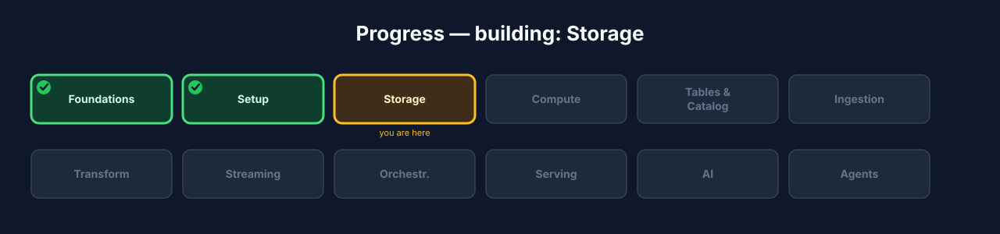
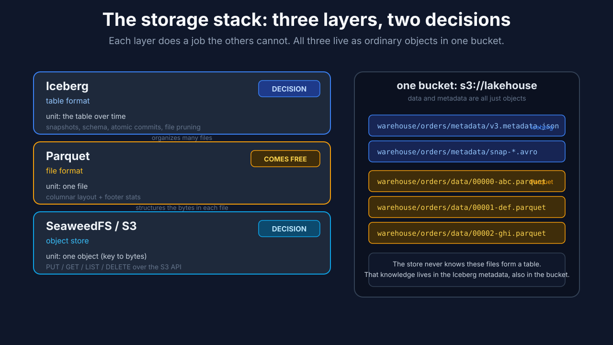
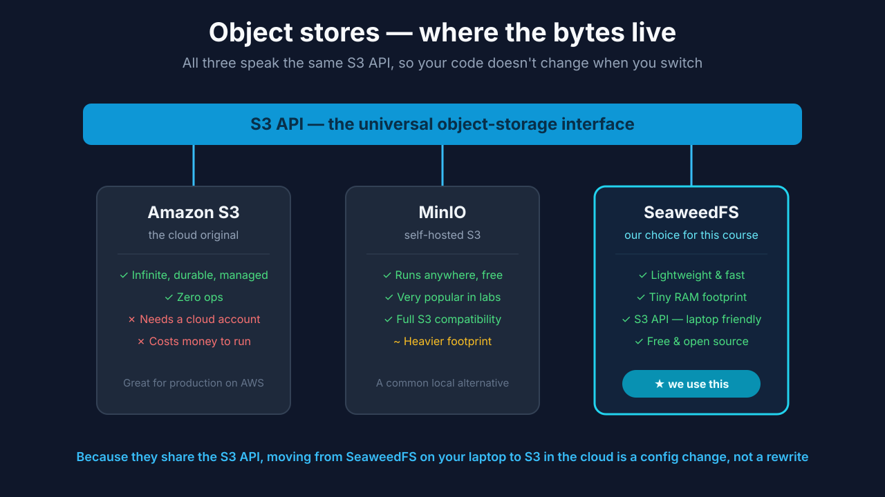
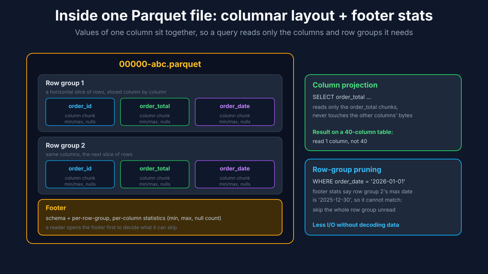
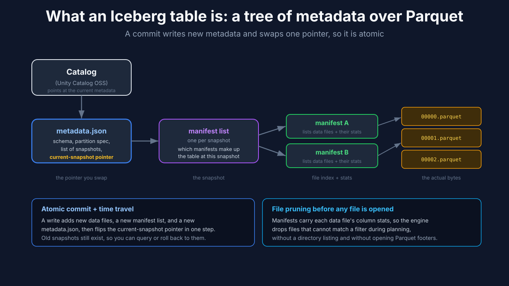
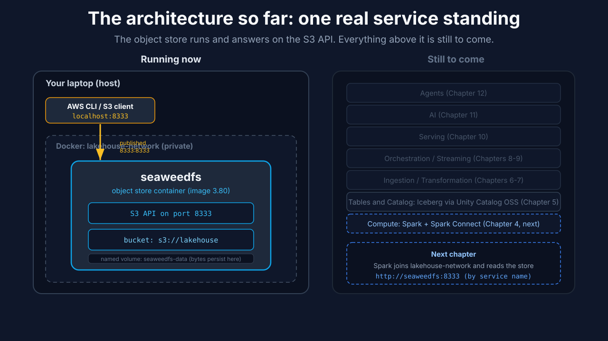
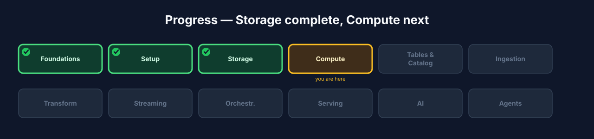

# Chapter 3: Storage

This is the first chapter where you build a real piece of the lakehouse. By the end you'll have an object store running as the first service in your `docker-compose.yml`, a bucket to hold your tables, and you'll have put bytes in and pulled them back out through the S3 API, all on your own machine.

Storage is the ground floor. Every table, pipeline, model, and query in the chapters ahead ultimately reads from and writes to what you set up here. And the single most useful idea in this chapter is that "storage" in a lakehouse is really two separate decisions stacked together: where the raw bytes physically live, and what turns those bytes into a real table. People blur these constantly, and keeping them apart is what makes the rest of the lakehouse make sense. This chapter builds the bottom half, the object store, and settles the decision about the top half, the table format. Chapter 5 builds that top half for real.



**Figure 3.1**. Progress map with **Storage** highlighted.

## Learning objectives

By the end of this chapter you'll be able to:

- Explain the two separate decisions bundled inside the word "storage": the object store and the table format.
- Describe what an object store is, why it's the base of a lakehouse, and how it differs from a filesystem.
- Weigh the common object stores (S3, MinIO, SeaweedFS) on the axes that matter and pick the right one for a given situation.
- Explain what an open table format adds on top of raw Parquet files, and weigh Iceberg against Delta on engine neutrality, governance, and workload fit.
- Describe what an Iceberg table actually is on disk (Parquet data files, metadata, and manifests) so you recognize its shape before you create one in Chapter 5.
- Stand up the object store as the first service in your `docker-compose.yml`, create the warehouse bucket, and round-trip a file through the S3 API.

## The storage stack: three layers, two decisions

People blur three different things together when they say "storage": SeaweedFS, Parquet, and Iceberg. They sit at three different levels, and each one does a job the others can't. Get these straight and the rest of the lakehouse stops being mysterious.

**SeaweedFS is the object store: the substrate.** Its unit is the object, an opaque blob of bytes at a key, reached over the S3 API (`PUT`, `GET`, `LIST`, `DELETE`). It knows keys and bytes and nothing else. It has no idea whether an object is a Parquet file, a JPEG, or a log line. It gives you cheap, effectively unlimited capacity and parallel reads, and in exchange it offers zero table semantics: no schema, no transactions, no way to update a set of objects atomically. It moves bytes. That is the whole contract.

**Parquet is the file format: how the bytes inside one object are laid out.** Its unit is a single file. Parquet is columnar: it stores all the values of one column together rather than row by row, split into row groups, and each file carries a footer with the schema and per-column statistics (min, max, null counts) for every row group. That layout is what makes analytics fast: a query touching 3 of 40 columns reads only those 3 columns' bytes, and the footer stats let a reader skip entire row groups that can't match a filter, without decoding them. But a Parquet file knows only about itself. It has no idea other Parquet files exist, or that together they form a table called `orders`. You don't choose Parquet as a decision; Iceberg and Delta both write it. It comes with the territory.

**Iceberg is the table format: what makes many files behave as one table.** Its unit is the table across time. Iceberg stores no data itself. It's a tree of metadata files, sitting in the same bucket next to the Parquet, that records exactly which data files make up the table right now and at every past snapshot. That metadata is what supplies everything the store and the file format can't: a commit becomes atomic by writing new metadata and swapping a single pointer; schema evolution, snapshots, and time travel fall out of versioned metadata; and because each file's column stats are recorded up in the manifests, the engine prunes whole files during scan planning before it opens a single Parquet footer. Iceberg imposes table meaning on a set of otherwise-independent files; it delegates the actual byte storage down to the object store.

So the stack reads bottom to top: the object store holds opaque bytes, Parquet structures the bytes inside each file, and Iceberg metadata (also just files in the bucket) ties many Parquet files into one transactional table. Two of these are decisions you make, the object store and the table format; Parquet is the near-universal default underneath both.



**Figure 3.2**. SeaweedFS holds objects, Parquet structures each file, and Iceberg metadata ties many files into one table. Data and metadata all live as ordinary objects in the same bucket.

| Layer | Example | Its unit | Knows about | Can't do |
|---|---|---|---|---|
| Object store | SeaweedFS / S3 | one object (key to bytes) | keys, bytes | schema, transactions, atomic multi-file update |
| File format | Parquet | one file | that file's columns and stats | that other files or a table exist |
| Table format | Iceberg | the table over time | which files are the table, per-file stats, snapshots, schema history | store or move bytes (delegates to the object store) |

Why insist on the split? Because it shows up the moment you operate this. You debug at two layers, and they fail differently: a storage failure looks like a bad endpoint, wrong credentials, a missing bucket, or throttling, while a table failure looks like a dangling metadata pointer, a snapshot that references a deleted file, or a schema mismatch. If you don't know which layer you're in, you check the wrong one. And because both data and metadata are just objects in your bucket, you can `LIST` them, open a metadata JSON by hand, and see exactly what the engine sees when something breaks. Nothing is hidden inside a proprietary storage engine.

We build the bottom layer now and settle the top-layer decision; Chapter 5 builds the top layer for real.

## Part 1. Where the bytes live: the object store

Why object storage, and not a filesystem or a database? Three reasons: it's cheap per gigabyte, it scales effectively without limit, and, critically for a lakehouse, it's decoupled from compute, so you can point many engines at the same files without any of them owning the storage. The universal interface is the S3 API, originally Amazon's, now the lingua franca that every object store speaks. Because your code targets the S3 API rather than a specific product, moving between object stores is a configuration change, not a rewrite.

### How object storage differs from a filesystem

It's tempting to think of an object store as "a hard drive in the cloud," but the differences matter and explain a lot of lakehouse design:

- **No true folders.** Object stores have a flat namespace of keys. What looks like `warehouse/orders/data/file1.parquet` is really just one long key with slashes in it; the "folders" are a convenient fiction. This is why table formats keep their own precise index of files rather than trusting directory listings.
- **No in-place edits.** You can write a whole object or replace it, but you can't efficiently change byte 5,000 of a large file. This is the reason a table format works by writing new files and swapping a pointer rather than editing existing ones: the storage layer simply doesn't support editing in place.
- **Massively parallel reads.** Many engines can read the same objects at once without contention. This is what makes "the same tables, many engines" (Chapter 10) physically possible.

Understanding these three properties means you'll never be surprised by why Iceberg does things the way it does. Its whole design is shaped by what object storage can and can't do.

### Weighing the object store: S3, MinIO, SeaweedFS

Where you run largely dictates the object store, so this is less a free choice than a "use the right one for your environment" decision. Three you'll meet:

- **Amazon S3** (and its cloud siblings, GCS and Azure Blob) is what production runs on: infinite, durable, zero-ops, and already integrated with everything else in the cloud. It needs an account and costs money, so it's not what you develop against locally. There's no case for running your own object store on top of a cloud that already gives you one.
- **MinIO** is the common self-hosted, S3-compatible store for on-prem and lab deployments: mature, feature-rich, with erasure coding and replication when it's genuinely holding your data.
- **SeaweedFS** is a lighter self-hosted S3-compatible store, and it's what this course runs locally.

The honest reason we land on SeaweedFS over MinIO here is not "it's lighter." It's two concrete things. First, licensing: SeaweedFS is under a permissive license, while MinIO's server is AGPL, which some organizations can't take on. Second, and more specific to this stack, SeaweedFS handles S3 presigned-URL host rewriting in a way the catalog's credential vending depends on later: when Unity Catalog OSS vends short-lived, scoped credentials to a reader, the presigned URLs have to resolve correctly from both inside and outside the container network, and SeaweedFS supports that cleanly. That's a real "why we chose this" you can defend, not a preference. Because all three speak the S3 API, the lakehouse you build on SeaweedFS locally runs on Amazon S3 in production by changing an endpoint and some credentials; nothing about your tables or pipelines changes.



**Figure 3.3**. S3, MinIO, and SeaweedFS all speak the same S3 API, so the store is swappable by configuration.

> **Warehouse (location)** *(canonical term)*: the object-storage path where lakehouse tables physically live. Ours will be `s3a://lakehouse/warehouse`.

Note the `s3a://` prefix: that's the scheme Spark and Hadoop use to talk to S3-compatible storage. You'll see `s3://` (AWS tools), `s3a://` (Spark/Hadoop), and plain paths in different contexts; they all point at the same objects, just through different clients. Don't let the prefixes confuse you, they're dialects of the same address.

## Part 2. Inside the two formats: Parquet and Iceberg

The top of this chapter named the three layers. Now we open the two that are worth understanding in detail: what a Parquet file looks like inside, and what an Iceberg table actually is on disk. You will not create a table here (that needs a compute engine and a catalog, which arrive in Chapters 4 and 5), but knowing the shape now means nothing in those chapters is a black box.

### What a Parquet file looks like inside

Parquet is columnar: instead of storing row 1, then row 2, then row 3, it stores all of column A's values together, then all of column B's. Physically, a file is split into row groups (horizontal slices of rows), each row group holds one column chunk per column, and a footer at the end records the schema plus per-column statistics (min, max, null count) for every row group.

That layout buys two concrete speedups, and both matter for every query you will write:

- **Column projection.** A query that selects 3 of 40 columns reads only those 3 columns' chunks and never touches the other 37 columns' bytes. Row-oriented formats can't do this; they have to read whole rows.
- **Row-group pruning.** Before decoding anything, a reader checks the footer stats. If you filter `WHERE order_date = '2026-01-01'` and a row group's recorded max date is `2025-12-30`, that row group cannot match, so the reader skips it unread. Less I/O, no wasted decoding.



**Figure 3.4**. A Parquet file is row groups of column chunks plus a footer of statistics. Column projection reads only the needed columns; row-group pruning skips slices that can't match a filter.

Parquet also compresses well, because a column holds one type of value and similar values sit next to each other. You don't choose Parquet as a decision: Iceberg and Delta both write it. The table format's job is not to replace Parquet but to organize many Parquet files into one coherent, transactional table.

### What an Iceberg table is on disk

An Iceberg table is not a Parquet file and not a folder. It's a tree of metadata files, living in the same bucket next to the data, that a catalog points at. From the top down: the catalog holds a pointer to the current `metadata.json`; that file records the schema, the partition spec, and the list of snapshots, and it names the current snapshot; each snapshot points at a manifest list; the manifest list names the manifests; and each manifest enumerates the actual Parquet data files along with each file's column statistics.



**Figure 3.5**. Catalog pointer to metadata.json to manifest list to manifests to Parquet data files. Every layer above the data files is itself just an object in the bucket.

Two properties fall directly out of that structure, and they are the reason Iceberg exists:

- **Atomic commits and time travel.** A write adds new data files, a new manifest list, and a new `metadata.json`, then flips the current-snapshot pointer in a single step. Readers see either the old table or the new one, never a half-written mix. Old snapshots still exist, so you can query the table as it was, or roll back to it.
- **File pruning during planning.** Because manifests carry each data file's column stats, the engine drops files that cannot match a filter while it is still planning the scan, before it lists a directory or opens a single Parquet footer. On a large table this is the difference between reading a few files and reading all of them.

### Weighing the table format: Iceberg against Delta

There are three serious open table formats, but in practice the real decision is Iceberg versus Delta (Hudi is the specialist, strongest when your dominant workload is high-frequency upserts and change-data-capture). They do the same core job, so you weigh them on the axes that actually differ:

- **Engine neutrality.** How many engines read the format without a conversion step. Iceberg was engine-neutral from the start (Spark, Trino, Flink, DuckDB, and more), which is your lock-in insurance when you can't predict every future consumer. Delta was historically Spark-first and is opening up, but Iceberg leads here.
- **Governance of the spec.** Iceberg is a multi-vendor Apache project; Delta is open but driven primarily by Databricks. This is a bet on the next five years, not this quarter.
- **Workload and ecosystem fit.** Delta is excellent and deeply integrated if your center of gravity is Databricks, and fighting that to be a purist is a bad trade. Otherwise the neutrality argument wins.

This course uses **Iceberg**, because engine neutrality is exactly what lets Chapter 10 serve the same tables to multiple engines through Unity Catalog OSS. If your honest answer to "what is our center of gravity" is Databricks, you would reasonably land on Delta and most of this course still applies. The point is that you can see why the choice follows from the axes and redo it for your own weights. One rule regardless: standardize on one format. Running two side by side doubles your catalog config and compatibility testing for no gain.

This chapter settles the two decisions, the object store (SeaweedFS) and the table format (Iceberg). Chapter 5 does the hands-on Iceberg build: creating tables through Unity Catalog OSS, evolving schema, and time-travel queries. This chapter is "what and why"; Chapter 5 is "how."

## Build: SeaweedFS as your first service

This is the first real service in your stack, so it's the first thing in the `docker-compose.yml` you deleted the smoke test from at the end of Chapter 2. You'll define SeaweedFS, bring it up, and prove you can put bytes in and get them back out over the S3 API.

Step 1. Put the credentials in your `.env`. SeaweedFS needs an access key and secret to protect its S3 endpoint, and everything downstream (Spark, the catalog) will read the same values. These are secrets, so they live in the gitignored `.env` from Chapter 2, not in the Compose file:

```bash
# .env
S3_ACCESS_KEY=lakehouse
S3_SECRET_KEY=lakehouse-secret
S3_BUCKET=lakehouse
S3_WAREHOUSE=s3a://lakehouse/warehouse
```

Use your own values for a real deployment; these are fine for local development.

Step 2. Define the object store as a service. Create `docker-compose.yml` at your project root with a single service:

```yaml
services:
  seaweedfs:
    image: chrislusf/seaweedfs:3.80
    command: server -s3 -dir=/data
    ports:
      - "8333:8333"   # S3 API, reachable from your host at localhost:8333
    environment:
      AWS_ACCESS_KEY_ID: ${S3_ACCESS_KEY}
      AWS_SECRET_ACCESS_KEY: ${S3_SECRET_KEY}
    volumes:
      - seaweedfs-data:/data

volumes:
  seaweedfs-data:
```

A few things to notice, all of them concepts from Chapter 2 made concrete. The image is pinned to a specific version (`3.80`) rather than `latest`, so your stack is reproducible and doesn't drift when a new release lands. The `ports` entry publishes the S3 port so you can reach it from your laptop; other containers won't need that, they'll reach it by service name. The credentials are referenced as `${S3_ACCESS_KEY}`, which Compose reads from your `.env`, so no secret is written into the committed file. And the named volume `seaweedfs-data` is where the bytes actually persist; without it, everything you store vanishes when the container stops.

Step 3. Bring it up:

```bash
docker compose up -d
docker compose ps
```

Expected: `docker compose ps` shows the `seaweedfs` service running. The `-d` flag runs it in the background (detached), so you get your shell back; this is the normal way to run long-lived services, unlike the foreground `hello-world` run in Chapter 2.

Step 4. Create the warehouse bucket and round-trip a file. Point any S3 client at the published endpoint. Using the AWS CLI:

```bash
export AWS_ACCESS_KEY_ID=lakehouse
export AWS_SECRET_ACCESS_KEY=lakehouse-secret

# create the bucket your tables will live in
aws --endpoint-url http://localhost:8333 s3 mb s3://lakehouse

# put a file in, list it, and pull it back
echo "hello lakehouse" > /tmp/hello.txt
aws --endpoint-url http://localhost:8333 s3 cp /tmp/hello.txt s3://lakehouse/test/hello.txt
aws --endpoint-url http://localhost:8333 s3 ls s3://lakehouse/test/
aws --endpoint-url http://localhost:8333 s3 cp s3://lakehouse/test/hello.txt /tmp/back.txt
cat /tmp/back.txt   # -> hello lakehouse
```

**What just happened?** You talked to your local object store using the same AWS CLI you'd use against real Amazon S3; the only difference is `--endpoint-url` pointing at your laptop instead of AWS. That's the S3-API promise made concrete: one tool, one command shape, whether the store is on your machine or in the cloud. You created the bucket your tables will eventually live in, and you proved the fundamental contract, put bytes in, get the same bytes out. There are no tables yet, and that's correct: you built the container they'll live in, not the tables themselves.

One networking point worth fixing in your head now, because it will save you an hour later. You reached the store at `localhost:8333` because you're on the host and the port is published. When Spark connects in the next chapter, it's another container on the Compose network, so it will reach the same store at `http://seaweedfs:8333`, by service name, not `localhost`. Same store, two addresses, depending on who's asking. This is exactly the container-to-container versus host-to-container distinction from Chapter 2.

Step back and look at what you've actually stood up. It's one service, but it's a real one: an object store running in a container on a private Docker network, persisting to a named volume, answering the S3 API, and holding the bucket your tables will live in. Every layer above it in the reference architecture, compute, tables and catalog, ingestion, and the rest, is still empty. That's the point of building bottom-up: the ground floor is solid and you understand it completely before anything stands on it.



**Figure 3.6**. What's running after this chapter: the SeaweedFS object store, reachable at `localhost:8333` from your host and `seaweedfs:8333` from inside the network. Every layer above it is still to come.

## Troubleshooting

- **`docker compose ps` doesn't show seaweedfs running.** Check `docker compose logs seaweedfs`. A common cause is that the published port `8333` is already in use by something else; change the host side of the mapping (for example `"8433:8333"`) and reach it there.
- **`aws s3 ls` gives "Could not connect to the endpoint."** The service isn't up, or you're pointed at the wrong address. From your host shell use `localhost:8333`; `seaweedfs:8333` only resolves from inside the Compose network.
- **"Access Denied" listing the bucket.** The credentials the AWS CLI is using don't match the ones SeaweedFS started with. Confirm the `AWS_ACCESS_KEY_ID` / `AWS_SECRET_ACCESS_KEY` in your shell match `S3_ACCESS_KEY` / `S3_SECRET_KEY` in `.env`.
- **Your data vanished after a restart.** You almost certainly omitted the named volume, or ran `docker compose down -v`, which deletes volumes. `down` alone keeps your data; `down -v` wipes it. That `-v` is a real footgun on a stack holding data you care about.

## Checkpoint

- The `seaweedfs` service is defined in `docker-compose.yml` with a pinned image, a published port, and a named volume, and it shows running under `docker compose ps`.
- Credentials live in the gitignored `.env` and are referenced from Compose, not hardcoded.
- The `lakehouse` bucket exists, and you round-tripped a file through the S3 API.
- You can explain why you reach the store at `localhost:8333` but Spark will reach it at `seaweedfs:8333`.
- You can explain, on the axes that matter, why this course runs SeaweedFS and uses Iceberg, and the difference between the object store and the table format.

## Try it yourself

1. **Prove the flat namespace.** Upload a file with a key like `demo/a/b/c/file.txt`, then list `s3://lakehouse/demo/`. Notice how the "folders" are just prefixes of one key, not real directories.
2. **Swap the endpoint in your head.** Write down exactly which lines of your config would change to run this same setup against real Amazon S3. (Answer: the endpoint and credentials, nothing about your tables.)
3. **Test persistence.** Stop the stack with `docker compose down` (no `-v`), bring it back up, and confirm your file is still there. Then reason about what `docker compose down -v` would have done instead.
4. **Weigh it yourself.** In one sentence each, argue why an org already on Databricks might choose Delta over Iceberg, and why a multi-engine shop would choose Iceberg. If you can't yet, re-read the weighing sections.

## Check your understanding

- What are the two independent decisions bundled inside the word "storage"?
- Give two properties of object storage that shape how table formats are designed.
- What does a table format add that a plain pile of Parquet files lacks?
- Why does the *same* lakehouse run on SeaweedFS locally and Amazon S3 in production with only a config change?

## Recap and what's next

- Storage is two decisions: an object store for the bytes and a chosen open table format for the structure. Parquet, the file format underneath, comes free with either.
- Object storage is cheap, effectively infinite, decoupled from compute, has no real folders, and can't edit in place, which is exactly why table formats work by adding files and swapping pointers.
- You run SeaweedFS (S3 API on `:8333`) as the first service in your `docker-compose.yml`, and you'll use Iceberg as the table format on top of it.
- Your warehouse location is `s3a://lakehouse/warehouse`, and you reach the store at `localhost:8333` from the host while containers reach it at `seaweedfs:8333`.
- Next, Chapter 4, Compute: bring up Spark and connect to it with a Spark Connect thin client (`sc://`) to run a first job against this storage.



**Figure 3.7**. Progress map with Storage done and Compute highlighted next.
