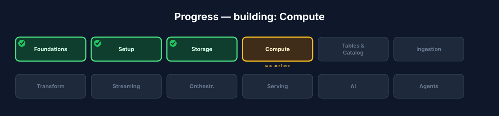
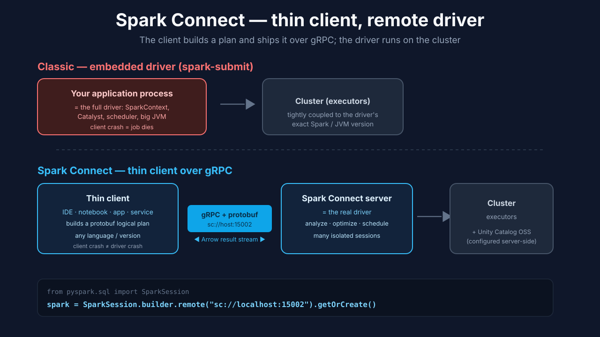
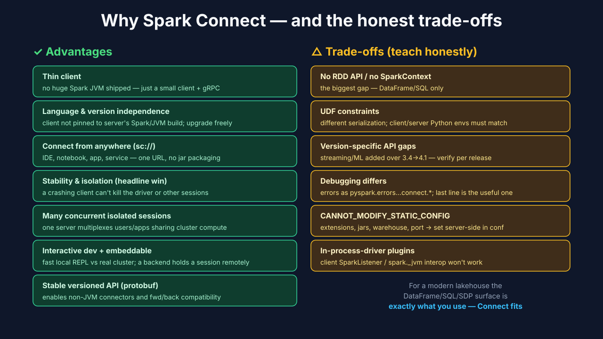
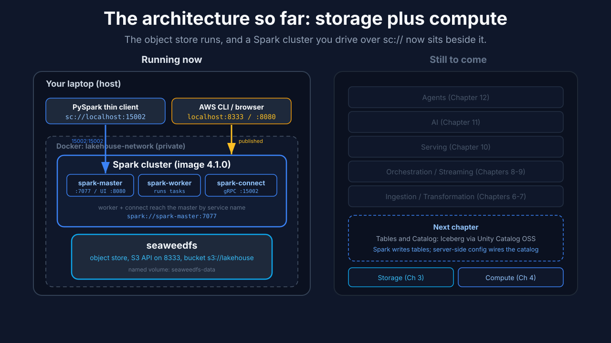

# Chapter 4: Compute

Storage holds the bytes, but bytes just sit there until something acts on them: reads them, filters them, joins them, aggregates them, writes new ones. That something is the compute layer, and in this course it's Apache Spark. By the end of this chapter you'll have added Spark to your `docker-compose.yml` as the next service, joined it to the same network as your object store, and run your first job against it from a thin client over `sc://`, without bundling the whole Spark engine into your program.

Just as important as Spark itself is how you talk to it. The modern way is Spark Connect: your program stays a lightweight client and sends its work to a remote Spark cluster over gRPC. That's the transport every later chapter uses, so this is where you set the pattern the rest of the build depends on.



**Figure 4.1**. Progress map with **Compute** highlighted.

## Learning objectives

By the end of this chapter you'll be able to:

- Explain what a compute engine does in the lakehouse and what "distributed compute" buys you over processing on one machine.
- Explain what Spark Connect is, how it differs from the classic embedded-driver model, and why this course standardizes on it.
- Weigh the advantages of Spark Connect against its honest trade-offs, so you know what you give up along with what you gain.
- Add Spark as a service on the Compose network and connect a Python client to it with `sc://` to run a job.

## What Spark is, and what "distributed compute" really means

Spark is a distributed compute engine: it splits work across many worker processes so you can process far more data than fits on one machine, using a familiar DataFrame and SQL API. In a lakehouse, Spark is the workhorse that lands data (Chapter 6), transforms it (Chapter 7), and streams it (Chapter 8). Storage holds the bytes; Spark is what acts on them.

The word "distributed" is doing a lot of work, so let's make it concrete. Imagine you need to count orders in a 500 GB dataset. On one machine, you'd read all 500 GB sequentially, which is slow and possibly more than fits in memory. Spark instead splits the data into chunks (partitions), hands each chunk to a different executor (a worker process, possibly on a different machine), and each executor counts its chunk in parallel. Then Spark combines the partial counts into a final answer. The big idea is divide the data, compute in parallel, combine the results, and Spark handles the messy parts (scheduling, retrying when a worker dies, moving data between stages) so you write code that looks like it's operating on one big table.

On your laptop, "the cluster" is a master and a single worker in containers, so the parallelism is modest. But the exact same code scales to hundreds of executors on a real cluster, which is the point of learning it here. You learn the model at small scale, and the model doesn't change at large scale.

### Lazy evaluation, the thing that surprises newcomers

Spark is lazy. When you write `df.filter(...).select(...)`, nothing actually runs. You're just describing a computation, building up a plan. Spark only executes when you call an action like `.show()`, `.count()`, or `.write`. Why? Because seeing the whole plan before running it lets Spark's optimizer (Catalyst) rearrange and fuse steps for efficiency, pushing filters down to read less data, combining operations, and so on. This trips up beginners who add a transformation, see "nothing happen," and think it's broken. It's not broken; it's waiting for an action. Remember: transformations build the plan, actions run it.

## The old way versus the modern way

Historically, your program was the Spark driver: you bundled a full Spark JVM (the `SparkContext`, the Catalyst optimizer, the scheduler) into your process and either ran `spark-submit` or built a local `SparkSession`. That works, but it makes your client heavy, pins it to one exact Spark and JVM version, and means a crash in your code can take the whole driver, and the job, down with it.

Picture the difference with a restaurant analogy. The classic model is like every diner bringing their own entire kitchen to the restaurant: you carry the stoves, the pantry, the chef, everything, just to make one meal. It works, but it's heavy, and if you set your kitchen on fire, the meal's gone. Spark Connect is like a normal restaurant: you (the thin client) sit at a table and send orders to a shared kitchen (the remote cluster) that does the cooking and sends back plates. Your order slip is tiny, the kitchen is shared, and if you spill your water, the kitchen keeps cooking for everyone else.

With Spark Connect, your client becomes a thin library. It builds an unresolved logical plan from your DataFrame and SQL calls and ships it as a protobuf message over gRPC to a remote Spark Connect server, which is the real driver, running on the cluster. The server analyzes, optimizes, and executes the plan, then streams results back as Apache Arrow batches. The API you write is identical; what changes is where the driver lives.



**Figure 4.2**. The classic embedded-driver model versus Spark Connect's thin client over gRPC, with the `sc://` client call.

## Why Spark Connect, and the honest trade-offs

This is the reason we standardize on Connect for the whole course. The advantages are concrete:

- **Thin client.** Your app links a small client library and talks gRPC; it doesn't ship a multi-hundred-megabyte Spark JVM.
- **Language and version independence.** The client isn't pinned to the server's exact Spark or JVM build. You can upgrade the server without rebuilding every client.
- **Connect from anywhere via `sc://`.** An IDE, a notebook, a web app, or a long-running service attaches to a remote cluster with one URL. No jar packaging, no cluster-side submission.
- **Stability and isolation** (the headline win). A buggy or out-of-memory client can't take down the driver or the cluster; the server keeps running and other sessions are unaffected.
- **Many concurrent, isolated sessions.** One Connect server multiplexes many users and apps sharing the same cluster compute.
- **Interactive development and embeddability.** Fast local REPL and notebook loops against real cluster data, and a backend service can hold a Spark session as just another remote dependency.

Why does the isolation win matter so much in practice? In the classic model, a shared team cluster was fragile: one person's runaway job could OOM the driver and kill everyone's work. With Connect, each session is insulated, so one person's mistake stays their problem. That single property is why Connect is becoming the default way teams share Spark compute.

But teach it honestly. Connect exposes the DataFrame, Spark SQL, and Structured Streaming surface, not the low-level driver internals:

- **No RDD API and no `SparkContext`,** the biggest gap. Code that drops to `spark.sparkContext` or RDDs won't work. For a modern DataFrame and SQL lakehouse this rarely bites, but know it. (RDDs are the older, lower-level Spark API; DataFrames and SQL have been the recommended surface for years, so most modern code is unaffected.)
- **UDF constraints.** Python and pandas UDFs work but serialize differently; the client and server Python environments must be compatible.
- **Version-specific gaps.** Connect gained streaming and more of the ML API over releases, so verify features against the Spark version you run.
- **Different debugging.** Errors arrive as `pyspark.errors.exceptions.connect.*`; the useful line is usually the last one.
- **`CANNOT_MODIFY_STATIC_CONFIG`.** Static settings (SQL extensions, jars, the warehouse directory, the gRPC port) must be set server-side in the cluster's config, and a client session cannot inject them. We'll hit this in Chapter 5 when wiring the catalog.

That last trade-off is worth internalizing now, because it's the one that will actually surprise you. In the classic model you'd set every config in your program. With Connect, static config lives on the server: it's baked into how the cluster was started, and a thin client can't change it on the fly. This is by design (a shared server can't let one client reconfigure it for everyone), but it means "set the catalog config" becomes a server-side task, which is exactly what you'll do next chapter.



**Figure 4.3**. The advantages (left) and the honest trade-offs (right).

## Build: add Spark to your stack and connect a thin client

Spark is the second real service in your stack. You'll add three related containers to the same `docker-compose.yml` you started in Chapter 3, all on the same Compose network as your object store, then drive them from a tiny Python client on your host.

Step 1. Add the Spark services. A working Spark cluster is three cooperating processes: a master that hands out work, a worker that runs it, and a Connect server that your thin client talks to. Add them to your `docker-compose.yml` alongside the `seaweedfs` service:

```yaml
services:
  # seaweedfs: ...  (from Chapter 3, unchanged)

  spark-master:
    image: apache/spark:4.1.0-scala2.13-java21-python3-r-ubuntu
    command: >
      bash -c "/opt/spark/sbin/start-master.sh --host 0.0.0.0 --port 7077 &&
               tail -f /opt/spark/logs/*"
    ports:
      - "8080:8080"   # master web UI, at localhost:8080

  spark-worker:
    image: apache/spark:4.1.0-scala2.13-java21-python3-r-ubuntu
    depends_on: [spark-master]
    command: >
      bash -c "/opt/spark/sbin/start-worker.sh spark://spark-master:7077 &&
               tail -f /opt/spark/logs/*"

  spark-connect:
    image: apache/spark:4.1.0-scala2.13-java21-python3-r-ubuntu
    depends_on: [spark-master, spark-worker]
    environment:
      SPARK_NO_DAEMONIZE: "1"
    command: >
      /opt/spark/sbin/start-connect-server.sh
      --master spark://spark-master:7077
      --conf spark.connect.grpc.binding.host=0.0.0.0
      --packages org.apache.spark:spark-connect_2.13:4.1.0
    ports:
      - "15002:15002"   # Spark Connect gRPC, at localhost:15002
    volumes:
      - ./config/spark:/opt/spark/conf   # server-side static config lives here
```

Notice how this uses the exact concepts from Chapter 2. All three services share the same pinned image, so their versions match and the stack is reproducible. They join the default Compose network automatically, so the worker reaches the master by service name at `spark://spark-master:7077`, and the Connect server reaches the master the same way, no IP addresses, no `localhost`. Only two ports are published to your host: the master web UI on `8080` and the Connect gRPC endpoint on `15002`, because those are the two you reach from your laptop. And the `spark-connect` service mounts `./config/spark` into the container's config directory: it's empty now, but that's where the server-side static config from Chapter 5 (the catalog and S3 settings) will live, exactly because a thin client can't set those.

Step 2. Bring the new services up:

```bash
docker compose up -d
docker compose ps
```

Expected: `docker compose ps` now shows `seaweedfs`, `spark-master`, `spark-worker`, and `spark-connect` all running. The first `up` pulls the Spark image, which is large, so give it a minute.

**What just happened?** You started three related things: a Spark master (the coordinator that hands out work), a worker (the process that actually runs tasks), and the Connect server (the gRPC endpoint your thin client will talk to). The master and worker are the "kitchen," and the Connect server is the "waiter" taking your orders. All three run in containers on the same network as your storage, so in later chapters Spark will reach the object store at `seaweedfs:8333` by service name.

Step 3. Open the Spark UI to see the cluster. Visit `http://localhost:8080` in your browser. You should see one worker registered and no applications running yet. The Spark UI is one of the most useful debugging tools you have: it shows running jobs, how work was split into tasks, and where time is spent. Get in the habit of opening it; when a job is mysteriously slow later, the UI usually shows why (one partition doing all the work, a stage retrying, and so on).

Step 4. Connect a thin client and run your first job. From your host, in a Python environment with `pyspark` installed (`pip install pyspark`):

```python
from pyspark.sql import SparkSession

# The whole point: we attach to a REMOTE Spark over sc://, not a local driver.
spark = SparkSession.builder.remote("sc://localhost:15002").getOrCreate()

df = spark.range(5)
df.show()
```

Expected output:

```
+---+
| id|
+---+
|  0|
|  1|
|  2|
|  3|
|  4|
+---+
```

**What just happened?** Look closely at `.remote("sc://localhost:15002")`. That one call is the entire lesson of this chapter. You did not start a Spark engine in your Python process; you opened a thin gRPC connection to the remote Connect server and asked it to run `spark.range(5)`. The five rows came back over the wire as Arrow batches. Your Python process stayed tiny throughout. This is the exact pattern every later chapter uses to talk to Spark.

Step 5. Point the client somewhere else without changing code, using an environment variable or URL parameters:

```bash
# Local, via env var (PySpark reads SPARK_REMOTE):
export SPARK_REMOTE="sc://localhost:15002"

# Remote with TLS and a token, same client code, different URL:
#   sc://connect.example.com:443/;use_ssl=true;token=<bearer>
```

This portability, same code and different endpoint, is exactly why you can develop locally and later point at a bigger cluster with a one-line change. The Python you wrote in Step 4 doesn't know or care whether Spark is on your laptop or a hundred-node cluster in the cloud. That's not a small convenience; it's the reason Connect is the modern default.

Step back and look at what you've stood up. Your stack is now two layers deep: the object store from Chapter 3, and a Spark cluster you drive over `sc://` from a thin client. Storage and compute are separate services on the same network, exactly as the lakehouse promises, and every layer above (tables, ingestion, transformation) will run on this same engine.



**Figure 4.4**. What's running after this chapter: the object store from Chapter 3, plus a Spark cluster (master, worker, Connect server). Your host drives it over `sc://localhost:15002`; inside the network, Spark will reach storage at `seaweedfs:8333`.

### Under the hood: SDP is built on Connect

Spark Declarative Pipelines (`pyspark.pipelines`), which we use to build the medallion in Chapter 7, use Spark Connect internally. Standardizing on Connect now isn't just a compute choice; it's the foundation the transformation layer is built on. When you write a declarative pipeline in Chapter 7, it will speak to the cluster over the same `sc://` transport you just used, so everything you learned here carries forward.

## Troubleshooting

- **Client hangs or "connection refused" on `sc://localhost:15002`.** The Connect server isn't up yet, or is still starting. Run `docker compose ps` to confirm `spark-connect` is running, and `docker compose logs spark-connect` to see why if it isn't. On the first `up` it can take a minute to download the `spark-connect` package.
- **`pyspark.errors.exceptions.connect.*` traceback.** That's a Connect-style error; the last line is usually the real message. Read it before scrolling up through the gRPC noise.
- **Code fails with something about `sparkContext` or RDDs.** You're using an API Connect doesn't expose. Rewrite it in DataFrame or SQL terms; there's almost always a direct equivalent.
- **`CANNOT_MODIFY_STATIC_CONFIG`.** You tried to set a static config from the client. It has to be set server-side, in the mounted `config/spark` directory; you'll see how in Chapter 5.
- **UDF errors about Python versions.** The client and server Python environments differ. Since you're driving the containerized server from your host, keep your local Python close to the server's version (the image ships Python 3).
- **The worker doesn't register with the master.** Check `docker compose logs spark-worker`. The usual cause is the master wasn't ready yet; `depends_on` starts it first, but if the worker raced ahead, `docker compose restart spark-worker` fixes it.

## Checkpoint

- `docker compose ps` shows `spark-master`, `spark-worker`, and `spark-connect` running alongside `seaweedfs`.
- The Spark UI at `localhost:8080` shows a registered worker.
- Your Python client connected via `sc://localhost:15002` and `spark.range(5).show()` returned five rows.
- You can name three advantages of Spark Connect and at least one trade-off.
- You can explain, in your own words, the difference between a transformation and an action (lazy evaluation).

## Try it yourself

1. **Watch it in the UI.** With the client connected, run a slightly bigger job (for example `spark.range(10_000_000).filter("id % 2 = 0").count()`) and watch it appear in the Spark UI. Notice how the work is split into tasks.
2. **Prove laziness.** Define a DataFrame with several transformations but don't call an action. Confirm nothing runs in the UI. Then add `.count()` and watch the job finally execute.
3. **Two sessions at once.** Open a second Python client with its own `SparkSession.builder.remote(...)`. Confirm both work independently against the same cluster, which is the multi-session isolation from earlier.
4. **Read a Connect error on purpose.** Try calling `spark.sparkContext` from the client and read the error. Now you'll recognize it instantly if it ever happens for real.

## Check your understanding

- In one sentence, what does "distributed compute" mean, and what are the three steps of the divide-compute-combine model?
- What is the difference between a transformation and an action in Spark?
- Explain the restaurant analogy: what plays the role of the diner, the order slip, and the kitchen in Spark Connect?
- Why must static config be set server-side with Spark Connect, and what error tells you you've violated that?

## Recap and what's next

- **Spark** is the compute engine of the lakehouse; it divides data into partitions, computes in parallel across workers, and combines results.
- Spark is **lazy**: transformations build a plan, actions run it.
- You drive it with **Spark Connect**, a thin client over `sc://`, for portability, isolation, and thin dependencies, accepting the DataFrame and SQL surface in exchange.
- Static config lives **server-side**, in the mounted config directory; remember `CANNOT_MODIFY_STATIC_CONFIG`.
- **Next, Chapter 5, Tables and Catalog:** create real Iceberg tables through Unity Catalog OSS, evolve their schema, and travel through their snapshots.


**Figure 4.5**. Progress map with **Compute** done and **Tables and Catalog** next.
