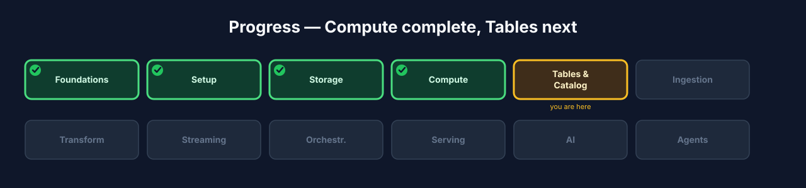

# Chapter 4 — Compute: Spark, driven by Spark Connect

## 4.0 What you'll build

The engine of the lakehouse — Apache Spark — and the modern way to drive it: **Spark
Connect**. You'll start a Spark cluster and its Connect server, then run your first
job from a **thin client** over `sc://`, without bundling the whole Spark engine
into your program. This is the transport every later chapter uses.

If Chapter 3 was the ground floor, this is the engine room. Storage holds the bytes,
but bytes just sit there until something *acts* on them — reads them, filters them,
joins them, aggregates them, writes new ones. That "something" is compute, and in
this course it's Spark. Just as important as Spark itself is *how you talk to it*,
and that's where Spark Connect comes in — a genuinely modern approach that we lean
on from here to the end of the book.


**Figure 4.3** — Progress map with **Compute** highlighted.

## 4.1 Learning objectives

By the end of this chapter you can:

- Explain what **Spark** does in the lakehouse (distributed compute).
- Explain what **Spark Connect** is and how it differs from the classic embedded
  driver model.
- List the practitioner advantages of Spark Connect — and its honest trade-offs.
- Connect a Python client to a remote Spark cluster with `sc://` and run a job.

## 4.2 What Spark is, and what "distributed compute" really means

> **Compute** *(canonical term)*: the engine that reads, writes, and transforms
> data — separate from storage. Ours is Apache Spark 4.x.

Spark is a distributed compute engine: it splits work across executors so you can
process far more data than fits on one machine, using a familiar DataFrame and SQL
API. In a lakehouse, Spark is the workhorse that lands data (Chapter 6), transforms
it (Chapter 7), and streams it (Chapter 8). Storage (Chapter 3) holds the bytes;
Spark is what *acts* on them.

The word "distributed" is doing a lot of work, so let's make it concrete. Imagine
you need to count orders in a 500 GB dataset. On one machine, you'd read all 500 GB
sequentially — slow, and possibly more than fits in memory. Spark instead splits the
data into chunks (**partitions**), hands each chunk to a different **executor**
(a worker process, possibly on a different machine), and each executor counts *its*
chunk in parallel. Then Spark combines the partial counts into a final answer. The
big idea is **divide the data, compute in parallel, combine the results** — and
Spark handles the messy parts (scheduling, retries when a worker dies, moving data
between stages) so you write code that looks like it's operating on one big table.

On your laptop, "the cluster" is a master and a single worker in containers, so the
parallelism is modest. But the *exact same code* scales to hundreds of executors on
a real cluster — that's the point of learning it here. You learn the model at small
scale; the model doesn't change at large scale.

### Under the hood — lazy evaluation, the thing that surprises newcomers

Spark is **lazy**. When you write `df.filter(...).select(...)`, nothing actually
runs — you're just *describing* a computation, building up a plan. Spark only
executes when you call an **action** like `.show()`, `.count()`, or `.write`. Why?
Because seeing the whole plan before running lets Spark's optimizer (Catalyst)
rearrange and fuse steps for efficiency — pushing filters down to read less data,
combining operations, and so on. This trips up beginners who add a transformation,
see "nothing happen," and think it's broken. It's not broken; it's waiting for an
action. Remember: **transformations build the plan, actions run it.**

## 4.3 The old way vs. the modern way

Historically, your program *was* the Spark driver: you bundled a full Spark JVM —
the `SparkContext`, the Catalyst optimizer, the scheduler — into your process and
either ran `spark-submit` or built a local `SparkSession`. That works, but it makes
your client heavy, pins it to one exact Spark and JVM version, and means a crash in
your code can take the whole driver (and job) down with it.

Picture the difference with a restaurant analogy. The classic model is like every
diner bringing their own *entire kitchen* to the restaurant — you carry the stoves,
the pantry, the chef, everything, just to make one meal. It works, but it's heavy,
and if you set your kitchen on fire, the meal's gone. Spark Connect is like a
normal restaurant: you (the thin client) sit at a table and send *orders* to a
shared kitchen (the remote cluster) that does the cooking and sends back plates.
Your "order slip" is tiny; the kitchen is shared; and if you spill your water, the
kitchen keeps cooking for everyone else.

> **Spark Connect** *(canonical term)*: a thin client that drives a remote Spark
> cluster over gRPC at `sc://host:15002`, decoupled from the driver.

With Spark Connect, your client becomes a **thin library**. It builds an unresolved
logical plan from your DataFrame/SQL calls and ships it as a **protobuf message over
gRPC** to a remote **Spark Connect server** — which *is* the real driver, running
on the cluster. The server analyzes, optimizes, and executes the plan, then streams
results back as **Apache Arrow** batches. The API you write is identical; what
changes is *where the driver lives*.


**Figure 4.1** — Classic embedded-driver model vs. Spark Connect's thin client
over gRPC, with the `sc://` client call.

## 4.4 Why Spark Connect (and the honest trade-offs)

This is the reason we standardize on Connect for the whole course. The advantages
are concrete:

- **Thin client** — your app links a small client library and talks gRPC; it
  doesn't ship a multi-hundred-megabyte Spark JVM.
- **Language & version independence** — the client isn't pinned to the server's
  exact Spark/JVM build. Upgrade the server without rebuilding every client.
- **Connect from anywhere via `sc://`** — an IDE, a notebook, a web app, or a
  long-running service attaches to a remote cluster with one URL. No jar packaging,
  no cluster-side submission.
- **Stability & isolation** *(the headline win)* — a buggy or out-of-memory client
  can't take down the driver or the cluster; the server keeps running and other
  sessions are unaffected.
- **Many concurrent, isolated sessions** — one Connect server multiplexes many
  users and apps sharing the same cluster compute.
- **Interactive development & embeddability** — fast local REPL/notebook loops
  against real cluster data, and a backend service can hold a Spark session as just
  another remote dependency.

Why does the isolation win matter so much in practice? In the classic model, a
shared team cluster was fragile: one person's runaway job could OOM the driver and
kill *everyone's* work. With Connect, each session is insulated — one person's
mistake stays their problem. That single property is why Connect is becoming the
default way teams share Spark compute.

But teach it honestly — Connect exposes the DataFrame / Spark SQL / Structured
Streaming surface, **not** the low-level driver internals:

- **No RDD API / no `SparkContext`** — the biggest gap. Code that drops to
  `spark.sparkContext` or RDDs won't work. For a modern DataFrame/SQL lakehouse
  this rarely bites, but know it. (RDDs are the older, lower-level Spark API;
  DataFrames and SQL have been the recommended surface for years, so most modern
  code is unaffected.)
- **UDF constraints** — Python/pandas UDFs work but serialize differently; the
  client and server Python environments must be compatible.
- **Version-specific gaps** — Connect gained streaming and more of the ML API over
  releases; verify features against the Spark version you run.
- **Different debugging** — errors arrive as `pyspark.errors.exceptions.connect.*`;
  the useful line is usually the last one.
- **`CANNOT_MODIFY_STATIC_CONFIG`** — static settings (SQL extensions, jars, the
  warehouse dir, the gRPC port) must be set **server-side** in `spark-defaults.conf`;
  a client session cannot inject them. We'll hit this in Chapter 5 when wiring the
  catalog.

That last trade-off is worth internalizing now, because it's the one that will
actually surprise you. In the classic model you'd set every config in your program.
With Connect, *static* config lives on the server — it's baked into how the cluster
was started, and a thin client can't change it on the fly. This is by design (a
shared server can't let one client reconfigure it for everyone), but it means "set
the catalog config" becomes a server-side task, which is exactly what you'll do next
chapter.


**Figure 4.2** — The advantages (left) and the honest trade-offs (right).

## 4.5 Build — start Spark and connect a thin client

Step 1 — start the Spark cluster (master, worker, and the Connect server):

```bash
./lakehouse start spark
./lakehouse status
```

Expected: the Spark master, worker, and Connect server show healthy. The Spark UI
is available in your browser (master UI on the Spark 4.1 default), and the Connect
server is listening on gRPC port **15002**.

**What just happened?** You started three related things: a Spark **master** (the
coordinator that hands out work), a **worker** (the process that actually runs
tasks), and the **Connect server** (the gRPC endpoint your thin client will talk
to). The master and worker are the "kitchen"; the Connect server is the "waiter"
taking your orders. All three run in containers you didn't have to configure by
hand.

Step 2 — open the Spark UI to see the cluster:

Visit the master UI in your browser. You should see one worker registered and no
applications running yet. The Spark UI is one of the most useful debugging tools
you have — it shows running jobs, how work was split into tasks, and where time is
spent. Get in the habit of opening it; when a job is mysteriously slow later, the UI
usually shows why (one partition doing all the work, a stage retrying, and so on).

Step 3 — connect a thin client and run your first job:

```python
from pyspark.sql import SparkSession

# The whole point: we attach to a REMOTE Spark over sc://, not a local driver.
spark = SparkSession.builder.remote("sc://localhost:15002").getOrCreate()

df = spark.range(5)
df.show()
```

Expected output:

```
+---+
| id|
+---+
|  0|
|  1|
|  2|
|  3|
|  4|
+---+
```

**What just happened?** Look closely at `.remote("sc://localhost:15002")` — that
one call is the entire lesson of this chapter. You did *not* start a Spark engine in
your Python process; you opened a thin gRPC connection to the remote Connect server
and asked *it* to run `spark.range(5)`. The five rows came back over the wire as
Arrow batches. Your Python process stayed tiny throughout. This is the exact pattern
every later chapter uses to talk to Spark.

Step 4 — point the client somewhere else without changing code, using an
environment variable or URL parameters:

```bash
# Local, via env var (PySpark reads SPARK_REMOTE):
export SPARK_REMOTE="sc://localhost:15002"

# Remote with TLS + a token — same client code, different URL:
#   sc://connect.example.com:443/;use_ssl=true;token=<bearer>
```

This portability — same code, different endpoint — is exactly why we can develop
locally and later point at a bigger cluster with a one-line change. The Python you
wrote in Step 3 doesn't know or care whether Spark is on your laptop or a
hundred-node cluster in the cloud. That's not a small convenience; it's the reason
Connect is the modern default.

### Under the hood — SDP is built on Connect

Spark Declarative Pipelines (`pyspark.pipelines`), which we use to build the
medallion in Chapter 7, **use Spark Connect internally**. Standardizing on Connect
now isn't just a compute choice — it's the foundation the transformation layer is
built on. When you write a declarative pipeline in Chapter 7, it will speak to the
cluster over the same `sc://` transport you just used, so everything you learned
here carries forward.

## 4.6 Troubleshooting

- **Client hangs or "connection refused" on `sc://localhost:15002`.** The Connect
  server isn't up. Run `./lakehouse status` and confirm the Connect server is
  healthy; if not, `./lakehouse logs spark` usually shows why.
- **`pyspark.errors.exceptions.connect.*` traceback.** That's a Connect-style error;
  the *last* line is usually the real message. Read it before scrolling up through
  the gRPC noise.
- **Code fails with something about `sparkContext` or RDDs.** You're using an API
  Connect doesn't expose. Rewrite it in DataFrame/SQL terms — there's almost always
  a direct equivalent.
- **`CANNOT_MODIFY_STATIC_CONFIG`.** You tried to set a static config from the
  client. It has to be set server-side; you'll see how in Chapter 5.
- **UDF errors about Python versions.** The client and server Python environments
  differ. Since you're driving the containerized server from your host, keep your
  local Python close to the server's version.

## 4.7 Checkpoint

- `./lakehouse status` shows Spark master, worker, and the Connect server healthy.
- The Spark UI shows a registered worker.
- Your Python client connected via `sc://localhost:15002` and `spark.range(5).show()`
  returned five rows.
- You can name three advantages of Spark Connect and at least one trade-off.
- You can explain, in your own words, the difference between a transformation and an
  action (lazy evaluation).

## 4.8 Try it yourself

1. **Watch it in the UI.** With the client connected, run a slightly bigger job
   (e.g. `spark.range(10_000_000).filter("id % 2 = 0").count()`) and watch it appear
   in the Spark UI. Notice how the work is split into tasks.
2. **Prove laziness.** Define a DataFrame with several transformations but *don't*
   call an action. Confirm nothing runs in the UI. Then add `.count()` and watch the
   job finally execute.
3. **Two sessions at once.** Open a second Python client with its own
   `SparkSession.builder.remote(...)`. Confirm both work independently against the
   same cluster — that's the multi-session isolation from 4.4.
4. **Read a Connect error on purpose.** Try calling `spark.sparkContext` from the
   client and read the error. Now you'll recognize it instantly if it ever happens
   for real.

## 4.9 Check your understanding

- In one sentence, what does "distributed compute" mean, and what are the three
  steps of the divide-compute-combine model?
- What is the difference between a transformation and an action in Spark?
- Explain the restaurant analogy: what plays the role of the diner, the order slip,
  and the kitchen in Spark Connect?
- Why must static config be set server-side with Spark Connect, and what error tells
  you you've violated that?

## 4.10 Recap & what's next

- **Spark** is the compute engine of the lakehouse; it divides data into partitions,
  computes in parallel across executors, and combines results.
- Spark is **lazy** — transformations build a plan, actions run it.
- We drive it with **Spark Connect** — a thin client over `sc://` — for portability,
  isolation, and thin dependencies, accepting the DataFrame/SQL surface in exchange.
- Static config lives **server-side**; remember `CANNOT_MODIFY_STATIC_CONFIG`.
- **Next — Chapter 5, Tables & Catalog:** create real Iceberg tables through **Unity
  Catalog OSS**, evolve their schema, and travel through their snapshots.



**Figure 4.4** — Progress map with **Compute ✓** and **Tables & Catalog** next.
