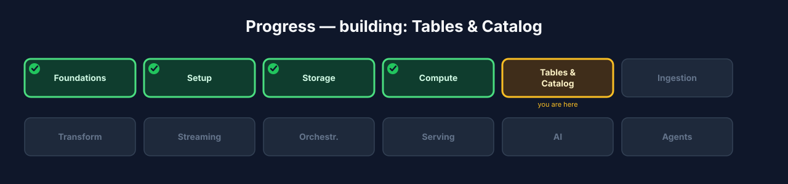
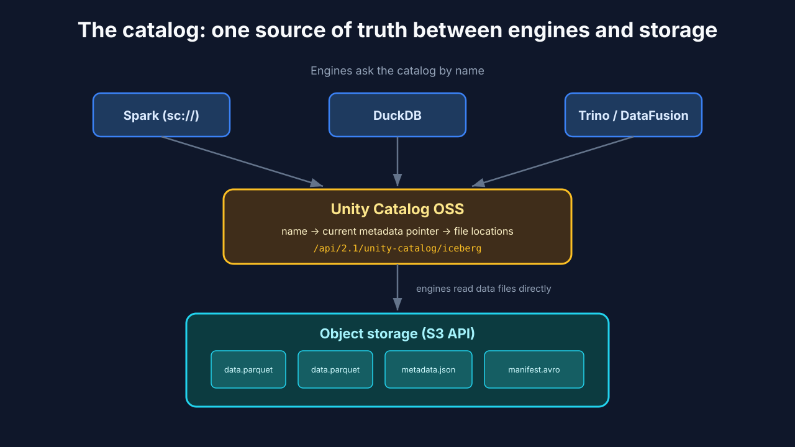
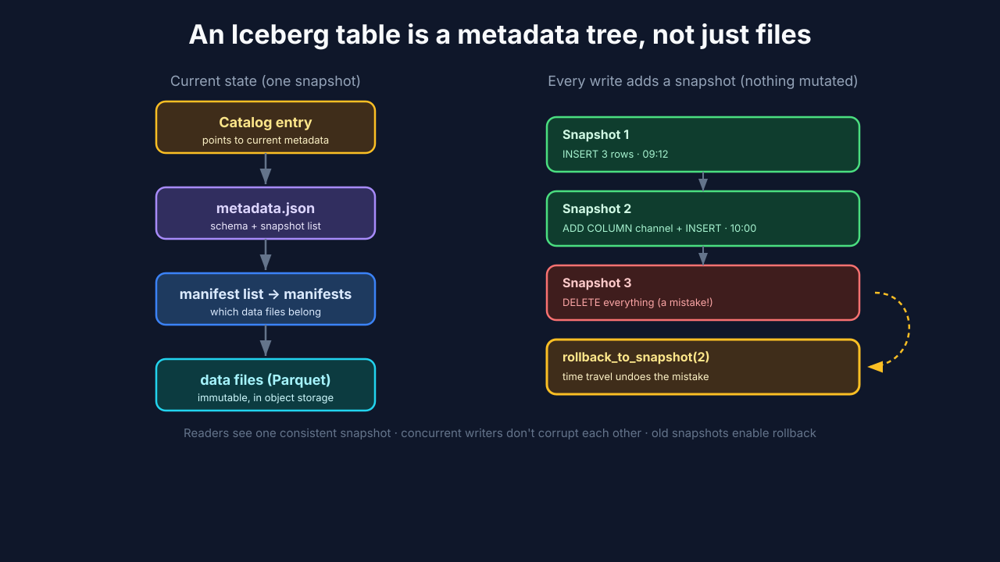
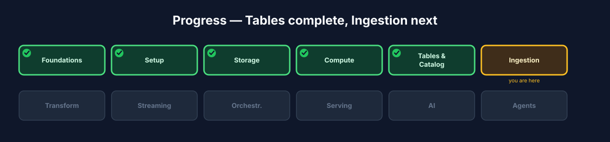

# Chapter 5 — Tables & Catalog: Iceberg through Unity Catalog OSS

## 5.0 What you'll build

Real, transactional tables — the moment your lakehouse stops being "files in a
bucket" and becomes a database.

In Chapter 3 you made two decisions: *where the bytes live* (object storage) and
*how loose files become a table* (the Iceberg open table format). In Chapter 4 you
got an engine (Spark) and a thin way to drive it (Spark Connect). This chapter ties
those together. You'll stand up **Unity Catalog OSS** as the single catalog every
engine in your lakehouse talks to, create **Iceberg** tables through it, load and
query data, evolve a table's schema *without rewriting a single data file*, and —
the crowd-pleaser — **time-travel**: query your table as it looked in the past and
roll back a catastrophic mistake as if it never happened.

By the end you'll understand not just the commands, but *what Iceberg is actually
doing underneath* — because once you see the metadata tree, every "magic" feature
(ACID, schema evolution, time travel) turns into something obvious.



**Figure 5.3** — Progress map with **Tables & Catalog** highlighted.

## 5.1 Learning objectives

By the end of this chapter you can:

- Explain what a **catalog** is, the three questions it answers, and why a lakehouse
  is nearly useless without one.
- Describe how **Unity Catalog OSS** exposes tables to *any* engine via an **Iceberg
  REST catalog** endpoint, and why that single endpoint matters so much.
- Create a namespace and an Iceberg table, insert rows, and query them through Spark
  Connect — and explain what happened in object storage each time.
- Read an Iceberg table's **metadata tables** (`.snapshots`, `.files`, `.history`)
  to see its internal structure.
- Evolve a table's **schema** (add, rename, drop, reorder columns) without rewriting
  data — and explain *why* that's cheap.
- Use **snapshots** to time-travel: query an older version, then roll a table back
  to undo a bad write.
- Diagnose the most common catalog/table errors you'll actually hit.

## 5.2 The problem a catalog solves

Let's start with a scenario, because the catalog only makes sense once you feel the
pain of not having one.

Imagine you skipped this chapter. You have Parquet files sitting in object storage
at `s3a://lakehouse/warehouse/orders/`. You want to query them from Spark. You can
— you point Spark at that path and it reads the files. Fine.

Now a teammate wants to query the *same* data from DuckDB. Where do they point it?
At the path — but they also need to know the schema, which columns are partitions,
and (critically) *which files are current* versus leftover from a half-finished job
that crashed last night. Now a third tool wants in. And now you ran a job that
rewrote half the files — how does every reader know which version is "the table"
right now, without reading a corrupt mix of old and new?

Every one of those questions is the reader guessing about state that lives *outside*
the files. That guessing is exactly how data lakes rotted into "data swamps." The
**catalog** is the fix: one authoritative service that every engine asks.

> **Catalog** *(canonical term)*: the service that maps human table names
> (`iceberg.bronze.orders`) to the metadata and files that physically make up the
> table, so any engine can find and read it consistently.

Concretely, a catalog answers three questions for *any* client, the same way every
time:

1. **What tables exist?** (and how are they organized into namespaces?)
2. **What is this table's current schema and current snapshot?** (its shape, right
   now — not a stale or half-written version)
3. **Where are its data files?** (the exact list, as of that current snapshot)

That's the difference between a swamp and a database. The files hold the data; the
catalog holds the *truth about* the data.



**Figure 5.1** — The catalog sits between engines and storage: a client asks the
catalog for `iceberg.bronze.orders`, gets back the current metadata pointer, and
then reads the data files directly from object storage. The catalog brokers *where
to look*; the engine still does the actual reading.

### A quick note on naming: catalog, namespace, table

Iceberg names have three parts: `catalog.namespace.table`, e.g.
`iceberg.bronze.orders`. Think of it like a filing system:

- **catalog** (`iceberg`) — the top-level registry. We have one, named `iceberg`.
- **namespace** (`bronze`) — a schema/folder grouping related tables. We'll use
  `bronze`, `silver`, and `gold` (the medallion tiers from Chapter 7).
- **table** (`orders`) — the table itself.

If you've used `database.table` in a warehouse, a namespace is that middle level —
Iceberg just lets you nest and organize them per catalog.

## 5.3 One catalog for everything: Unity Catalog OSS

Here's a decision that shapes the entire rest of the course: **we use Unity Catalog
OSS as *the* catalog for the whole lakehouse.** Not one catalog for Spark and a
different one for your BI tool and a third for your notebooks. One. Catalog. For.
Everything.

Why so emphatic? Because the single most valuable property of an open lakehouse —
the thing a closed warehouse *cannot* give you — is that many different engines read
the *same* tables with no copies and no drift. That's only possible if they share a
catalog. Split your tables across two catalogs and you've quietly rebuilt the silos
you were trying to escape.

The mechanism that makes this work is the **Iceberg REST catalog** — an open,
standardized HTTP protocol for catalogs. Unity Catalog OSS implements it and exposes
it at:

```
http://localhost:8081/api/2.1/unity-catalog/iceberg
```

Any engine that speaks the Iceberg REST protocol — Spark, DuckDB, Trino,
DataFusion, and a growing list of others — points at that one URL and immediately
sees the same tables, the same schemas, the same current snapshots. No per-engine
metastore to keep in sync. No export step. No "let me copy that table into a format
your tool understands."

> **Multi-engine / interoperability** *(canonical term)*: the same open tables, read
> by different engines, because they share one catalog and one open format.

You won't feel the full payoff until Chapter 10 (Serving), where you'll query these
exact tables from a *different* engine and watch identical rows come back. But the
decision is made *here*, in this chapter, when you create your first table in this
one catalog.

### Under the hood — static config lives server-side (and why your client stays thin)

Remember `CANNOT_MODIFY_STATIC_CONFIG` from Chapter 4? This is where it pays off.

The catalog wiring — the Iceberg SQL extensions, the REST catalog URI, the warehouse
location, the S3 credentials Spark uses to reach object storage — is all **static**
Spark configuration. It's set *once*, server-side, in the Connect server's
`spark-defaults.conf`. It is *not* something your thin client injects at runtime.

Why is that good news rather than a limitation? Because it means your client code is
gloriously boring. You connect over `sc://` and just write
`spark.sql("CREATE TABLE …")` — and the catalog is already wired, already
authenticated, already pointed at the right storage. The platform owns the plumbing;
you write logic. Every engineer who connects gets the same correct wiring for free,
and nobody can accidentally point their session at the wrong catalog. Thin clients,
central configuration — that's the Spark Connect philosophy from Chapter 4 doing
real work.

## 5.4 Build — create and query an Iceberg table

Time to make a real table. Make sure Spark is still up from Chapter 4; we'll add the
catalog alongside it.

**Step 1 — start Unity Catalog OSS.**

```bash
./lakehouse start unity-catalog
./lakehouse status
```

Expected: Unity Catalog OSS shows healthy on port **8081**, alongside the Spark
master, worker, and Connect server. If `status` shows it unhealthy, jump to the
troubleshooting section (5.8) before continuing — a table create against a
half-started catalog produces confusing errors.

**Step 2 — connect a thin client and create a namespace and a table.** The catalog
name `iceberg` and the REST wiring are configured server-side (see the callout
above), so from the client you simply *use* them:

```python
from pyspark.sql import SparkSession

spark = SparkSession.builder.remote("sc://localhost:15002").getOrCreate()

# A namespace (schema) to hold our Bronze tables.
spark.sql("CREATE NAMESPACE IF NOT EXISTS iceberg.bronze")

# A first Iceberg table for raw orders.
spark.sql("""
    CREATE TABLE IF NOT EXISTS iceberg.bronze.orders (
        order_id    STRING,
        customer_id STRING,
        amount      DOUBLE,
        status      STRING,
        created_at  TIMESTAMP
    )
    USING iceberg
""")
```

**What just happened?** Even before you inserted a single row, Iceberg wrote
*metadata* to object storage: a `metadata.json` file describing the table's schema,
a pointer registered in the catalog, and an initial (empty) snapshot. The catalog
now knows `iceberg.bronze.orders` exists, what shape it has, and where its metadata
lives. The table is real — it just has no data yet.

**Step 3 — insert a few rows and read them back:**

```python
spark.sql("""
    INSERT INTO iceberg.bronze.orders VALUES
        ('o-1001', 'c-1', 42.50, 'placed',    TIMESTAMP '2026-01-05 09:12:00'),
        ('o-1002', 'c-2', 19.99, 'placed',    TIMESTAMP '2026-01-05 09:15:30'),
        ('o-1003', 'c-1', 88.00, 'cancelled', TIMESTAMP '2026-01-05 09:20:10')
""")

spark.table("iceberg.bronze.orders").show()
```

Expected output:

```
+--------+-----------+------+---------+-------------------+
|order_id|customer_id|amount|   status|         created_at|
+--------+-----------+------+---------+-------------------+
|  o-1001|        c-1|  42.5|   placed|2026-01-05 09:12:00|
|  o-1002|        c-2| 19.99|   placed|2026-01-05 09:15:30|
|  o-1003|        c-1|  88.0|cancelled|2026-01-05 09:20:10|
+--------+-----------+------+---------+-------------------+
```

**What just happened?** That `INSERT` did *not* edit an existing file. Iceberg wrote
one or more **new** Parquet data files, then wrote new metadata declaring a fresh
**snapshot** whose file list includes them. The catalog's pointer moved to that new
snapshot atomically. This is the ACID guarantee in action: until that pointer
flips, no reader sees the half-written state; the instant it flips, every reader
sees the complete new version. There is never an in-between.

**Step 4 — verify through the CLI's data browser,** which reads the *same* table
through the *same* catalog (proof the catalog isn't Spark-specific):

```bash
./lakehouse browsedata iceberg.bronze.orders
```

You should see the same three rows. Different tool, same catalog, same data — a
tiny preview of Chapter 10.

## 5.5 Look inside: Iceberg is a metadata tree

Most people use Iceberg for months treating it as a black box. Ten minutes of
looking inside will make everything else in this course click, so let's look.

An Iceberg table is **not** the data files alone. It's a small tree of metadata that
*points at* immutable data files:

- The **catalog** holds a pointer to the table's current **metadata file**.
- The **metadata file** (`metadata.json`) holds the schema and the list of all
  **snapshots**.
- Each **snapshot** points at a **manifest list**, which points at **manifests**,
  which finally list the actual **data files** (Parquet) that belong to that
  snapshot.



**Figure 5.2** — Iceberg's layers: the catalog points at the current metadata file →
which lists manifests → which list data files. Each write adds a *new* snapshot
without mutating the old ones.

The key insight: **data files are immutable, and a write never edits them.** A
write adds *new* data files and a *new* snapshot that references the right set. Old
snapshots keep pointing at the old file sets, untouched. That one design choice is
what buys you three features at once:

- **ACID** — a write is "done" only when the current-snapshot pointer atomically
  flips. Readers always see one consistent snapshot.
- **Concurrent safety** — two writers producing new files and new snapshots don't
  stomp each other's data files.
- **Time travel** — old snapshots still exist and still point at valid files, so you
  can read the table "as of" any of them.

You don't have to take this on faith — Iceberg exposes its own internals as
queryable **metadata tables**. Try them:

```python
# The snapshots that make up this table's history:
spark.sql("SELECT snapshot_id, committed_at, operation "
          "FROM iceberg.bronze.orders.snapshots").show(truncate=False)

# The actual data files backing the current snapshot:
spark.sql("SELECT file_path, record_count, file_size_in_bytes "
          "FROM iceberg.bronze.orders.files").show(truncate=False)

# A human-readable history of what happened when:
spark.sql("SELECT made_current_at, snapshot_id, is_current_ancestor "
          "FROM iceberg.bronze.orders.history").show(truncate=False)
```

Expected: `.snapshots` shows two rows so far (the initial create and your insert —
`append`). `.files` shows the Parquet file(s) your insert produced, with a
`record_count` of 3. `.history` shows the order in which snapshots became current.
You are literally reading the tree from Figure 5.2.

## 5.6 Schema evolution: change the shape, keep the data

Requirements change. A month in, you need to know which **channel** each order came
from (web, mobile, in-store). In a naive files-on-disk world, adding a column can
mean rewriting every file. Iceberg makes it a metadata-only operation.

> **Schema evolution** *(canonical term)*: changing a table's columns (add, rename,
> drop, reorder) without rewriting existing data files.

Because the schema lives in metadata — not baked immutably into every Parquet file —
Iceberg tracks columns by a stable internal **field ID**, not by position or by
re-reading files. Adding a column just records a new field in the metadata.

**Add a column.** Existing rows read back `NULL` for it; no data is rewritten:

```python
spark.sql("ALTER TABLE iceberg.bronze.orders ADD COLUMN channel STRING")

spark.sql("""
    INSERT INTO iceberg.bronze.orders VALUES
        ('o-1004', 'c-3', 55.25, 'placed', TIMESTAMP '2026-01-05 10:00:00', 'mobile')
""")

spark.table("iceberg.bronze.orders").show()
```

Expected: the three original rows show `NULL` under `channel`; the new row shows
`mobile`. Crucially, the original Parquet files were **not** touched — Iceberg knows
they predate the `channel` field and simply returns `NULL` for it.

**Rename a column** — also metadata-only, because of those stable field IDs:

```python
spark.sql("ALTER TABLE iceberg.bronze.orders RENAME COLUMN amount TO order_amount")
```

Existing data files still store the column under its old name; Iceberg maps it via
the field ID. No rewrite, no broken reads.

### Under the hood — why field IDs matter

If Iceberg tracked columns by *name* or *position*, a rename or reorder would be a
minefield: old files say `amount`, new files say `order_amount`, and a reader
wouldn't know they're the same column. By assigning every column a permanent
numeric **field ID** the first time it appears, Iceberg decouples the logical schema
you see from the physical layout in each file. Rename, reorder, add, drop — all
become metadata edits, and every old file remains perfectly readable. This is the
unglamorous engineering that makes "just add a column" actually safe in production.

## 5.7 Time travel and rollback: your undo button for data

Now the feature that makes people fall in love with the lakehouse. Because every
write is a preserved snapshot, you can *query the past* and *undo mistakes*.

> **Snapshot / time travel** *(canonical term)*: every write is a versioned snapshot
> you can query, and roll back to.

**First, inspect the history** so you have snapshot IDs to work with:

```python
spark.sql("SELECT snapshot_id, committed_at, operation "
          "FROM iceberg.bronze.orders.snapshots").show(truncate=False)
```

Note the `snapshot_id` of a known-good state — say, right after your inserts, before
we break anything. Copy it.

**Now simulate a disaster** — the kind of one-line mistake that ends careers in a
warehouse without backups:

```python
# Oops — a WHERE clause that matches everything.
spark.sql("DELETE FROM iceberg.bronze.orders WHERE order_amount > 0")
spark.table("iceberg.bronze.orders").count()   # 0 — everything gone
```

Your live table is empty. In many systems, this is where you start restoring from
last night's backup and losing a day of data. Here, the data never actually left —
the `DELETE` just created a *new* snapshot whose file list excludes those rows. The
old snapshot still points at all the original files.

**Query the past** to confirm the rows are still there in the earlier snapshot:

```python
before = (spark.read
          .option("snapshot-id", "<good_snapshot_id>")   # from the history above
          .table("iceberg.bronze.orders"))
before.count()   # your rows are still here, untouched
```

**Roll back** to make that good snapshot current again:

```python
spark.sql("CALL iceberg.system.rollback_to_snapshot('bronze.orders', <good_snapshot_id>)")
spark.table("iceberg.bronze.orders").count()   # restored — as if the DELETE never happened
```

The rollback itself is just another metadata operation: flip the current pointer
back to the good snapshot. Instant, cheap, and complete.

This is the "wow" of the lakehouse, and it's worth pausing on *why* it's possible:
warehouse-grade safety (undo a destructive write in seconds) sitting on
warehouse-*cheap* storage (immutable files in an object store). You are not paying
for an expensive proprietary system to get this — it falls out of the open table
format's design.

> **A note on retention:** snapshots don't live forever by default in production —
> you expire old ones to reclaim storage (a maintenance job you'll meet in the "where
> to go next" roadmap). Time travel works within your retention window. For this
> course, nothing is expired, so all your snapshots are available.

## 5.8 Common pitfalls & troubleshooting

Real learning includes the errors. Here are the ones you're most likely to hit in
this chapter, and what they mean.

- **`NoSuchNamespaceException` / "namespace does not exist" on CREATE TABLE.**
  You skipped `CREATE NAMESPACE IF NOT EXISTS iceberg.bronze`, or you typo'd the
  namespace. Iceberg won't auto-create the parent namespace for you.

- **`CANNOT_MODIFY_STATIC_CONFIG` when you try to set a catalog option from the
  client.** Exactly the Chapter 4 lesson: catalog wiring is static, server-side.
  Don't set `spark.sql.catalog.*` from your `sc://` session — it's already
  configured. If it's genuinely misconfigured, fix `spark-defaults.conf` on the
  server and restart it, not the client.

- **`ConnectException` / cannot reach the catalog.** Unity Catalog OSS isn't up, or
  isn't healthy yet. Run `./lakehouse status`; if it's not green on **8081**, start
  it and wait for health before creating tables.

- **`TableAlreadyExistsException`.** You ran a `CREATE TABLE` (without `IF NOT
  EXISTS`) against a table that's already there. Either add `IF NOT EXISTS` or drop
  it first if you meant to recreate it.

- **Rollback "works" but you still see no rows.** You rolled back to the *wrong*
  snapshot (e.g. the empty initial-create snapshot). Re-check `.snapshots`, pick the
  `append` snapshot that has your data, and roll back to that one.

- **A stray/typo'd column in `INSERT ... VALUES` order.** Iceberg maps
  positional `VALUES` to the current schema order. After a schema change, re-check
  column order — an easy way to silently put `channel` values into `status`.

## 5.9 Try it yourself

Don't just read — extend the build. Each of these reinforces something from the
chapter:

1. **Add and populate `silver` and `gold` namespaces.** Create
   `iceberg.silver` and `iceberg.gold` namespaces now (you'll fill them in Chapter
   7). Confirm with `SHOW NAMESPACES IN iceberg`.

2. **Prove immutability.** After your first insert, note the file path from
   `.files`. Do a second insert, then query `.files` again. How many data files are
   there now? Did the original file change, or did a new one appear? Explain what
   that tells you about how Iceberg writes.

3. **Evolve, then time-travel across the evolution.** Time-travel to a snapshot from
   *before* you added the `channel` column. What columns does the old snapshot show?
   (This reveals how Iceberg reconstructs the schema for a historical read.)

4. **Drop and reorder.** Try `ALTER TABLE ... DROP COLUMN` and `ALTER TABLE ...
   ALTER COLUMN ... FIRST/AFTER`. Query the data after each. Did any data file get
   rewritten? Check `.files` to be sure.

5. **Break it and recover it, deliberately.** Do a bad `UPDATE` (e.g. set every
   `status` to `'wat'`), confirm the damage, then roll back. Time yourself — how
   fast is a full recovery?

## 5.10 Check your understanding

- In one sentence, what are the three questions a catalog answers for any engine?
- Why can adding a column to a huge Iceberg table be nearly instant, when it might
  rewrite terabytes in a naive files-on-disk setup?
- What actually happens, physically, when you `DELETE FROM` an Iceberg table — do the
  data files get erased?
- Why do we insist on *one* catalog for the whole lakehouse instead of one per
  engine?
- Where does the catalog wiring live, and why can't your Spark Connect client change
  it?

## 5.11 Recap & what's next

- A **catalog** maps table names to metadata and files so any engine can find them
  consistently — answering *what tables exist*, *what's the current schema/snapshot*,
  and *where are the files*.
- **Unity Catalog OSS** is our one catalog for everything, exposing a standard
  **Iceberg REST** endpoint that many engines share — the basis of Chapter 10's
  multi-engine serving.
- An **Iceberg table is a metadata tree** over immutable data files. That design
  gives you ACID, concurrent-writer safety, cheap **schema evolution**, and **time
  travel/rollback** — all as metadata operations.
- You can read Iceberg's own internals via `.snapshots`, `.files`, and `.history`.
- Static catalog wiring lives **server-side**; your thin client just uses it.
- **Next — Chapter 6, Ingestion:** now that you can create and trust tables, you'll
  land raw order data into the **Bronze** layer and meet the ingestion patterns that
  keep it correct — batch, ELT, and idempotency.



**Figure 5.4** — Progress map with **Tables & Catalog ✓** and **Ingestion** next.
