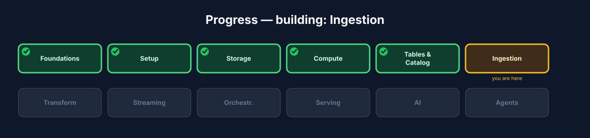
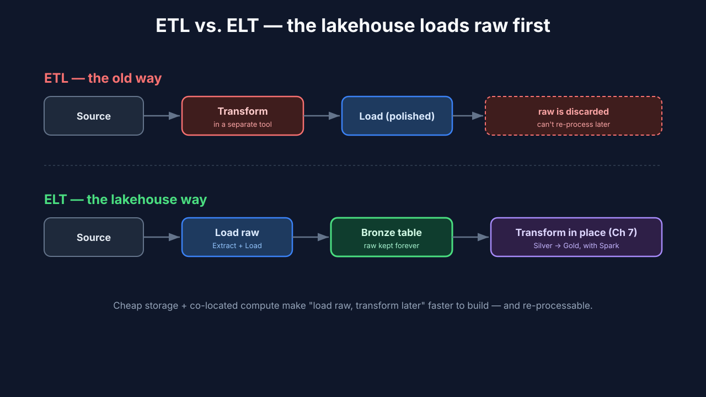
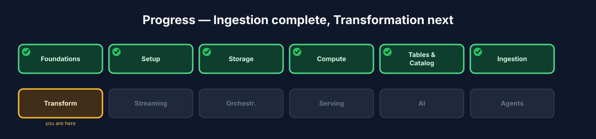

# Chapter 6 — Ingestion: landing raw data in the Bronze layer

## 6.0 What you'll build

The first data flow. You have storage (Ch 3), compute (Ch 4), and real tables
(Ch 5) — now you get *data into them*. You'll generate realistic order data and
**ingest** it as-is into a **Bronze** table: the raw, faithful landing zone that
every later transformation builds on. Along the way you'll meet the ingestion
vocabulary a practitioner uses every day — **batch**, **ELT**, and **idempotency**
— and see why "land raw first" is the modern default.

This is a turning point in the course. Everything before this was *infrastructure*
— places to put data and engines to act on it. From here on, we're moving actual
data through the system. Ingestion is where the lakehouse stops being a set of
empty rooms and starts being a working home for your data. And the single most
important habit you'll build here — landing raw data faithfully before touching it
— is one that separates engineers who sleep well from engineers who get paged.



**Figure 6.3** — Progress map with **Ingestion** highlighted.

## 6.1 Learning objectives

By the end of this chapter you can:

- Define **ingestion** and explain the role of the **Bronze** layer.
- Contrast **ELT** with ETL and say why lakehouses default to ELT.
- Explain **idempotency** and why an ingestion job must be safely re-runnable.
- Generate test data and ingest it into an Iceberg Bronze table with Spark Connect.

## 6.2 What ingestion is, and the golden rule of Bronze

> **Ingestion** *(canonical term)*: getting raw data from a source system into the
> lakehouse, with as little transformation as possible.

The guiding principle of Bronze is **fidelity**: capture the source data *exactly
as it arrived* — same fields, same values, warts and all — plus a little metadata
about *when* and *how* you got it. You do not clean, join, or reshape here. Why?
Because raw data you've faithfully stored can always be re-processed later if your
logic changes; data you "cleaned" on the way in and threw away is gone forever.

Let this sink in, because it's counterintuitive to beginners who want to "fix" data
immediately. Imagine you ingest orders and, being helpful, you drop rows with a null
`customer_id` because "those are obviously broken." Six months later you learn that
null `customer_id` actually meant "guest checkout" — a huge, valuable segment. If
you'd kept the raw data, you'd just re-run your transformations with the new
understanding. But you threw those rows away at ingest, so they're gone. **The
golden rule of Bronze: never lose information you can't recreate.** Clean data in
later layers, where mistakes are reversible.

> **Bronze / raw** *(canonical term)*: the first medallion tier — an
> as-faithful-as-possible copy of source data, the immutable foundation for
> everything downstream.

Think of Bronze as the crime-scene photographer. The photographer doesn't tidy up
the scene, move the furniture, or decide what's relevant — they capture *exactly
what's there*, timestamped, so any later investigation can rely on a faithful
record. Your Bronze table is that faithful record of what the source actually sent.

## 6.3 ELT, not ETL

> **ELT** *(canonical term)*: **E**xtract and **L**oad the raw data first, then
> **T**ransform it *inside* the lakehouse — as opposed to ETL, which transforms
> *before* loading.

The classic warehouse world did **ETL**: transform data in a separate tool, then
load only the polished result. The lakehouse inverts this. Storage is cheap and
compute is powerful and co-located, so you **load raw first** (that's Bronze) and
transform *in place* with Spark (that's Chapter 7). This is faster to build, keeps
the untouched source for re-processing, and means your transformations are just
more queries against tables you already have.

The reason the industry flipped from ETL to ELT is economics plus regret-avoidance.
In the old world, storage was expensive, so you couldn't afford to keep raw data —
you transformed it down to just what you needed and discarded the rest (and lived
with the golden-rule violations that caused). In the lakehouse world, storage is so
cheap that keeping every raw byte forever is affordable, and compute is powerful
enough to transform on demand. So the calculus reversed: **load everything raw,
transform later, keep the raw around forever as insurance.** Every serious
lakehouse follows this pattern.



**Figure 6.1** — ETL transforms before loading and discards the raw; ELT loads
raw into Bronze first, then transforms inside the lakehouse — keeping the source.

## 6.4 Idempotency: the property that makes ingestion safe

> **Idempotency** *(canonical term)*: re-running a job produces the same result as
> running it once — no duplicates, no drift.

Ingestion jobs fail and get retried — a network blip, a restarted worker, a manual
re-run. If a retry double-inserts yesterday's orders, your Bronze table is now
wrong, and so is everything built on it. An **idempotent** ingest is one you can
run twice safely. The usual techniques: ingest a bounded, identified batch (e.g.
"orders for 2026-01-05"), and either **overwrite that partition** or **merge on a
key** rather than blindly appending.

This is not a theoretical nicety — it's the difference between a pipeline you trust
and one you babysit. Real pipelines fail *constantly* for boring reasons: a cloud
region hiccups, a container gets OOM-killed, someone bumps a deploy. The pipelines
that survive are the ones where "just run it again" is always safe. If re-running
might duplicate data, then every failure becomes a delicate manual cleanup, and
every 3 a.m. page becomes a judgment call about whether it's safe to retry.
Idempotency turns retries from scary into routine. It's arguably the single most
important property of a production data job.

A quick mental test for idempotency: *"If I run this exact job twice in a row, is
the table identical to running it once?"* If yes, you're idempotent. If running it
twice doubles rows, drifts counts, or changes results, you're not — and you have a
latent bug waiting for the next retry.

### Under the hood — why append-only bites you

A naive `INSERT INTO … SELECT * FROM source` is *not* idempotent: run it twice and
every row is duplicated. The fixes Iceberg gives you: `INSERT OVERWRITE` a specific
partition (replaces just that slice), or `MERGE INTO … WHEN MATCHED / WHEN NOT
MATCHED` on a business key (upsert). We use a partition overwrite below because
Bronze is organized by ingest date — re-running a day's ingest simply replaces
that day.

When would you choose merge instead of partition overwrite? When you're ingesting
*updates* to existing records rather than fresh daily batches — for example, an
order whose status changes from `pending` to `shipped`. A merge on `order_id`
updates the matched row in place and inserts genuinely new ones, so you converge on
the correct latest state no matter how many times you run it. Partition overwrite is
simpler and perfect for append-mostly daily data; merge is the tool when records
mutate. Both are idempotent; they just fit different shapes of source data.

## 6.5 Build — generate data and ingest into Bronze

Step 1 — generate realistic order data with the CLI's built-in generator:

```bash
./lakehouse testdata generate
./lakehouse testdata stats
```

Expected: the generator writes a batch of synthetic order records (to a source
location / raw files) and `stats` prints how many records were produced. This is
our stand-in for a real source system.

**What just happened?** You stood in for a source system. In the real world, this
data would arrive from an application database, an event stream, a partner's API
export, or a file drop. Here, the generator plays that role, producing realistic —
and realistically *messy* — order records: some with odd values, some with nulls.
That messiness is deliberate; it's what makes the cleaning work in Chapter 7 real
rather than a toy.

Step 2 — connect a thin client and read the raw source into a DataFrame,
adding ingestion metadata (the "how/when we got it" that Bronze should carry):

```python
from pyspark.sql import SparkSession
from pyspark.sql import functions as F

spark = SparkSession.builder.remote("sc://localhost:15002").getOrCreate()

# Read the raw generated orders (path/format per the generator's output).
raw = spark.read.json("s3a://lakehouse/raw/orders/")

bronze = (
    raw
    .withColumn("_ingested_at", F.current_timestamp())   # when we landed it
    .withColumn("_source",      F.lit("orders-generator")) # where it came from
    .withColumn("_ingest_date", F.to_date(F.current_timestamp()))  # partition key
)
```

**What just happened?** Notice we added three metadata columns but changed *nothing*
about the source data itself. Those `_`-prefixed columns answer questions you'll be
grateful for later: *when* did we land this (`_ingested_at`), *where* did it come
from (`_source`), and *which day's batch* is it (`_ingest_date`, which we'll
partition by). This metadata is the one exception to "don't touch the data" —
recording the circumstances of ingestion is part of faithful capture, not a
transformation of the content.

Step 3 — write to the Bronze Iceberg table **idempotently**, partitioned
by ingest date so a re-run replaces just that day rather than duplicating it:

```python
# Create the Bronze table once, partitioned by ingest date.
spark.sql("""
    CREATE TABLE IF NOT EXISTS iceberg.bronze.orders_raw (
        order_id STRING, customer_id STRING, amount DOUBLE, status STRING,
        created_at TIMESTAMP, _ingested_at TIMESTAMP, _source STRING, _ingest_date DATE
    )
    USING iceberg
    PARTITIONED BY (_ingest_date)
""")

# Idempotent load: overwrite only the partition(s) present in this batch.
(bronze.writeTo("iceberg.bronze.orders_raw")
       .overwritePartitions())     # re-running the same day is safe
```

**What just happened?** `overwritePartitions()` is the idempotency mechanism in
action. Instead of blindly appending (which would duplicate on a re-run), it
*replaces* the partitions present in this batch. If today's batch is
`_ingest_date = 2026-01-05`, running it again simply overwrites that one day's
partition with the same data — same result, no duplicates. Yesterday's partitions
are untouched. This is the safe-retry property from 6.4 made concrete in code.

Step 4 — verify the landing, and prove idempotency by running Step 3
again and confirming the count does **not** change:

```python
spark.table("iceberg.bronze.orders_raw").count()
# run the write again … then:
spark.table("iceberg.bronze.orders_raw").count()   # same number — no duplicates
```

Expected: the second run leaves the row count unchanged — that's idempotency you
can see. This is worth doing deliberately once, because "the count didn't change
when I ran it twice" is the most satisfying and concrete proof that your ingest is
safe to retry. If you'd used a naive append, the count would have doubled — try
that too (in a scratch table) so you feel the difference.

## 6.6 Batch now, streaming later

What you just built is **batch** ingestion:

> **Batch** *(canonical term)*: processing a bounded chunk of data (e.g. "today's
> orders") on a schedule or on demand.

Batch is the right default for most ingestion and the easiest to reason about,
precisely because "a bounded chunk with a clear identity" (today's orders) makes
idempotency straightforward — you know exactly which partition to overwrite. In
Chapter 8 you'll build the **streaming** counterpart — the *same* Bronze table fed
continuously from Kafka as events arrive — and see when each approach fits. Streaming
trades batch's simplicity for freshness, and it makes idempotency harder (there's no
neat "today's batch" boundary), which is why we build batch first. For now, bounded
batches keep the mental model clean.

## 6.7 Troubleshooting

- **`spark.read.json` finds no data / an empty DataFrame.** The path or format
  doesn't match what the generator produced. Confirm where `testdata generate` wrote
  its output and adjust the read path/format accordingly.
- **Row count *doubles* on the second run.** You're appending, not overwriting.
  Confirm you're using `.overwritePartitions()` (or a merge), not `INSERT INTO` /
  `.append()`.
- **`CREATE TABLE` fails with a catalog error.** The Iceberg catalog isn't wired up.
  Revisit Chapter 5 — the catalog must be configured server-side before writes
  succeed.
- **Schema mismatch on write.** The DataFrame's columns don't line up with the table
  definition. Check that your added metadata columns match the `CREATE TABLE` schema
  exactly (names and types).

## 6.8 Checkpoint

- `./lakehouse testdata generate` produced records and `testdata stats` counted them.
- You ingested the raw orders into `iceberg.bronze.orders_raw` over `sc://`, adding
  `_ingested_at` / `_source` / `_ingest_date` metadata.
- The Bronze table is partitioned by `_ingest_date`.
- Running the write twice left the row count unchanged — the ingest is idempotent.
- You can explain the golden rule of Bronze and why it matters.

## 6.9 Try it yourself

1. **Prove non-idempotency, safely.** In a scratch table, ingest the same batch with
   a plain append twice and watch the count double. Now you've *felt* why
   `overwritePartitions()` matters.
2. **Add a second day.** Generate another batch, set its `_ingest_date` to a
   different day, and ingest it. Confirm both partitions coexist and re-running
   either day only touches that day.
3. **Inspect the metadata columns.** Query a few rows and look at `_ingested_at` /
   `_source`. Imagine debugging a data issue in six months — how would these columns
   help you?
4. **Design a merge.** Sketch (in SQL) how you'd ingest order *status updates* with a
   `MERGE INTO … ON order_id` instead of a partition overwrite. When would you prefer
   each?

## 6.10 Check your understanding

- State the golden rule of Bronze and give an example of violating it.
- Why did the industry shift from ETL to ELT? Name the two forces.
- What is idempotency, and what's the quick mental test for whether a job has it?
- When would you choose a key-based merge over a partition overwrite?

## 6.11 Recap & what's next

- **Ingestion** lands raw source data into **Bronze** with maximum fidelity and
  minimal transformation — never lose information you can't recreate.
- Lakehouses default to **ELT**: load raw first, transform in place later, keep the
  raw forever.
- Ingestion must be **idempotent** — use partition overwrite or key-based merge, not
  blind append — so retries are always safe.
- This was **batch**; **streaming** ingestion of the same table comes in Chapter 8.
- **Next — Chapter 7, Transformation:** turn raw Bronze into clean Silver and
  business-ready Gold with **Spark Declarative Pipelines**.



**Figure 6.4** — Progress map with **Ingestion ✓** and **Transformation** next.
