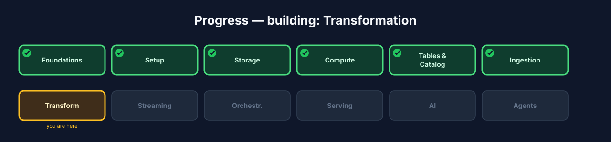
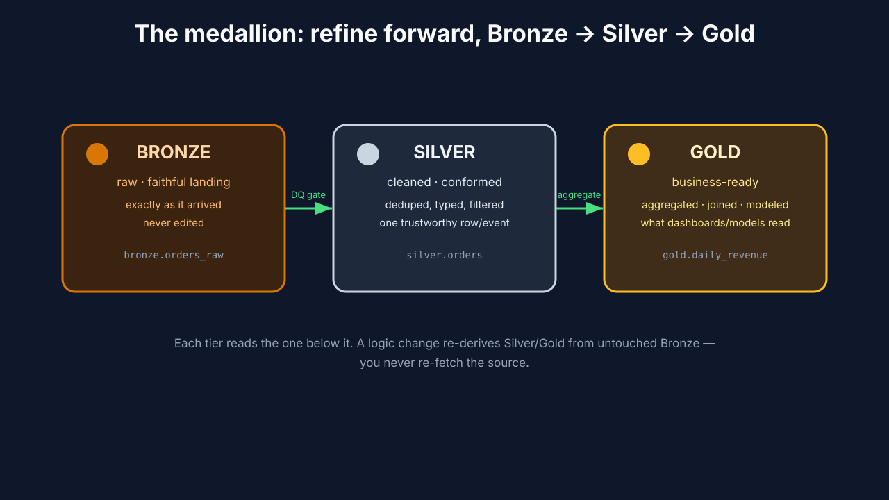
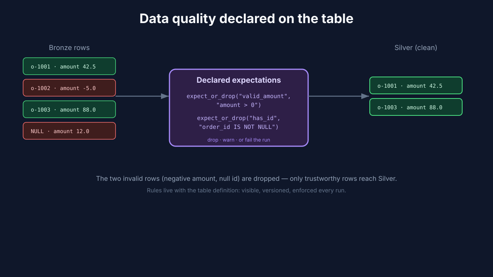
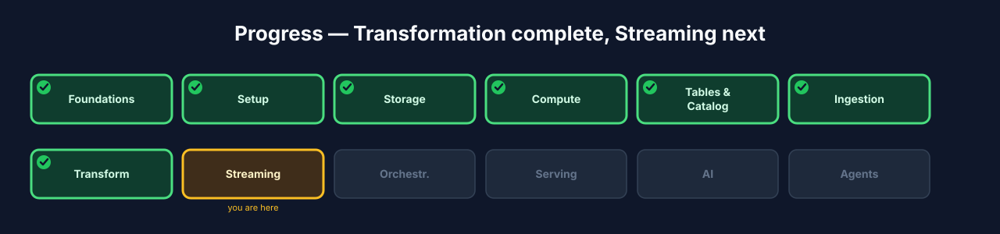

# Chapter 7 — Transformation: the medallion with Spark Declarative Pipelines

## 7.0 What you'll build

The heart of the lakehouse. You have raw orders in **Bronze** (Ch 6); now you
refine them into clean **Silver** and business-ready **Gold** — the **medallion**
pattern. And you'll build it the modern way: with **Spark Declarative Pipelines
(SDP)**, where you *declare* each table and its dependencies and let the engine
figure out the execution graph, incremental refresh, and data-quality enforcement.
You describe the *what*; SDP handles the *how*.

This is the chapter people remember, because it's where raw data becomes *useful*.
Bronze is faithful but ugly — duplicates, nulls, inconsistent casing, no
aggregation. Nobody builds a dashboard on Bronze. The medallion is the assembly
line that turns that raw material into something a business analyst, a dashboard,
or a model can actually trust and use. And by building it declaratively, you'll
write dramatically less plumbing than the old hand-scripted way — which is exactly
how modern data teams work.



**Figure 7.3** — Progress map with **Transformation** highlighted.

## 7.1 Learning objectives

By the end of this chapter you can:

- Explain the **medallion** architecture: Bronze → Silver → Gold and what each tier
  is for.
- Explain what **Spark Declarative Pipelines** are and how they differ from
  hand-written pipeline scripts.
- Declare Silver and Gold tables with dependencies and let SDP derive the graph.
- Attach **data quality** expectations to a table and see them enforced.

## 7.2 The medallion: Bronze → Silver → Gold

> **Medallion (Bronze/Silver/Gold)** *(canonical term)*: a layered refinement
> pattern — raw (Bronze) → cleaned and conformed (Silver) → aggregated,
> business-ready (Gold).

Each tier has one job:

- **Bronze** — raw, faithful landing (built in Chapter 6). Never edited.
- **Silver** — *cleaned and conformed*: valid types, deduplicated, bad rows
  filtered, columns standardized. One trustworthy row per real-world event.
- **Gold** — *business-ready*: aggregated, joined, modeled for how people actually
  consume it (e.g. daily revenue by channel). This is what dashboards and models
  read.

Why three tiers and not one big "clean it all up" step? Because each tier serves a
different audience and changes at a different rate, and separating them makes the
whole pipeline more robust and reusable. Think of an ore refinery: Bronze is the
raw ore straight from the mine (kept exactly as dug), Silver is the refined metal
(impurities removed, standardized into ingots), and Gold is the finished product
(shaped into exactly what a customer ordered). You *could* try to go from ore to
finished product in one giant step, but then every product change means re-mining.
By keeping distinct tiers, a new Gold table (say, "revenue by customer region")
just reads the *existing* trustworthy Silver — no re-cleaning, no re-ingesting.

There's a practical reuse point hiding here. Silver is shared infrastructure: many
different Gold tables read from the *same* clean Silver. You clean and deduplicate
orders *once* in Silver, and then build a dozen business views on top. If you
cleaned inside each Gold table instead, you'd repeat that logic a dozen times and
they'd inevitably drift apart. **Clean once in Silver; aggregate many ways in
Gold.**

You refine *forward* — each tier reads the one below it — so a logic change means
re-deriving Silver/Gold from the untouched Bronze, never re-fetching the source.
This is the ELT golden rule from Chapter 6 paying off: because Bronze is a faithful,
permanent record, you can rebuild everything above it whenever your understanding
improves.



**Figure 7.1** — Bronze (raw) → Silver (clean/conform) → Gold (aggregate/model),
each tier reading the one below, with data-quality gates between them.

## 7.3 What Spark Declarative Pipelines are

> **Spark Declarative Pipelines (SDP)** *(canonical term)*: a framework
> (`pyspark.pipelines`) where you *declare* the datasets that make up a pipeline and
> their dependencies; the engine derives the execution order, handles incremental
> refresh, and enforces data-quality expectations.

With a hand-written script you'd have to sequence the steps yourself, wire up
dependencies, decide what to recompute, and bolt on your own quality checks. SDP
flips that: you write one function per table, decorated to say "this *is* the
`silver_orders` table," and reference other tables by name. SDP reads all the
declarations, builds the dependency graph, and runs them in the right order — the
same declarative model that makes tools like dbt so productive, but native to
Spark and built **on Spark Connect** (Ch 4).

The distinction between **imperative** and **declarative** is worth making crisp,
because it's the core idea of the chapter. *Imperative* means you write the exact
steps in order: "first build Silver, then build Gold, and if Silver changed also
rebuild Gold, and don't forget to validate in between." You're the one holding the
whole sequence in your head. *Declarative* means you describe the desired *result*
— "Silver is Bronze cleaned; Gold is Silver aggregated" — and let the engine figure
out the order, the dependencies, and what needs recomputing. It's the difference
between giving someone turn-by-turn driving directions (imperative) and just giving
them the destination address and a GPS (declarative). As pipelines grow to dozens
or hundreds of tables, holding the imperative sequence in your head becomes
impossible; the declarative approach scales because the engine does the
bookkeeping.

### Under the hood — SDP runs on Spark Connect

`pyspark.pipelines` uses Spark Connect internally. That's why we standardized on
Connect back in Chapter 4: the transformation layer is built on it. Your pipeline
definitions are declarative Python; SDP compiles them to plans that execute on the
Connect server. Everything you learned about the thin-client model applies directly
— your pipeline code is a client that ships declarations to the remote engine.

## 7.4 Build — declare the medallion pipeline

An SDP pipeline is a set of decorated Python functions plus a small YAML that tells
SDP where the definitions live. You declare tables; you never call them in order
yourself.

Step 1 — the pipeline definitions (`pipeline_sdp.py`). Each function
returns a DataFrame and is registered as a table; dependencies are expressed by
reading other declared tables:

```python
from pyspark import pipelines as dp
from pyspark.sql import functions as F

# SILVER — clean & conform the raw Bronze orders.
@dp.table(name="iceberg.silver.orders")
@dp.expect_or_drop("valid_amount", "amount > 0")          # data-quality gate
@dp.expect_or_drop("has_id", "order_id IS NOT NULL")
def silver_orders():
    return (
        dp.read("iceberg.bronze.orders_raw")
          .dropDuplicates(["order_id"])                    # one row per order
          .withColumn("status", F.lower(F.col("status")))  # conform
          .select("order_id", "customer_id", "amount", "status", "created_at")
    )

# GOLD — daily revenue by status, business-ready.
@dp.table(name="iceberg.gold.daily_revenue")
def gold_daily_revenue():
    return (
        dp.read("iceberg.silver.orders")
          .withColumn("order_date", F.to_date("created_at"))
          .groupBy("order_date", "status")
          .agg(F.sum("amount").alias("revenue"),
               F.count("*").alias("order_count"))
    )
```

**What just happened?** Read the two functions and notice what's *absent*: nowhere
do you say "run Silver before Gold." You never call these functions yourself at
all. Instead, `gold_daily_revenue` reads `iceberg.silver.orders` via `dp.read(...)`,
and *that reference is the dependency*. SDP scans the declarations, sees that Gold
depends on Silver (which depends on Bronze), and infers the whole graph. You wrote
*what each table is*, not *when to build it* — that's the declarative model in one
screen of code.

Step 2 — the pipeline spec (`spark-pipeline.yml`) points SDP at the
definitions:

```yaml
name: lakehouse-medallion
definitions:
  - glob:
      include: pipeline_sdp.py
```

Step 3 — run the pipeline. SDP reads the declarations, builds the graph
(Bronze → Silver → Gold), and executes in dependency order:

```bash
spark-pipelines run --spec scripts/pipelines/spark-pipeline.yml
```

Expected: SDP reports the resolved graph and materializes `iceberg.silver.orders`
then `iceberg.gold.daily_revenue`. You did not sequence them — SDP inferred that
Gold depends on Silver, which depends on Bronze.

**What just happened?** SDP did the orchestration you'd otherwise hand-code. It
resolved the graph, ran Silver first, applied the data-quality gates, then ran Gold
against the freshly-materialized Silver. If you later add a third table that reads
Gold, SDP will slot it into the graph automatically — you won't touch the run
command. This is why declarative pipelines scale: adding a table is a local change,
not a rewrite of the sequence.

Step 4 — query the Gold table over a thin client:

```python
from pyspark.sql import SparkSession
spark = SparkSession.builder.remote("sc://localhost:15002").getOrCreate()
spark.table("iceberg.gold.daily_revenue").orderBy("order_date", "status").show()
```

Expected output (shape):

```
+----------+---------+-------+-----------+
|order_date|   status|revenue|order_count|
+----------+---------+-------+-----------+
|2026-01-05|cancelled|   88.0|          1|
|2026-01-05|   placed|  117.7|          3|
+----------+---------+-------+-----------+
```

**What just happened?** You're reading a business-ready table — daily revenue and
order counts by status. Trace its lineage in your head: these numbers came from
Silver (clean, deduplicated orders), which came from Bronze (the raw landing), which
came from the generator standing in for a source system. That full path, from raw
event to business metric, is the entire data engineering lifecycle in miniature —
and you built it declaratively.

## 7.5 Data quality as a first-class citizen

> **Data quality** *(canonical term)*: checks that data meets expectations before
> it's trusted downstream.

Notice the `@dp.expect_or_drop(...)` decorators on Silver. In SDP, quality rules are
**declared on the table**, not bolted on afterward. Each expectation is a named
boolean condition; SDP evaluates it on every row and can **drop** violating rows
(as here), **warn**, or **fail** the pipeline outright. Because the rule lives with
the table definition, it's visible, versioned, and enforced every run — no separate
validation job to forget.

Choosing between drop, warn, and fail is a real design decision, so think about it:

- **`expect_or_drop`** — silently remove bad rows. Good when a few malformed records
  shouldn't block the whole pipeline and you're fine excluding them from downstream
  tables. (Careful: dropping is data loss from the *clean* layer's perspective — the
  rows still exist in Bronze, which is exactly why Bronze fidelity matters.)
- **warn** — keep the row but record that it violated the rule. Good for monitoring
  data health without changing behavior.
- **`expect_or_fail`** — stop the whole pipeline if any row violates. Reserve this
  for conditions that mean something is catastrophically wrong (e.g. a primary key
  is null in a table that must have it), where continuing would corrupt everything
  downstream.

The instinct to reach for is: **fail loud on things that must never happen; drop or
warn on messiness you expect.** A null `order_id` where every order must have one?
Fail — something is deeply broken upstream. A negative `amount` from a known-flaky
source? Drop it and move on. Encoding these decisions right in the table definition
means the next engineer sees your data-quality intent without hunting through a
separate validation script.



**Figure 7.2** — Rows flow through declared expectations; violations are
dropped (or warned/failed) so only trustworthy rows reach Silver.

## 7.6 Troubleshooting

- **SDP reports a cycle or can't resolve the graph.** Two tables read each other, or
  a `dp.read(...)` names a table that isn't declared. Check that every referenced
  table either exists (like Bronze) or is declared in the pipeline.
- **A table materializes empty.** Often an over-strict expectation dropped every
  row, or the upstream table was empty. Check the expectation conditions and confirm
  Bronze actually has data.
- **`pyspark.pipelines` import errors.** You're on a Spark version without SDP.
  Confirm you're running the default Spark 4.1 (SDP is a recent feature).
- **Connect-style error during run.** SDP runs on Spark Connect, so failures surface
  as Connect errors — read the last line, as in Chapter 4.
- **Data-quality rule "isn't firing."** Confirm the decorator is on the right
  function and the condition is a valid SQL boolean expression over the table's
  columns.

## 7.7 Checkpoint

- `pipeline_sdp.py` declares `iceberg.silver.orders` and `iceberg.gold.daily_revenue`
  with dependencies expressed by `dp.read(...)`.
- `spark-pipelines run` materialized both tables in the correct order without you
  sequencing them.
- Silver carries `@dp.expect_or_drop` data-quality gates and dropped invalid rows.
- Querying `iceberg.gold.daily_revenue` returns aggregated, business-ready results.
- You can explain the difference between imperative and declarative pipelines.

## 7.8 Try it yourself

1. **Add a Gold table.** Declare a second Gold table — say, revenue by
   `customer_id` — that also reads Silver. Re-run the pipeline and confirm SDP builds
   it without you changing the run command. That's the "clean once, aggregate many
   ways" payoff.
2. **Tighten a rule.** Add an expectation to Silver (e.g. `status IN ('placed',
   'shipped', 'cancelled')`) and watch how many rows it drops. Then relax it and
   compare.
3. **Try fail vs. drop.** Change one expectation from `expect_or_drop` to
   `expect_or_fail`, introduce a violating row, and watch the pipeline stop. Reflect
   on when that behavior is what you want.
4. **Trace the lineage.** Pick one number in the Gold output and, in words, trace it
   back through Silver to Bronze to the generator. Being able to explain "where did
   this number come from?" is a core data-engineering skill.

## 7.9 Check your understanding

- What is each medallion tier for, and why keep them separate instead of one big
  cleanup step?
- Explain "clean once in Silver, aggregate many ways in Gold."
- What's the difference between an imperative and a declarative pipeline? Give the
  GPS analogy.
- When should a data-quality expectation *fail* the pipeline versus *drop* the row?

## 7.10 Recap & what's next

- The **medallion** refines data forward: **Bronze** (raw) → **Silver** (clean) →
  **Gold** (business-ready) — clean once, aggregate many ways.
- **Spark Declarative Pipelines** let you *declare* tables and dependencies; the
  engine derives the graph, refresh, and quality enforcement — built on Spark
  Connect.
- **Data quality** lives on the table as declared expectations (drop / warn / fail),
  enforced every run.
- **Next — Chapter 8, Streaming:** feed the *same* Bronze table continuously from
  Kafka, and contrast streaming with the batch pipeline you just built.



**Figure 7.4** — Progress map with **Transformation ✓** and **Streaming** next.
