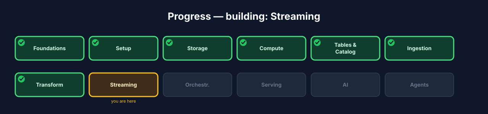
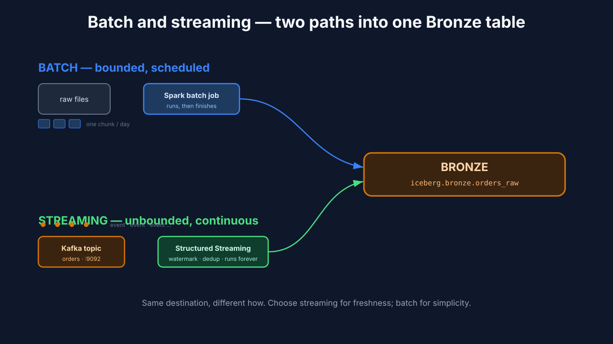
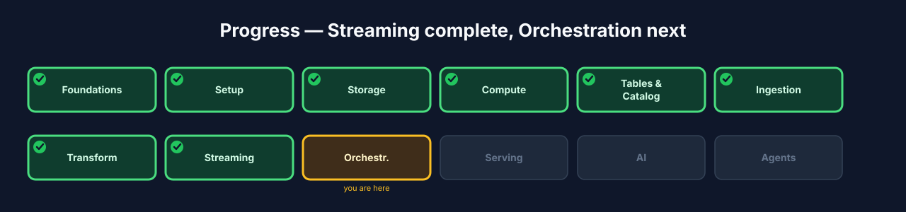

# Chapter 8 — Streaming: real-time ingestion with Kafka and Structured Streaming

## 8.0 What you'll build

The real-time path. In Chapter 6 you ingested a bounded **batch** of orders. Now
you'll feed the *same* Bronze table **continuously**: orders arrive as an **event
stream** on Kafka, and a Spark **Structured Streaming** job lands them into Iceberg
as they happen. You'll handle the hard parts of streaming honestly — **unbounded**
data, late events with **watermarks**, and exactly-once **deduplication** — and see
exactly when to reach for streaming instead of batch.



**Figure 8.3** — Progress map with **Streaming** highlighted.

## 8.1 Learning objectives

By the end of this chapter you can:

- Explain what an **event stream** and **unbounded** data are.
- Read from a Kafka topic with Spark **Structured Streaming** and write to Iceberg.
- Use a **watermark** to bound state and handle late-arriving events.
- Deduplicate a stream so the same event isn't landed twice.
- Decide when **streaming** is the right tool versus **batch**.

## 8.2 Streaming vs. batch

> **Streaming** *(canonical term)*: processing **unbounded** data continuously, as
> each event arrives, rather than in scheduled bounded chunks.

> **Event stream** *(canonical term)*: an unbounded, ordered sequence of records —
> here, a Kafka topic of order events.

Batch asks "process today's orders." Streaming asks "process each order the moment
it appears, forever." The data never ends — it's **unbounded** — so a streaming job
is a long-running process, not a script that finishes. You choose streaming when
freshness matters (fraud checks, live dashboards, alerting); you choose batch when
periodic is fine and simplicity wins. Crucially, both can feed the *same* Bronze
table — streaming is a different *how*, not a different destination.



**Figure 8.1** — Batch lands bounded chunks on a schedule; streaming lands
individual events continuously — both writing to the same Iceberg Bronze table.

## 8.3 The streaming challenges: order, lateness, duplicates

Real streams are messy. Events arrive **out of order** and **late** (a phone was
offline; a retry fired an hour later), and the *same* event can arrive **twice** (an
at-least-once producer). A correct streaming job must handle all three.

> **Watermark** *(canonical term)*: the streaming engine's moving clock — "I will
> not wait for events older than this" — which bounds how much state is kept and
> decides when late data is too late to include.

> **Dedup / idempotency** *(canonical term)*: dropping repeated events (by key +
> event time) so each real event lands exactly once.

Without a watermark, the engine would have to remember every event forever to catch
possible late-arrivers — unbounded state, eventual crash. The watermark says "after
this much lateness, stop waiting," letting Spark drop old state safely.

### Under the hood — Structured Streaming on Connect

Structured Streaming runs through the same Spark Connect server you started in
Chapter 4 (streaming support was added to Connect in the Spark 4.x line). The
streaming DataFrame API is identical to batch — `readStream`/`writeStream` instead
of `read`/`write` — so everything you learned transfers directly.

## 8.4 Build — stream orders from Kafka into Bronze

Step 1 — start Kafka and begin producing a live stream of order events:

```bash
./lakehouse start kafka
./lakehouse testdata stream --speed 5     # emit order events to the Kafka topic
```

Expected: Kafka is healthy on **9092**, and the generator publishes order events
continuously to the orders topic. (`./lakehouse producer` does the same;
`./lakehouse consumer` runs a ready-made Structured Streaming consumer if you want
to see one immediately.)

Step 2 — connect a thin client and define the streaming read from Kafka:

```python
from pyspark.sql import SparkSession
from pyspark.sql import functions as F
from pyspark.sql.types import StructType, StructField, StringType, DoubleType, TimestampType

spark = SparkSession.builder.remote("sc://localhost:15002").getOrCreate()

schema = StructType([
    StructField("order_id", StringType()), StructField("customer_id", StringType()),
    StructField("amount", DoubleType()),   StructField("status", StringType()),
    StructField("created_at", TimestampType()),
])

raw = (spark.readStream
       .format("kafka")
       .option("kafka.bootstrap.servers", "localhost:9092")
       .option("subscribe", "orders")
       .option("startingOffsets", "latest")
       .load())

# Kafka values are bytes; parse the JSON payload into columns.
events = (raw.select(F.from_json(F.col("value").cast("string"), schema).alias("e"))
             .select("e.*"))
```

Step 3 — watermark and deduplicate, then write the stream into the Bronze
Iceberg table:

```python
deduped = (events
    .withWatermark("created_at", "10 minutes")          # tolerate 10 min lateness
    .dropDuplicatesWithinWatermark(["order_id"]))        # exactly-once per order

query = (deduped.writeStream
    .format("iceberg")
    .outputMode("append")
    .option("checkpointLocation", "s3a://lakehouse/_checkpoints/bronze_orders_stream")
    .toTable("iceberg.bronze.orders_raw"))               # SAME Bronze table as batch

query.awaitTermination()   # long-running: this job doesn't "finish"
```

Expected: the query starts and micro-batches begin appending to
`iceberg.bronze.orders_raw`. The **checkpoint** records progress so a restart
resumes exactly where it left off — no gaps, no re-processing.

Step 4 — from another client, watch the Bronze count climb as events flow:

```python
spark.table("iceberg.bronze.orders_raw").count()   # run repeatedly — it grows
```

## 8.5 Why the checkpoint matters

The `checkpointLocation` is what makes a streaming job restartable and idempotent
across failures: it durably records which Kafka offsets have been processed and the
watermark state. Kill the job and restart it, and it resumes from the last committed
offset — it will not skip events or double-write them. Delete the checkpoint and it
starts over. Treat the checkpoint as part of your data: one checkpoint per streaming
query, never shared.

## 8.6 Checkpoint (yours, not the stream's)

- Kafka is healthy on **9092** and `testdata stream` is publishing order events.
- Your Structured Streaming job reads the `orders` topic over `sc://` and appends to
  `iceberg.bronze.orders_raw`.
- The job uses a **watermark** and `dropDuplicatesWithinWatermark` for exactly-once.
- A `checkpointLocation` is set, and the Bronze row count grows as events arrive.
- You can state one case where streaming beats batch and one where it doesn't.

## 8.7 Recap & what's next

- **Streaming** processes **unbounded** event streams continuously; batch processes
  bounded chunks. Both can feed the same Bronze table.
- **Watermarks** bound state and handle lateness; **dedup within the watermark**
  gives exactly-once landing.
- **Checkpoints** make streaming jobs restartable and idempotent.
- Structured Streaming uses the same Connect transport and DataFrame API as batch.
- **Next — Chapter 9, Orchestration:** schedule the batch medallion pipeline as a
  DAG with retries and backfills.



**Figure 8.4** — Progress map with **Streaming ✓** and **Orchestration** next.
