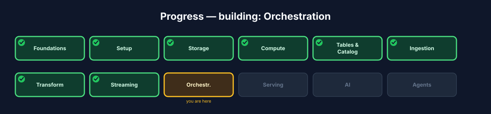
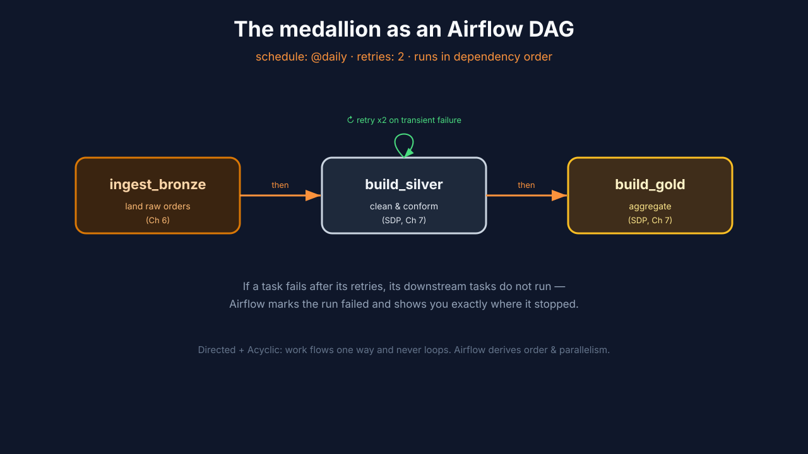
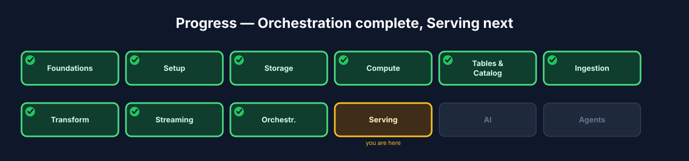

# Chapter 9 — Orchestration: scheduling the pipeline with Airflow

## 9.0 What you'll build

The conductor. You can run the medallion pipeline by hand — but a real lakehouse
runs it *on a schedule*, recovers from failures, and can re-run history on demand.
That's **orchestration**. You'll wrap the batch medallion (Ch 7) in an **Apache
Airflow** **DAG**, give it a schedule and **retries**, and run a **backfill** to
populate past dates. Airflow becomes the thing that keeps the lakehouse fed without
you babysitting it.



**Figure 9.3** — Progress map with **Orchestration** highlighted.

## 9.1 Learning objectives

By the end of this chapter you can:

- Explain what **orchestration** is and why a scheduler beats cron for pipelines.
- Read and reason about a **DAG**: tasks and their dependencies.
- Give a DAG a schedule and configure **retries** for resilience.
- Run a **backfill** to process historical dates.

## 9.2 What orchestration is

> **Orchestration** *(canonical term)*: scheduling tasks and wiring them into a
> dependency-aware pipeline that runs reliably, recovers from failure, and can be
> re-run over past time windows.

Scheduling alone (plain cron) fires a command at a time. Orchestration adds what
production actually needs: **dependencies** (run Silver only after Bronze
succeeds), **retries** (a transient failure shouldn't need a human), **visibility**
(which runs passed, which failed, why), and **backfills** (re-run last month
because logic changed). Airflow is the industry-standard tool for this.

## 9.3 The DAG: tasks and dependencies

> **DAG** *(canonical term)*: a Directed Acyclic Graph — the pipeline's tasks and
> the dependency edges between them. "Directed" and "acyclic" mean work flows one
> way and never loops.

In Airflow you express your pipeline as a DAG: each step is a **task**, and you
declare which tasks must finish before others start. Airflow figures out the order,
runs independent tasks in parallel, and stops a downstream task if its upstream
failed. Our medallion is a natural DAG: `ingest_bronze → build_silver →
build_gold`.



**Figure 9.1** — The medallion DAG: `ingest_bronze → build_silver → build_gold`,
scheduled daily, each task with retries; a failed task blocks its downstream.

### Under the hood — the DAG triggers work, it isn't the work

A common confusion: the DAG doesn't *contain* your Spark logic — it *triggers* it.
Each task typically calls the pipeline you already built (e.g. runs the SDP pipeline
or a Spark job over Connect). Keep heavy transformation in Spark and let Airflow do
what it's good at: scheduling, ordering, retrying, and reporting. This separation is
why the same pipeline runs identically whether you launch it by hand or Airflow
launches it at 2 a.m.

## 9.4 Build — a scheduled medallion DAG

Step 1 — start Airflow and open its UI:

```bash
./lakehouse start airflow
./lakehouse status
```

Expected: Airflow is healthy; the web UI is available on port **8085**. Log in and
you'll see the DAGs, including the medallion pipeline.

Step 2 — the DAG definition (`dags/lakehouse_medallion_pipeline.py`). It
schedules the pipeline daily, with retries, and expresses the medallion order:

```python
from datetime import datetime, timedelta
from airflow import DAG
from airflow.operators.python import PythonOperator

default_args = {
    "retries": 2,                          # transient failures auto-retry
    "retry_delay": timedelta(minutes=5),
}

def ingest_bronze(**_): ...   # calls the batch ingest from Ch 6
def build_silver(**_): ...    # runs the SDP Silver step from Ch 7
def build_gold(**_): ...      # runs the SDP Gold step from Ch 7

with DAG(
    dag_id="lakehouse_medallion_pipeline",
    start_date=datetime(2026, 1, 1),
    schedule="@daily",                      # run once a day
    catchup=False,                          # don't auto-run all history on deploy
    default_args=default_args,
) as dag:
    t_bronze = PythonOperator(task_id="ingest_bronze", python_callable=ingest_bronze)
    t_silver = PythonOperator(task_id="build_silver",  python_callable=build_silver)
    t_gold   = PythonOperator(task_id="build_gold",    python_callable=build_gold)

    t_bronze >> t_silver >> t_gold          # the dependency edges = the DAG
```

Step 3 — trigger a run from the UI (or CLI) and watch the tasks go green in
order:

```bash
./lakehouse airflow dags trigger lakehouse_medallion_pipeline
```

Expected: `ingest_bronze` runs first; only when it succeeds does `build_silver`
start, then `build_gold`. In the UI's graph view each task turns green in sequence.

## 9.5 Retries and backfills — the production payoff

**Retries.** With `retries: 2`, a task that hits a transient error (a momentary
storage blip) is retried automatically before the run is marked failed. You wake up
to a green pipeline, not a 2 a.m. page.

> **Backfill** *(canonical term)*: running a pipeline over past dates to populate or
> re-populate history.

**Backfill.** Suppose you fixed a Gold aggregation and need last week re-computed.
Because each Airflow run is tied to a date (its "logical date"), you can backfill a
range and Airflow runs one pipeline execution per day in that window:

```bash
./lakehouse airflow dags backfill lakehouse_medallion_pipeline \
    --start-date 2026-01-01 --end-date 2026-01-07
```

Expected: seven dated runs execute, each re-deriving that day's Silver/Gold from the
untouched Bronze — the payoff of the ELT + idempotency choices from Chapter 6.

## 9.6 Checkpoint

- `./lakehouse status` shows Airflow healthy; the UI opens on **8085**.
- The `lakehouse_medallion_pipeline` DAG shows `ingest_bronze → build_silver →
  build_gold`.
- A triggered run turns the tasks green in dependency order.
- `retries` are configured, and you ran a **backfill** over a date range.

## 9.7 Recap & what's next

- **Orchestration** schedules, orders, retries, and reports on pipeline tasks —
  everything cron can't.
- A **DAG** expresses tasks and dependencies; Airflow derives order and parallelism.
- The DAG **triggers** your Spark/SDP work; it doesn't replace it.
- **Retries** give resilience; **backfills** re-run history, made safe by idempotency.
- **Next — Chapter 10, Serving:** expose the finished Gold tables to other engines
  through the one open catalog.



**Figure 9.4** — Progress map with **Orchestration ✓** and **Serving** next.
