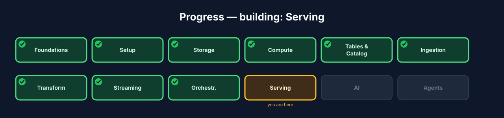
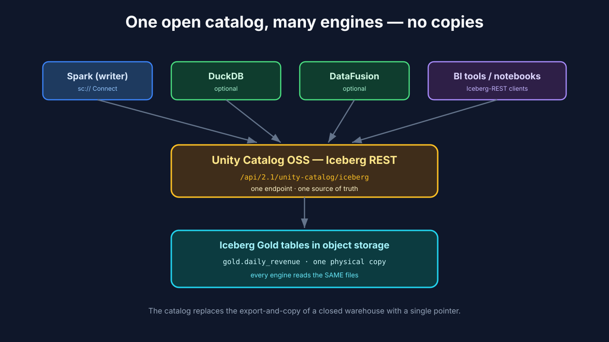
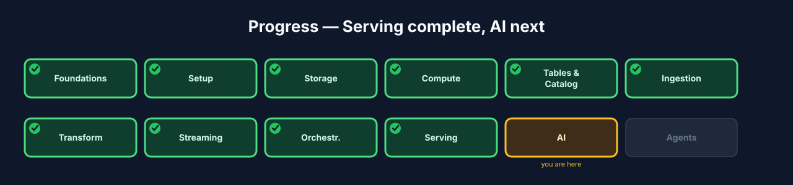

# Chapter 10 — Serving: one open catalog, many engines

## 10.0 What you'll build

The payoff of "open." Your Gold tables are built, refreshed, and scheduled. Now you
**serve** them — make them available to whatever wants to read: a second query
engine, a BI tool, a notebook, a model. And here the open lakehouse earns its name:
because every table lives in **Unity Catalog OSS** as an open Iceberg table, *any*
Iceberg-aware engine reads the **same** data through **one** catalog endpoint — no
copies, no exports, no per-tool metastore. You'll prove it by querying your Gold
table from a *different* engine than the one that wrote it.



**Figure 10.3** — Progress map with **Serving** highlighted.

## 10.1 Learning objectives

By the end of this chapter you can:

- Define the **serving** layer and who consumes it.
- Explain how one **Iceberg REST catalog** enables **multi-engine** access.
- Read a Gold table from a second engine and get identical results.
- Describe how serving differs from a closed warehouse's export-and-copy model.

## 10.2 What serving is

> **Serving** *(canonical term)*: making finished data available to consumers — BI
> tools, other query engines, apps, and models — ideally engine-neutrally.

Serving is a **read/consumption** concern, defined by the *consumer*, not the
producer. The test of a good serving layer: can something *other than* the tool that
produced the data get at it, easily and without a copy? In a closed warehouse the
answer is usually "export it first." In the open lakehouse the answer is "point your
engine at the catalog" — because the data was never locked in a proprietary format
to begin with.

## 10.3 One catalog, many engines

The mechanism is the one you stood up in Chapter 5: Unity Catalog OSS's **Iceberg
REST catalog** at `http://localhost:8081/api/2.1/unity-catalog/iceberg`. It's a
*standard* protocol, so many engines speak it. Spark wrote the tables; DuckDB,
DataFusion, Trino, and others can read them — all pointing at that single URL,
all seeing the same current snapshot.

> **Multi-engine / interoperability** *(canonical term)*: the same open tables read
> by different engines, because they share one catalog and one open format.



**Figure 10.1** — Spark, DuckDB, DataFusion, and BI tools all read the same
Iceberg Gold tables through the one Unity Catalog OSS REST endpoint — no data
copied.

### Under the hood — serving vs. a closed warehouse

In a closed warehouse, "giving another team access" often means an ETL job that
*copies* data out to wherever they can read it — and now you have two copies that
drift. The open lakehouse replaces the copy with a *pointer*: the catalog. Every
consumer reads the one authoritative table. Fewer copies, no drift, and governance
stays in one place (Chapter 12's agents and any BI tool hit the same governed
tables).

## 10.4 Build — serve Gold to a second engine

The primary, always-available path is Spark itself reading through the catalog — but
the *point* of this chapter is a **different** engine, so we also read the same table
from DuckDB.

Step 1 — confirm Gold is present via the catalog (Spark Connect client):

```python
from pyspark.sql import SparkSession
spark = SparkSession.builder.remote("sc://localhost:15002").getOrCreate()
spark.table("iceberg.gold.daily_revenue").orderBy("order_date").show()
```

Step 2 — read the *same* table from **DuckDB**, pointing at the one Iceberg
REST catalog. DuckDB is not required infrastructure — it's a lightweight second
engine that proves interoperability:

```sql
-- In the DuckDB CLI / Python:
INSTALL iceberg; LOAD iceberg;

-- Attach the SAME Unity Catalog OSS Iceberg REST endpoint Spark uses.
ATTACH 'iceberg.gold' AS gold (
    TYPE iceberg,
    ENDPOINT 'http://localhost:8081/api/2.1/unity-catalog/iceberg'
);

SELECT order_date, status, revenue, order_count
FROM gold.daily_revenue
ORDER BY order_date, status;
```

Expected: DuckDB returns **the same rows** Spark returned in Step 1 — read directly
from the Iceberg files, through the shared catalog, with no export step. That
identical result across two independent engines is the whole demonstration.

> Note: DuckDB / DataFusion are *optional garnish* — nice for proving the point and
> for lightweight local analytics. Unity Catalog OSS is the one catalog everything
> goes through; the second engine is interchangeable.

Step 3 — (optional) point a BI tool or notebook at the same catalog. Any
Iceberg-REST-aware client uses the identical endpoint and sees the identical tables.

## 10.5 Checkpoint

- Your Gold table is visible through the Unity Catalog OSS Iceberg REST catalog.
- You queried `gold.daily_revenue` from a **second engine** (DuckDB) using the same
  endpoint Spark uses.
- The second engine returned **identical results** with no data copied or exported.
- You can explain why this beats a warehouse's export-and-copy model.

## 10.6 Recap & what's next

- **Serving** exposes finished data to consumers, engine-neutrally.
- One **Iceberg REST catalog** (Unity Catalog OSS) lets **many engines** read the
  **same** tables — no copies, no drift.
- DuckDB/DataFusion are optional second engines; the catalog is the constant.
- **Next — Chapter 11, AI:** train a model on the Gold table and track it with
  MLflow — the data feeding intelligence.



**Figure 10.4** — Progress map with **Serving ✓** and **AI** next.
