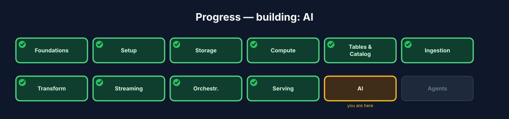
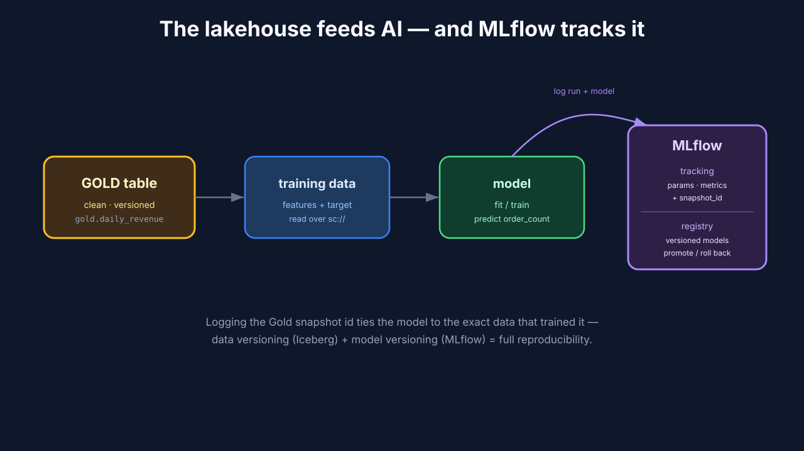
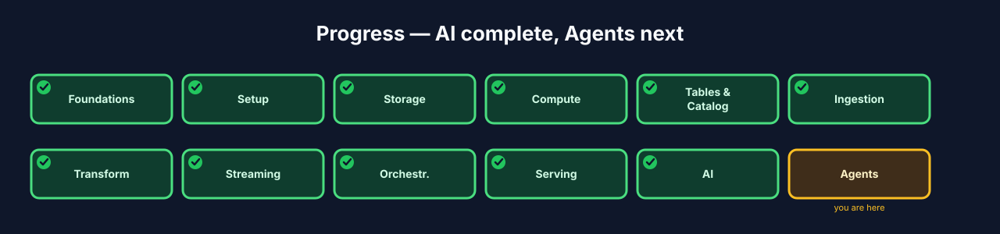

# Chapter 11 — AI: training and tracking a model on the lakehouse

## 11.0 What you'll build

The lakehouse feeding intelligence. Your Gold tables are clean, served, and
governed — exactly the shape a model wants. In this chapter you read a Gold table as
**training data**, train a simple model, and record the run with **MLflow**:
**experiment tracking** for params and metrics, and a **model registry** for
versioned, promotable models. The point isn't the model — it's the *pattern*: the
same open tables that serve BI also serve AI, from one governed source.

Let's set expectations honestly up front: this is **not** a machine-learning course,
and the model you train will be almost comically simple. That's deliberate. The
lesson here isn't "how to build a good model" — it's "how the lakehouse is the right
*foundation* for AI, and how you track model work with the same discipline you
brought to your data." The ML world is drowning in un-reproducible experiments and
mystery models; the lakehouse plus MLflow is how you bring order to that chaos.
Focus on the *workflow*, not the algorithm.



**Figure 11.3** — Progress map with **AI** highlighted.

## 11.1 Learning objectives

By the end of this chapter you can:

- Read a Gold table as **training data** for a model.
- Use MLflow **experiment tracking** to log params, metrics, and artifacts.
- Register a trained model in the MLflow **model registry** and version it.
- Explain why a lakehouse is a natural foundation for AI workloads.

## 11.2 Why the lakehouse is a good home for AI

Models are only as good as their data, and the lakehouse already solved the hard
data problems: Gold tables are clean and conformed (Ch 7), versioned via snapshots
(Ch 5) so you can reproduce *exactly which data* trained a model, served openly
(Ch 10) so training reads the same governed tables as everything else, and
refreshed on a schedule (Ch 9). "Train on Gold" gives you reproducibility and
lineage for free — you can always answer "what data produced this model?"

That last point is worth dwelling on, because it's a genuine pain in real ML work.
Ask a typical ML team "what exact data did this production model train on?" and the
honest answer is often a shrug — a CSV someone exported months ago, since
overwritten, from a query nobody saved. When something goes wrong, you can't
reproduce the training set, so you can't diagnose the model. The lakehouse dissolves
this problem: your training data is a *versioned Iceberg table*. You can point at the
exact snapshot, time-travel back to it (Chapter 5), and reconstruct the precise rows
that trained any model. Reproducible data is the foundation of trustworthy ML, and
you already have it.

> **Training data** *(canonical term)*: the historical, feature-shaped data a model
> learns from — here, rows from a Gold table.



**Figure 11.1** — Gold table → training data → model; every run's params,
metrics, and the model artifact are logged to MLflow and versioned in the registry.

## 11.3 What MLflow gives you

> **Experiment tracking** *(canonical term)*: recording each model run's parameters,
> metrics, and artifacts so runs are comparable and reproducible.

> **Model registry** *(canonical term)*: a versioned store of trained models,
> promotable through stages (e.g. staging → production).

Without tracking, model development is a mess of notebooks and "which version was
that?" MLflow fixes both ends: every training run is logged (what params, what
score, what artifact), and the good models get registered under a name with
versions you can promote or roll back — the same disciplined versioning Iceberg gave
your data, now for your models.

Picture the world *without* MLflow, because most people have lived it. You train a
model in a notebook, tweak a parameter, train again, tweak, train again — twenty
times. Which run was best? You're not sure; the numbers scrolled off the screen. Can
you recreate the good one? Not really. Which model file is deployed? The one called
`model_final_v2_REAL.pkl`, probably. This is the actual state of a lot of ML work,
and it's a reproducibility disaster. MLflow replaces it with a system: every run is
recorded with its params and metrics so you can *sort by score and find the best*;
every model is versioned in the registry so "what's in production" is a fact, not a
guess. It brings the same rigor to models that Iceberg brought to your data.

### Under the hood — reproducibility from snapshots

Because you train on an Iceberg Gold table, you can log the table's **snapshot id**
as a run parameter. That means a year later you can reconstruct the *exact* training
set by time-traveling to that snapshot (Ch 5). Data versioning + model versioning =
end-to-end reproducibility, something classic ML setups struggle to guarantee. This
is the single most powerful idea in the chapter: when your data lives in a versioned
table and your models live in a versioned registry, the entire chain from raw data
to deployed model is reproducible. That's rare, and it's a direct consequence of
building on a lakehouse.

## 11.4 Build — train, track, register

Step 1 — start MLflow and open its UI:

```bash
./lakehouse start mlflow
./lakehouse status
```

Expected: MLflow tracking server healthy; UI available on port **5000**.

**What just happened?** You started the MLflow tracking server — the service that
records every training run and stores registered models. The UI on port 5000 is
where model work becomes visible and comparable, the same way the Airflow UI made
orchestration visible. Keep it open as you train; watching runs appear is how the
tracking concept becomes concrete.

Step 2 — read Gold as training data over Spark Connect, then train and log
with MLflow. We fit a small model that predicts order count from revenue — trivial
on purpose; the *workflow* is the lesson:

```python
import mlflow, mlflow.sklearn
from sklearn.linear_model import LinearRegression
from pyspark.sql import SparkSession

spark = SparkSession.builder.remote("sc://localhost:15002").getOrCreate()

# Record WHICH data trained the model (snapshot id → reproducibility).
snap = spark.sql("SELECT max(snapshot_id) s FROM iceberg.gold.daily_revenue.snapshots").collect()[0]["s"]
pdf = spark.table("iceberg.gold.daily_revenue").toPandas()
X, y = pdf[["revenue"]], pdf["order_count"]

mlflow.set_tracking_uri("http://localhost:5000")
mlflow.set_experiment("orders-baseline")

with mlflow.start_run():
    model = LinearRegression().fit(X, y)
    mlflow.log_param("gold_snapshot_id", snap)     # data lineage
    mlflow.log_param("features", "revenue")
    mlflow.log_metric("r2", model.score(X, y))     # a metric to compare runs
    mlflow.sklearn.log_model(model, "model")       # the artifact
```

Expected: a new run appears under the `orders-baseline` experiment in the MLflow UI,
showing the `r2` metric, the logged params (including the Gold snapshot id), and the
saved model artifact.

**What just happened?** Look at the `log_param("gold_snapshot_id", snap)` line — that
is the reproducibility magic from 11.3 in one call. You captured the exact Iceberg
snapshot the training data came from and stamped it onto the run. A year from now,
"what data trained this model?" has an exact answer, and you can time-travel to that
snapshot to get the identical rows. The rest is standard MLflow: log the params you
chose, the metric to judge by, and the model artifact itself. Notice how little of
this is about the *model* — it's about *recording the work* so it's not lost.

Step 3 — register the model to version and promote it:

```python
result = mlflow.register_model(
    model_uri=f"runs:/{mlflow.last_active_run().info.run_id}/model",
    name="orders-order-count",
)
# The registry now holds version N of "orders-order-count", ready to promote.
```

Expected: the model shows up in the MLflow **Models** tab as a named, versioned
entry you can move through stages.

**What just happened?** You promoted a run's model into the *registry* — a named,
versioned home for models you might actually use. This is the difference between "a
model file somewhere" and "version 3 of `orders-order-count`, which we can promote to
production or roll back." The registry is to models what the catalog is to tables:
the one authoritative, versioned source of truth.

Step 4 — compare runs: train again with a tweak (e.g. a different feature)
and view both runs side by side in the UI, sorted by `r2`. This is why tracking
exists — objective comparison instead of guesswork.

**What just happened?** You just experienced the entire point of experiment
tracking. Two runs, side by side, sorted by score — you can *see* which was better
instead of guessing. Scale that from two runs to two hundred and you understand why
no serious ML team works without tracking. The best run isn't the one you remember;
it's the one the data says is best.

## 11.5 Troubleshooting

- **`mlflow` can't connect to the tracking server.** The tracking URI is wrong or the
  server is down. Confirm `./lakehouse status` shows MLflow healthy and that
  `set_tracking_uri("http://localhost:5000")` matches.
- **`.toPandas()` is slow or runs out of memory.** You're pulling a large table into
  local memory. Fine for a small Gold table like ours; for big data you'd sample or
  train distributed. Keep the teaching example small.
- **The snapshots query errors.** The `.snapshots` metadata table is Iceberg-specific
  — confirm you're querying an Iceberg table through the catalog (Chapter 5).
- **`register_model` fails / no run found.** `last_active_run()` returns nothing if
  the run already closed. Register inside or right after the `with mlflow.start_run()`
  block, or pass the run id explicitly.
- **Model artifact doesn't appear in the UI.** The `log_model` call didn't run or
  logged to a different experiment. Confirm the experiment name and that the run
  completed without error.

## 11.6 Checkpoint

- MLflow is healthy; the UI opens on **5000**.
- You read `iceberg.gold.daily_revenue` as training data over `sc://`.
- A run logged params (including the Gold **snapshot id**), the `r2` metric, and a
  model artifact.
- You **registered** the model and can see a versioned entry in the registry.
- You can explain how snapshots make the training set reproducible.

## 11.7 Try it yourself

1. **Run the comparison for real.** Train three times with different features or
   parameters, then sort the runs by `r2` in the UI and identify the best. You've now
   used tracking the way real teams do.
2. **Prove reproducibility.** Note the `gold_snapshot_id` you logged. Write out (in
   words or SQL) how you'd time-travel to that snapshot to reconstruct the exact
   training data months later.
3. **Promote a version.** In the registry, move your model between stages (e.g. to
   "staging"). Notice that "what's the current staging model?" is now a precise
   answer, not a guess.
4. **Explain the pattern.** In two sentences, explain to an imaginary ML colleague
   why training on a Gold Iceberg table beats training on an exported CSV.

## 11.8 Check your understanding

- Why is a lakehouse a good foundation for AI? Name at least three properties Gold
  tables already have that models want.
- What are the two things MLflow tracks, and what problem does each solve?
- How does logging the Gold snapshot id give you end-to-end reproducibility?
- What's the difference between a logged run and a registered model?

## 11.9 Recap & what's next

- The lakehouse is a natural AI foundation: clean, versioned, served, scheduled data
  — reproducible training data for free.
- **Experiment tracking** logs params/metrics/artifacts so runs are comparable; the
  **model registry** versions and promotes models.
- Logging the Gold **snapshot id** ties model lineage to exact data — full
  reproducibility from raw data to deployed model.
- **Next — Chapter 12, Agents:** let an LLM agent operate the whole lakehouse
  through its CLI and skills.



**Figure 11.4** — Progress map with **AI ✓** and **Agents** next.
