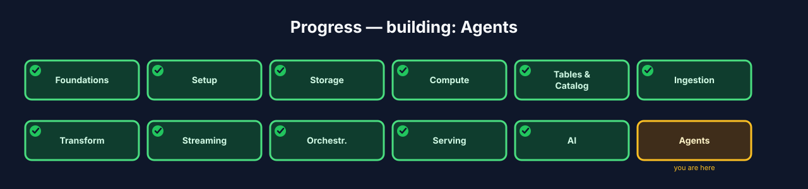
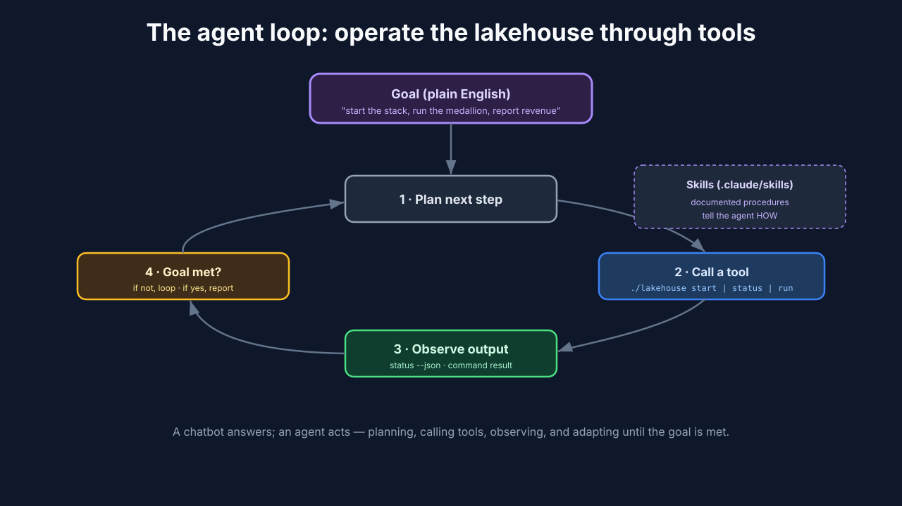
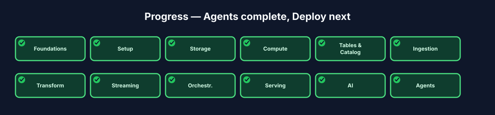

# Chapter 12 — Agents: letting an LLM operate the lakehouse

## 12.0 What you'll build

The newest layer, and a fitting capstone: an **agent** — an LLM that *operates* the
lakehouse for you. You've built every layer by hand; now you hand the controls to an
AI that drives the same `./lakehouse` CLI and reads the same skills you've used all
course. You'll ask it, in plain English, to start the stack, run the medallion, and
report on the Gold tables — and watch it use **tools** to actually do it. This is
the "designed to be operated by an AI agent" ethos the reference architecture was
built around.

This is the frontier layer — the one that didn't exist in data engineering courses
a couple of years ago and that most still skip. It's also the one that ties a bow on
everything you've built: every earlier chapter created a clean, uniform way to
operate the lakehouse, and that uniformity is *exactly* what makes it operable by an
AI. The agent isn't magic bolted on top; it's the natural payoff of having built the
whole system behind one consistent control surface. By the end you'll understand
both how agents work *and* why good engineering discipline is what makes them
possible.



**Figure 12.3** — Progress map with **Agents** highlighted.

## 12.1 Learning objectives

By the end of this chapter you can:

- Define an **agent** and what distinguishes it from a chatbot.
- Explain **tool use** and how **skills** expose safe actions to an agent.
- Have an agent operate the lakehouse via the `./lakehouse` CLI.
- Describe the guardrails that make agent-operated infrastructure safe.

## 12.2 What an agent is

> **Agent** *(canonical term)*: an LLM that takes *actions* through tools to
> accomplish a goal — not just generating text, but doing work and observing results.

A chatbot answers; an agent *acts*. Given a goal ("run today's pipeline and tell me
revenue by status"), an agent plans steps, calls tools to execute them, reads the
results, and adapts — looping until the goal is met. The lakehouse is an ideal thing
for an agent to operate because it already exposes a clean, uniform control
surface: the `./lakehouse` CLI you've used in every chapter.

The distinction between a chatbot and an agent is the whole conceptual leap, so make
it crisp. A chatbot is a very knowledgeable person locked in a room with a phone —
they can *tell* you how to run the pipeline, but they can't touch anything. An agent
is that same knowledgeable person, but now they're standing in front of the actual
controls, *with hands*. They can plan, press buttons, look at what happened, and
adjust. The "hands" are **tools** — the concrete actions the agent is allowed to
take. An LLM without tools can only talk; an LLM with tools can do. Everything
interesting about agents comes from that one addition: the ability to act and then
observe the result of acting.

> **Tool use / skills** *(canonical term)*: the defined actions an agent can invoke.
> Here the tools are `./lakehouse` subcommands, and **skills** are documented
> procedures (`.claude/skills/`) that tell the agent how to accomplish a task.



**Figure 12.1** — The agent loop: goal → plan → call a tool (`./lakehouse …`) →
observe output → repeat until done. Skills supply the how-to; the CLI supplies the
actions.

The loop in Figure 12.1 is the beating heart of every agent, and it's worth naming
each step: the agent **plans** (decides the next action toward the goal), **acts**
(calls a tool), **observes** (reads the tool's output), and **repeats**. This
observe-and-adapt loop is what separates an agent from a script. A script runs fixed
steps blindly; an agent looks at each result and decides what to do next. If
`status` shows a service unhealthy, the agent can notice and react — a hardcoded
script would barrel ahead.

## 12.3 Why the lakehouse is agent-ready

Two things make this lakehouse operable by an agent without inventing anything:

1. **One uniform control surface.** Everything — setup, start/stop, status,
   testdata, pipelines, browse — goes through `./lakehouse`. An agent that can run
   shell commands can run the whole platform, and `status --json` gives it
   machine-readable state to reason over.
2. **Skills as documented procedures.** The repo ships `.claude/skills/` (e.g. the
   `SDP.md` skill) and a `CLAUDE.md` entry point. A skill is a written recipe — "to
   run the medallion, do X, then Y, verify Z" — so the agent follows a proven path
   instead of improvising.

Here's the deeper lesson, and it's one that will make you a better engineer whether
or not you ever deploy an agent: **the qualities that make a system agent-friendly
are the same qualities that make it human-friendly.** A single consistent CLI,
machine-readable status output, and clear written procedures are things you'd want
for *yourself* and your teammates. It's no accident that the well-designed lakehouse
is also the agent-operable one. Building for clarity — one front door, predictable
outputs, documented procedures — pays off twice: humans onboard faster, and agents
can drive it. If there's one takeaway from this chapter beyond "agents are cool," it's
that good structure is the real enabler.

### Under the hood — the README contract

The reference architecture's demos follow a fixed README contract: each demo
documents how to run and verify it in a predictable place. That consistency is what
lets an agent "run any demo by reading its README" — the structure *is* the
tool interface. Well-structured docs aren't just for humans anymore; they're the
API an agent programs against. When your documentation is consistent and complete
enough that an agent can follow it without guessing, you've also made it good enough
that a new human teammate can too.

## 12.4 Build — have an agent run the lakehouse

Step 1 — point a coding agent (Claude Code, Cursor, or similar) at the repo.
The agent discovers its instructions from `CLAUDE.md` / `AGENTS.md` and the
`.claude/skills/` directory — the same files you've had all along.

**What just happened?** The agent didn't need special integration — it "onboarded"
by reading the same instruction files a human would. `CLAUDE.md` / `AGENTS.md` are
the entry points that tell the agent what this project is and how to operate it, and
the skills directory holds the step-by-step recipes. This is the README contract in
action: the agent learns the system by reading its docs.

Step 2 — give it a plain-English goal:

```
You: Start the lakehouse stack, run the batch medallion pipeline,
     then show me daily revenue by status from the Gold table.
```

Step 3 — watch the agent operate. It plans and calls tools in sequence,
observing each result before the next step:

```text
agent → ./lakehouse start spark          # bring up compute
agent → ./lakehouse start unity-catalog  # bring up the catalog
agent → ./lakehouse status --json        # confirm healthy (machine-readable)
agent → spark-pipelines run --spec .../spark-pipeline.yml   # run the medallion
agent → ./lakehouse browsedata iceberg.gold.daily_revenue   # read the result
agent → "Here's daily revenue by status: …"                 # reports back
```

Expected: the agent brings the stack up, runs the pipeline you built in Chapter 7,
reads the Gold table through the catalog, and summarizes the numbers — all from one
English instruction, using only the tools you already have.

**What just happened?** Trace what the agent did against the loop from 12.2. It
*planned* a sequence (start compute, start catalog, verify, run pipeline, read
results). It *acted* by calling `./lakehouse` commands — the exact same commands
you've typed all course. It *observed* — notice the `status --json` call, where it
checks health before proceeding rather than assuming success. And it *reported* back
in plain language. Every tool it used is one you've used; the agent added planning
and adaptation on top of the control surface you already built.

Step 4 — try a follow-up that requires adaptation, e.g. "now tear it all
down cleanly." The agent uses `./lakehouse stop all`, confirming state via `status`
before and after — planning and verifying, not just firing commands.

**What just happened?** The follow-up shows the "observe" step earning its keep. A
good agent checks status before tearing down (what's actually running?) and after
(did it stop cleanly?), rather than blindly firing a stop command and hoping. That
verify-don't-assume behavior is exactly what you'd want a careful human operator to
do — and it's why the machine-readable `status --json` is such an important part of
making the lakehouse agent-ready.

## 12.5 Guardrails: agent-operated, not agent-out-of-control

Handing infrastructure to an agent demands limits. The practitioner guardrails:

- **Scoped tools.** The agent gets the `./lakehouse` CLI, not unrestricted shell
  power. Its action space is the platform's own commands.
- **Read-then-act.** `status --json` lets the agent *check* state before and after
  changes, so it verifies rather than assumes.
- **Reversibility.** Teardown is one command and volumes are preserved by default —
  a mistake is recoverable, echoing the time-travel safety net from Chapter 5.
- **Human in the loop for destructive steps.** Operations like `reset --all` (which
  wipes data) should require explicit confirmation, not silent execution.

The principle uniting these is **least privilege plus reversibility** — give the
agent exactly the powers it needs and no more, and make sure anything it does can be
undone. This is the same instinct you'd apply to a new team member on their first
day: let them run the safe, everyday commands freely, but require a second pair of
eyes before anything destructive or irreversible. An agent is a fast, tireless
operator, which makes it wonderful for routine work and dangerous if handed a loaded
gun. Scoped tools and human approval for destructive steps are how you get the
upside without the downside. Note how the lakehouse's earlier design choices — a
reversible teardown, preserved volumes, time-travel — mean the safety net was
already there before the agent arrived.

## 12.6 Troubleshooting

- **The agent can't figure out how to operate the repo.** Its instruction files are
  missing or thin. Confirm `CLAUDE.md` / `AGENTS.md` and `.claude/skills/` exist and
  actually describe how to run and verify things — the agent is only as good as the
  docs it reads.
- **The agent runs a command that fails and gives up.** Often the underlying stack
  isn't healthy. Run `./lakehouse status` yourself; fix the real issue and the agent
  will proceed. The agent surfaces problems, it doesn't invent fixes for broken
  infrastructure.
- **The agent tries something destructive.** Your guardrails are too loose. Restrict
  its tools and require confirmation for commands like `reset --all`.
- **The agent "hallucinates" a command that doesn't exist.** It's improvising instead
  of following a skill. Point it at the documented skill/CLI help so it uses real
  subcommands, not invented ones.

## 12.7 Checkpoint

- You pointed an agent at the repo; it read `CLAUDE.md` / skills for instructions.
- From one English goal, the agent started the stack, ran the medallion, and
  reported Gold results using `./lakehouse` tools.
- It used `status` to verify state before/after actions.
- You can name three guardrails that keep agent operation safe.
- You can explain why the qualities that make a system agent-ready also make it
  human-friendly.

## 12.8 Try it yourself

1. **Give it a multi-step goal.** Ask the agent to generate fresh test data, run the
   pipeline, and report the top revenue day. Watch how it sequences and verifies each
   step.
2. **Watch it recover.** Stop a service the agent will need, then give it a goal that
   requires it. Observe whether it notices the unhealthy state (via `status`) and
   reacts, versus barreling ahead.
3. **Tighten a guardrail.** Decide which `./lakehouse` commands you'd never let an
   agent run without confirmation, and write down the rule. You've just designed an
   agent safety policy.
4. **Reflect on the meta-lesson.** In a paragraph, explain why building the lakehouse
   behind one clean CLI made this whole chapter possible — and how that same choice
   helps human operators.

## 12.9 Check your understanding

- What is the one thing that turns an LLM from a chatbot into an agent?
- Name the four steps of the agent loop and what each does.
- Why is this lakehouse "agent-ready" without inventing anything new? Give the two
  reasons.
- State the "least privilege plus reversibility" principle and give two guardrails
  that implement it.

## 12.10 Recap & what's next

- An **agent** takes actions through **tools** to reach a goal, looping through
  plan → act → observe → repeat; **skills** give it proven procedures.
- The lakehouse is agent-ready because of one uniform CLI control surface and
  documented skills — the same qualities that make it human-friendly.
- Guardrails — scoped tools, read-then-act, reversibility, human approval for
  destructive ops — keep it safe (least privilege plus reversibility).
- **Next — Chapter 13, Deploy & Teardown:** take the lakehouse to the cloud (tour),
  tear it down cleanly, and map where to go next.



**Figure 12.4** — Progress map with **Agents ✓** and **Deploy** next.
