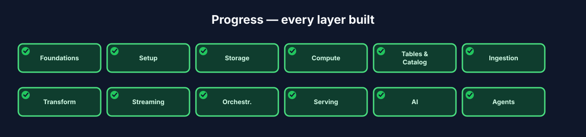
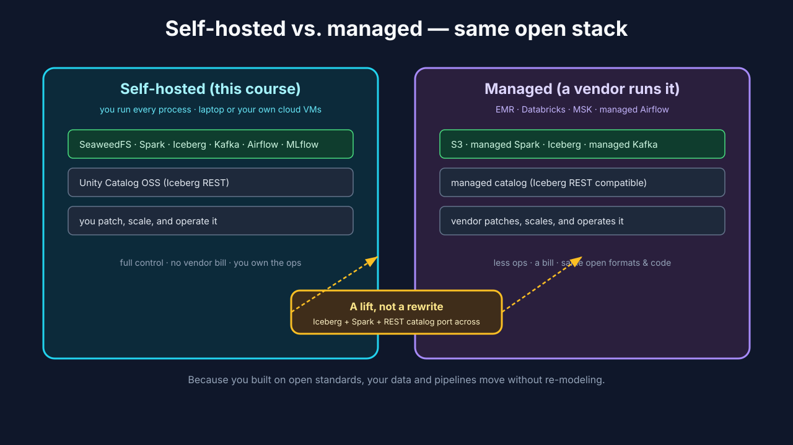
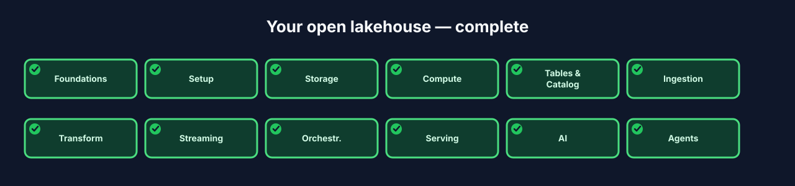

# Chapter 13 — Deploy, Teardown & Where to Go Next

## 13.0 What you'll build

The wrap-up. You've built the whole lakehouse — storage to agents — on your laptop.
This final chapter zooms out: a **narrated tour** of taking it to the cloud (so you
understand the path without spending a dollar), a clean **teardown** that gives your
machine back, and a roadmap of where to grow next. No new required infrastructure —
this is about understanding the full lifecycle and leaving you with next steps.



**Figure 13.3** — Progress map: every layer complete.

## 13.1 Learning objectives

By the end of this chapter you can:

- Contrast **self-hosted** and **managed** deployments and pick sensibly.
- Describe the cloud deploy path (Terraform) at a high level.
- Tear the local lakehouse down cleanly, understanding what's preserved vs. wiped.
- Name concrete next steps to deepen each layer.

## 13.2 Self-hosted vs. managed

> **Self-hosted vs. managed** *(canonical term)*: you run the infrastructure
> yourself (this whole course) versus a cloud vendor runs it for you (EMR,
> Databricks, MSK, managed Airflow).

Everything you built is **self-hosted** — you own every process. The exact same
open components also exist as **managed** services, and because you built on open
standards, moving is a *lift*, not a *rewrite*: your Iceberg tables, Spark jobs, SDP
pipelines, and Airflow DAGs port over. That's the whole payoff of the open-source
choice from Chapter 1 — the skills and the artifacts transfer.



**Figure 13.1** — The same open components, self-hosted (you run them) vs.
managed (a vendor runs them); the open formats and code carry across.

## 13.3 The cloud path (a tour, not a bill)

The reference architecture ships Terraform for cloud deployment. We *tour* it —
reading the shape, not running it — so you don't incur cloud costs to learn the
path:

- **`terraform/`** — self-hosted-on-cloud: Spark on ECS/EMR, object storage on S3,
  Postgres on RDS. You still run the open components, just on cloud infrastructure.
- **`terraform-databricks/`** — the fully managed path on Databricks.

> **Infrastructure as code** — the deployment is *declared* in Terraform and applied
> reproducibly, the same declarative philosophy you saw in SDP (Ch 7) and Airflow
> DAGs (Ch 9): describe the desired state, let the tool converge to it.

### Under the hood — why "lift, not rewrite" is true

Your data is in **Iceberg**, an open table format any engine and any cloud reads.
Your catalog speaks the **Iceberg REST** protocol. Your transforms are **Spark**.
None of these are proprietary, so a managed service consumes them directly. Contrast
a closed warehouse, where migrating means exporting and re-modeling everything. Open
standards are what make your work portable — that was the bet in Chapter 1, and this
is where it pays off.

## 13.4 Teardown — give your machine back

Step 1 — stop everything (preserves your data volumes):

```bash
./lakehouse stop all
./lakehouse status
```

Expected: all services stop; `status` shows nothing running. Your Iceberg tables and
catalog data remain on disk, so a later `start` resumes where you left off.

Step 2 — full reset, only if you want a clean slate (this **wipes data**):

```bash
./lakehouse reset --all      # destructive: removes data + metadata
```

Expected: volumes and state are cleared. Use this to reclaim disk or start fresh —
and note this is exactly the kind of destructive operation that should require human
confirmation when an agent (Ch 12) is at the controls.

> Teardown discipline is a feature, not an afterthought: because everything runs in
> containers with explicit volumes, "give my laptop back" is one command, and there
> are no stray processes left behind.

## 13.5 Where to go next

You've built the core. Concrete ways to deepen each layer:

- **Storage / Tables** — table maintenance: compaction, snapshot expiration, and
  partition evolution on your Iceberg tables.
- **Transformation** — add a real data-quality suite and more Gold marts; explore
  incremental SDP refresh in depth.
- **Streaming** — exactly-once end-to-end, schema-registry-backed Kafka, and
  windowed aggregations in the stream.
- **Serving** — wire a BI tool (or a semantic layer) onto the Gold tables; try
  Trino as a third engine.
- **AI** — batch inference writing predictions back to an Iceberg table, and model
  promotion workflows in the registry.
- **Agents** — a retrieval/analytics agent that answers questions by querying Gold
  through the catalog (text-to-SQL over the lakehouse).
- **Governance** — deepen Unity Catalog OSS: access control, lineage, and audit.

## 13.6 Checkpoint — you built an open lakehouse

Look back at the cold open from Chapter 1. You now have:

- **Storage** (object store) holding open **Iceberg** tables via **Unity Catalog OSS**.
- **Compute** driven by **Spark Connect**.
- **Ingestion** (batch) and **Streaming** (Kafka) both feeding **Bronze**.
- **Transformation** into Silver/Gold with **Spark Declarative Pipelines**.
- **Orchestration** via **Airflow**.
- **Serving** to multiple engines through one open catalog.
- **AI** trained and tracked with **MLflow**.
- **Agents** operating it all through the CLI.

Every layer, built by you, running on your own machine, entirely open source.

## 13.7 Recap

- **Self-hosted** (this course) and **managed** run the same open stack; open
  standards make migration a lift, not a rewrite.
- The cloud path is Terraform — declarative infrastructure, toured here without cost.
- **Teardown** is one command; `stop all` preserves data, `reset --all` wipes it.
- The roadmap deepens every layer — you have the foundation to grow.



**Figure 13.4** — Every layer checked: the finished open lakehouse.
